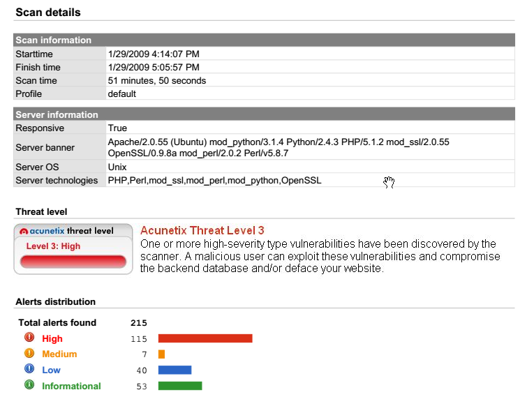

# The hacker methodology

**What process does a Hacker follow?**

**The Process that pentesters follow is summarized in the following steps:**

1. **Reconnaissance**
2. **Enumeration/Scanning**
3. **Gaining Access**
4. **Privilege Escalation**
5. **Covering Tracks**
6. **Reporting**

# 1. Reconnaissance Overview

Reconnaissance is all about collecting information about your target.

Generally speaking, reconnaissance usually involves no interaction with the target(s) or system(s).

Reconnaissance is a pretty simple concept, think about what tools we can use on the internet to gather information about people.

What websites and technology come to mind to gather information about a target organization, technology, or set of individuals?

One of the most useful tools in a Hacker's possession:

- **Google**

Reconnaissance usually involves using publicly available tools like Google to conduct research about your target.

**There are some specialized tools that we can utilize but for this introduction it is good to know the following tools.**

- Google (specifically Google Dorking)
- Wikipedia
- PeopleFinder.com
- who.is
- sublist3r (Shows subdomains)
- hunter.io
- builtwith.com
- wappalyzer

# 2. Enumeration and Scanning Overview

**The second phase of the Hacker Methodology is Scanning and Enumeration.**

This is where a hacker will start interacting with (scanning and enumerating) the target to attempt to find vulnerabilities related to the target.

This is where more specialized tools start to come in to the arsenal. Tools like nmap, dirb, metasploit, exploit-db, Burp Suite and others are very useful to help us try to find vulnerabilities in a target. (Don't worry about them now, you can get into the nitty-gritty later)

In the scanning and enumeration phase, the attacker is interacting with the target to determine its overall attack surface.

The attack surface determines what the target might be vulnerable to in the Exploitation phase. These vulnerabilities might be a range of things: anything from a webpage not being properly locked down, a website leaking information, SQL Injection, Cross Site Scripting or any number of other vulnerabilities.

To simplify - the enumeration and scanning phase is where we will try to determine WHAT the target might be vulnerable to.

- **Nmap is a tool which can scan a target and tell us a wide variety of things:**
    - What ports are open
    - The operating system of the target (Windows, Linux, MacOS, etc. including what version of the Operating System)
    - What services are running and what version of the service (for example, just saying FTP (File Transfer Protocol) isn't enough - nmap can attempt to fingerprint and determine the exact VERSION of FTP which may enable us to find a specific vulnerability in the target)
    
    Other tools:
    
    - dirb (used to find commonly-named directories on a website - like how under https://www.tesla.com there is also https://www.tesla.com/about, https://www.tesla.com/model3, https://www.tesla.com/modely, and most importantly https://www.tesla.com/models WITH LUDICROUS MODE!! ♥)
    - dirbuster (similar to dirb but with a cooler name, and with a user interface)
    - enum4linux (tool used specifically for Linux to find vulnerabilities)
    - metasploit (this tool is mostly used for exploitation, but it also has some built-in enumeration tools)
    - Burp Suite (this tool can be used to scan a website for subdirectories and to intercept network traffic)

# 3. Exploitation

In the news, they often talk about "this hack" or "this vulnerability" but the truth is that usually the "exploitation" phase of a pentest is not as glamorous as it seems. The exploitation phase can only be as good as the recon and enumeration phases before it, if you did not enumerate all vulnerabilities you may miss an opportunity, or if you did not look hard enough at the target - the exploit you have chosen may fail entirely!

One common tool used for exploitation is called Metasploit which has many built-in scripts to try to keep life simple.

You can also used tools like Burp Suite and SQLMap to exploit web applications. There are tools such as msfvenom (for building custom payloads), BeEF (browser-based exploitation), and many many others.

> For now, I think you have a good grasp on what "exploitation" means - just remember a professional penetration tester never jumps into the exploitation phase without doing adequate reconnaissance and enumeration.
> 

# 4. Privilege Escalation

After we have gained access to a victim machine via the **exploitation** phase, the next step is to **escalate privileges** to a higher user account. The following accounts are what we try to reach as a pentester:

- **In the Windows world, the target account is usually: Administrator or System.**
- **In the Linux world, the target account is usually: root**

As you can tell, discovering what Operating System a device is running on is very important to determine how we will escalate our privileges later. Once we gain access as a lower level user, we will try to run another exploit or find a way to become root or administrator.

**Privilege escalation can take many, many forms, some examples are:**

- Cracking password hashes found on the target
- Finding a vulnerable service or version of a service which will allow you to escalate privilege THROUGH the service
- Password spraying of previously discovered credentials (password re-use)
- Using default credentials
- Finding secret keys or SSH keys stored on a device which will allow pivoting to another machine
- Running scripts or commands to enumerate system settings like 'ifconfig' to find network settings, or the command 'find / -perm4000 -type f 2>/dev/null' to see if the user has access to any commands they can run as root

Just think of this section of the methodology as getting to a higher-level user account or pivoting to another machine with the ultimate goal to "own" the machine.

# 5. Covering Tracks

Most professional/ethical penetration testers never have the need to "cover their tracks". However, this is still a phase in the methodology.

You should always have explicit permission from the system owner regarding when the test is happening, how its occurring, and the scope of targets in any penetration test.

Since the rules of engagement for a penetration test should be agreed to before the test occurs, the penetration tester should stop IMMEDIATELY when they have achieved privilege escalation and report the finding to the client.

However, even though you do not cover your tracks, this does not resolve you of liability for your exploitation. Often you will need to assist the IT Administrator or system owner in cleaning up the exploit code that you utilized, and also recommending HOW to prevent the attack in the future.

While ethical hackers rarely have a need to cover their tracks, you still must carefully track and notate all of the tasks that you performed as part of the penetration test to assist in fixing the vulnerabilities and recommending changes to the system owner.

# 6. Reporting

This is one of the most important phases where you will outline everything that you found. The reporting phase often includes the following things:

- The Finding(s) or Vulnerabilities
- The CRITICALITY of the Finding
- A description or brief overview of how the finding was discovered
- Remediation recommendations to resolve the finding

The amount of reporting documentation varies widely by the type of engagement that the pentester is involved in. A findings report generally goes in three formats:

- Vulnerability scan results (a simple listing of vulnerabilities)
- Findings summary (list of the findings as outlined above)
- Full formal report.

As stated before there are many varying levels of documentation for a final written report. Here is how each type of reporting would look in practice:

- A vulnerability report usually looks like this:

- A findings summary is usually something like this:
- **Finding:** SQL Injection in ID Parameter of Cats Page
- **Criticality: Critical**
- **Description:** Placing a payload of *1' OR '1'='1* into the ID parameter of the website allowed the viewing of all cat names in the cat Table of the database. Furthermore, a UNION SELECT SQL statement allowed the attacker to view all usernames and passwords stored in the Accounts table.****
- **Remediation Recommendation:** Utilize a Prepared SQL statement to prevent SQL injection attacks