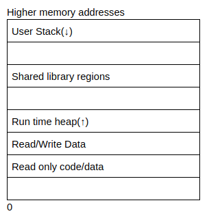

# Buffer Overflows
# First some background
When a program runs on a machine, the computer runs the program as a process. Current computer architecture allows multiple processes to be run concurrently(at the same time by a computer). While these processes may appear to run at the same time, the computer actually switches between the processes very quickly and makes it look like they are running at the same time. Switching between processes is called a context switch. Since each process may need different information to run(e.g. The current instruction to execute), the operating system has to keep track of all the information in a process. The memory in the process is organised sequentially and has the following layout: 

<div style="text-align:center;">
    <div style="display:flex; align-items:center; justify-content:center;">
        <div style="flex:1;">
            
        </div>
        <div style="justify-content:center;">
            <table>
                <tr><th>Kernel</th></tr>
                <tr><td>Stack</td></tr>
                <tr><td>Heap</td></tr>
                <tr><td>Data</td></tr>
                <tr><td>Text</td></tr>
            </table>
        </div>
    </div>
</div>

* User stack contains the information required to run the program. This information would include the current program counter, saved registers and more information(we will go into detail in the next section). The section after the user stack is unused memory and it is used in case the stack grows(downwards)
* Shared library regions are used to either statically/dynamically link libraries that are used by the program
* The heap increases and decreases dynamically depending on whether a program dynamically assigns memory. Notice there is a section that is unassigned above the heap which is used in the event that the size of the heap increases.
* The program code and data stores the program executable and initialised variables.

The stack pointer is known as `rsp` 

Upto 6 arguments for functions can be stored in the following registers:
* rdi
* rsi
* rdx
* rcx
* r8
* r9

Note: `rax` is a special register that stores the return values of the functions(if any).

If a function has anymore arguments, these arguments would be stored on the functions stack frame. 

## Endianess
The order in which bytes are stored in memory is called endianess. There are two types of endianess: Big Endian and Little Endian.

In Big Endian, the most significant byte is stored first. In Little Endian, the least significant byte is stored first.

## Overwriting variables
The gets function is dangerous because it doesn't really have a length check - This would mean that you can enter more than x bytes of data, which would then overwrite the integer variable. 

# Buffer Overflows
Buffer overflow is a type of vulnerability that occurs when a program tries to write more data to a buffer than it was allocated. This can be caused by a number of reasons, such as:
* A program that doesn't check the length of user input before writing it to a buffer

Shellcode is a small piece of code that can be used to execute commands on a system. It is usually written in assembly, but can also be written in C. When buffer overflows are exploited, shellcode is usually used to gain a shell on the system.

Example shellcode:
```bash
\x48\xb9\x2f\x62\x69\x6e\x2f\x73\x68\x11\x48\xc1\xe1\x08\x48\xc1\xe9\x08\x51\x48\x8d\x3c\x24\x48\x31\xd2\xb0\x3b\x0f\x05
```