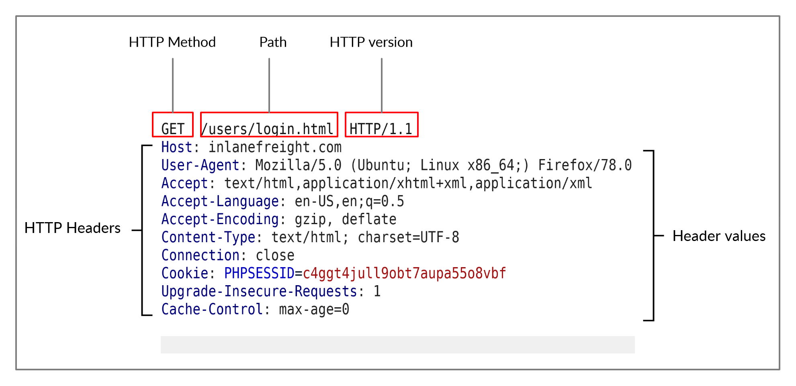
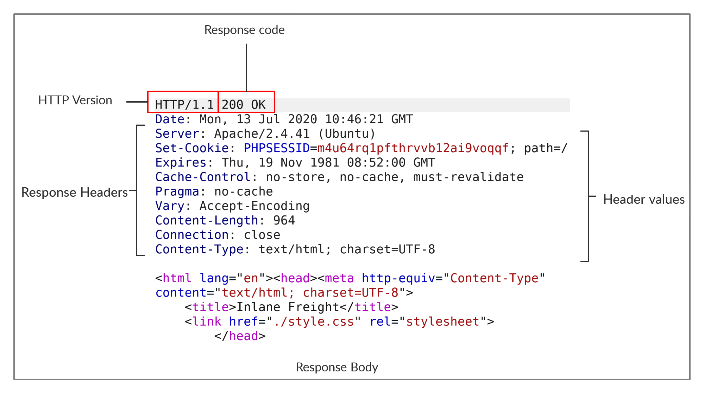

# HTTP Requests and Responses
HTTP communications mainly consist of an HTTP request and an HTTP response. 

An HTTP request is made by the client (e.g. cURL/browser), and is processed by the server (e.g. web server). The requests contain all of the details we require from the server, including the resource (e.g. URL, path, parameters), any request data, headers or options we specify, and many other options we will discuss throughout this module.

Once the server receives the HTTP request, it processes the it and responds by sending the HTTP response, which contains the response code, as discussed in a later section, and may contain the resource data if the requester had access to it.

## HTTP Request


The first line of any HTTP request contains three main fields 'separated by spaces':


| Field   | Example           | Description                                                                                                         |
|---------|-------------------|---------------------------------------------------------------------------------------------------------------------|
| Method  | GET               | The HTTP method or verb, which specifies the type of action to perform.                                             |
| Path    | /users/login.html | The path to the resource being accessed. This field can also be suffixed with a query string (e.g. ?username=user). |
| Version | HTTP/1.1          | The third and final field is used to denote the HTTP version.                                                       |

The next set of lines contain HTTP header value pairs, like Host, User-Agent, Cookie, and many other possible headers. These headers are used to specify various attributes of a request. The headers are terminated with a new line, which is necessary for the server to validate the request. Finally, a request may end with the request body and data.

## HTTP Response


The first line of an HTTP response contains two fields separated by spaces. The first being the HTTP version (e.g. HTTP/1.1), and the second denotes the HTTP response code (e.g. 200 OK).

Response codes are used to determine the request's status.

Finally, the response may end with a response body, which is separated by a new line after the headers. The response body is usually defined as HTML code. However, it can also respond with other code types such as JSON, website resources such as images, style sheets or scripts, or even a document such as a PDF document hosted on the webserver.

## cURL
To view the full HTTP request and response, we can simply add the `-v` verbose flag to our earlier commands, and it should print both the request and response:

```console
Berkan Kutuk@htb[/htb]$ curl inlanefreight.com -v

*   Trying SERVER_IP:80...
* TCP_NODELAY set
* Connected to inlanefreight.com (SERVER_IP) port 80 (#0)
> GET / HTTP/1.1
> Host: inlanefreight.com
> User-Agent: curl/7.65.3
> Accept: */*
> Connection: close
> 
* Mark bundle as not supporting multiuse
< HTTP/1.1 401 Unauthorized
< Date: Tue, 21 Jul 2020 05:20:15 GMT
< Server: Apache/X.Y.ZZ (Ubuntu)
< WWW-Authenticate: Basic realm="Restricted Content"
< Content-Length: 464
< Content-Type: text/html; charset=iso-8859-1
< 
<!DOCTYPE HTML PUBLIC "-//IETF//DTD HTML 2.0//EN">
<html><head>

...SNIP...
```

The `-vvv` flag shows an even more verbose output. 

