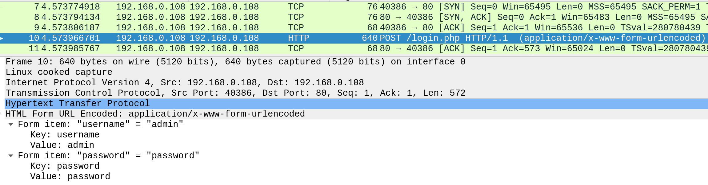
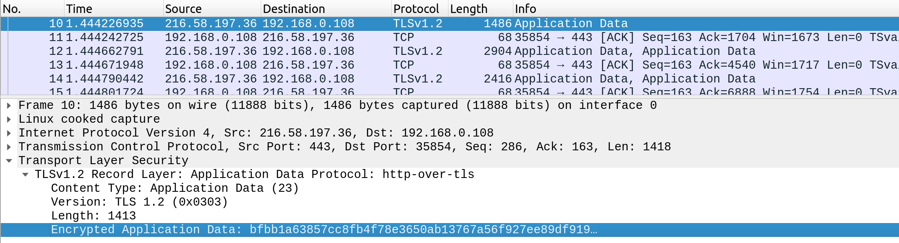
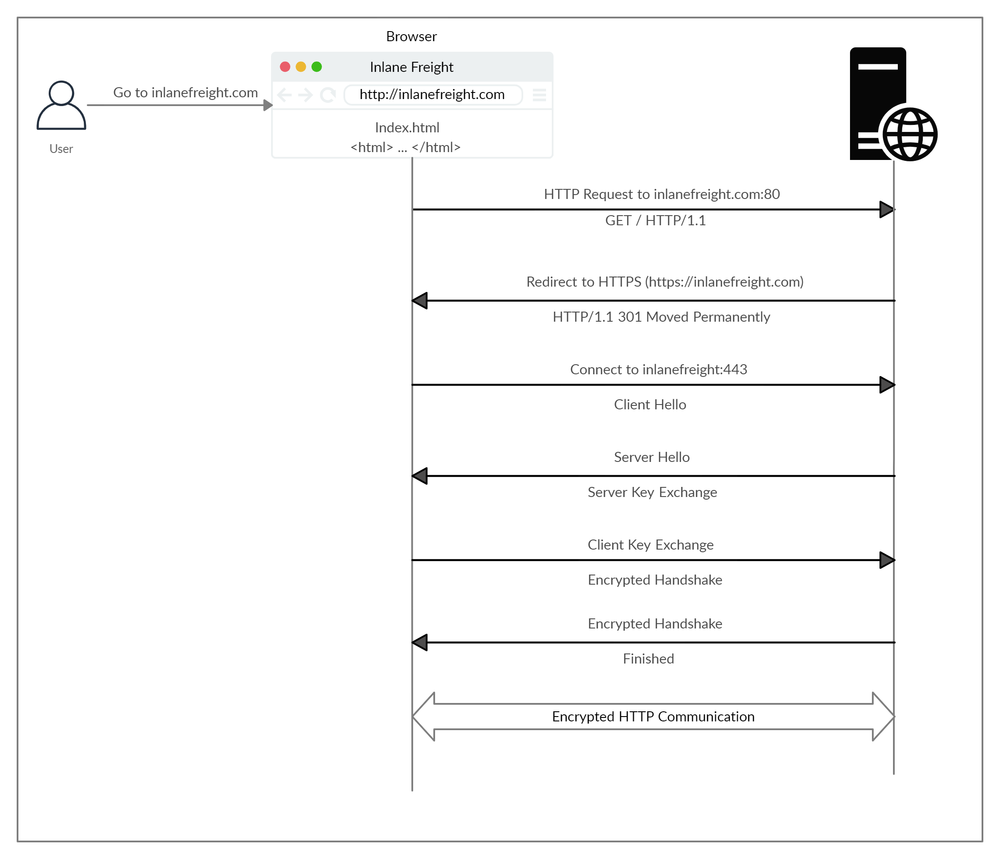

# Hypertext Transfer Protocol Secure (HTTPS)
In the previous section, we discussed how HTTP requests are sent and processed. However, one of the significant drawbacks of HTTP is that all data is transferred in clear-text. This means that anyone between the source and destination can perform a Man-in-the-middle (MiTM) attack to view the transferred data.

To counter this issue, the HTTPS (HTTP Secure) protocol was created, in which all communications are transferred in an encrypted format, so even if a third party does intercept the request, they would not be able to extract the data out of it. For this reason, HTTPS has become the mainstream scheme for websites on the internet, and HTTP is being phased out, and soon most web browsers will not allow visiting HTTP websites.

## HTTPS Overview
If we examine an HTTP request, we can see the effect of not enforcing secure communications between a web browser and a web application. For example, the following is the content of an HTTP login request:

We can see that the login credentials can be viewed in clear-text. This would make it easy for someone on the same network (such as a public wireless network) to capture the request and reuse the credentials for malicious purposes.

In contrast, when someone intercepts and analyzes traffic from an HTTPS request, they would see something like the following

As we can see, the data is transferred as a single encrypted stream, which makes it very difficult for anyone to capture information such as credentials or any other sensitive data.

**Note:** Although the data transferred through the HTTPS protocol may be encrypted, the request may still reveal the visited URL if it contacted a clear-text DNS server. For this reason, it is recommended to utilize encrypted DNS servers (e.g. 8.8.8.8 or 1.2.3.4), or utilize a VPN service to ensure all traffic is properly encrypted.


## HTTPS Flow


**Note:** Depending on the circumstances, an attacker may be able to perform an HTTP downgrade attack, which downgrades HTTPS communication to HTTP, making the data transferred in clear-text. This is done by setting up a Man-In-The-Middle (MITM) proxy to transfer all traffic through the attacker's host without the user's knowledge. However, most modern browsers, servers, and web applications protect against this attack.

## cURL for HTTPS
cURL should automatically handle all HTTPS communication standards and perform a secure handshake and then encrypt and decrypt data automatically. However, if we ever contact a website with an invalid SSL certificate or an outdated one, then cURL by default would not proceed with the communication to protect against the earlier mentioned MITM attacks.

Modern web browsers would do the same, warning the user against visiting a website with an invalid SSL certificate.

We may face such an issue when testing a local web application or with a web application hosted for practice purposes, as such web applications may not yet have implemented a valid SSL certificate. To skip the certificate check with cURL, we can use the -k flag:

```console
Berkan Kutuk@htb[/htb]$ curl -k https://inlanefreight.com

<!DOCTYPE HTML PUBLIC "-//IETF//DTD HTML 2.0//EN">
<html><head>
...SNIP...
```