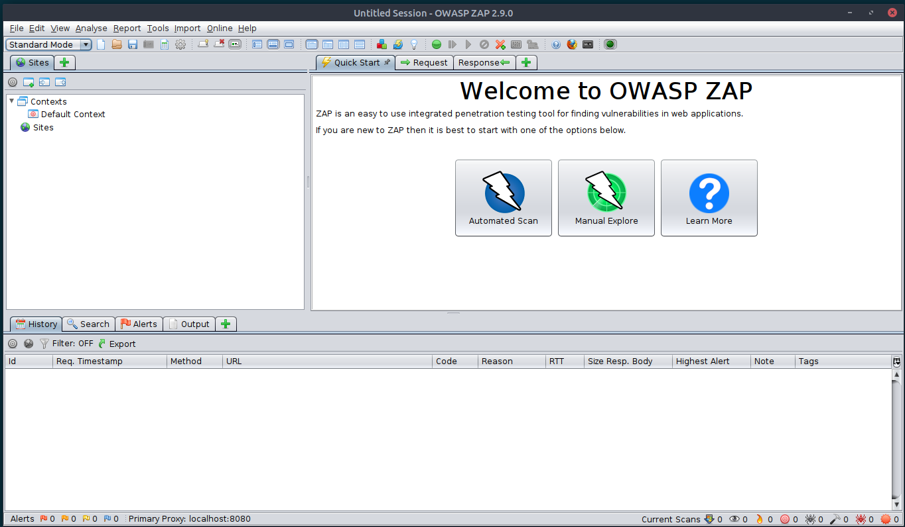
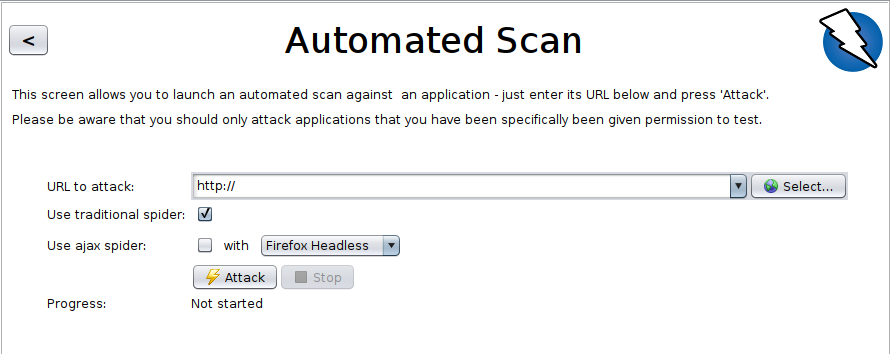

# Owasp Zap
OWASP ZAP (short for Zed Attack Proxy) is an open-source web application security scanner. It is intended to be used by both those new to application security as well as professional penetration testers.

It has been one of the most active Open Web Application Security Project (OWASP) projects and has been given Flagship status.

When used as a proxy server it allows the user to manipulate all of the traffic that passes through it, including traffic using HTTPS.

It can also run in a daemon mode which is then controlled via a REST API.

## Features
Some of the built in features include:

* An intercepting proxy server,
* Traditional and AJAX Web crawlers
* An automated scanner
* A passive scanner
* Forced browsing
* A fuzzer
* WebSocket support
* Scripting languages
* Plug-n-Hack support

It comes pre-installed on Kali Linux.