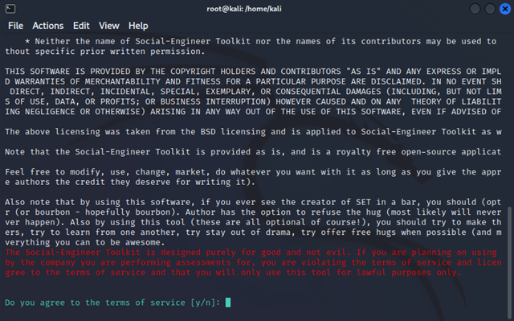
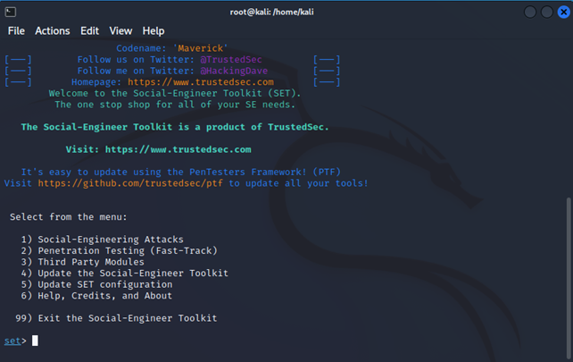
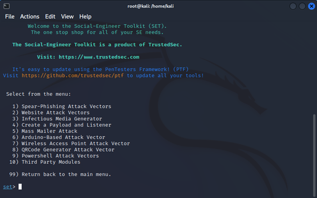
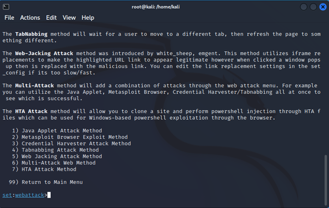
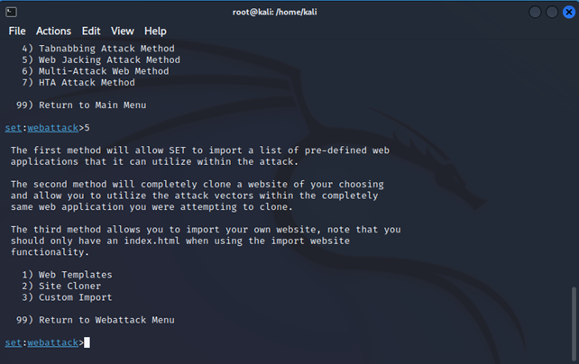
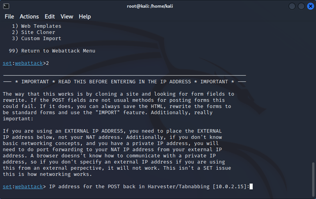
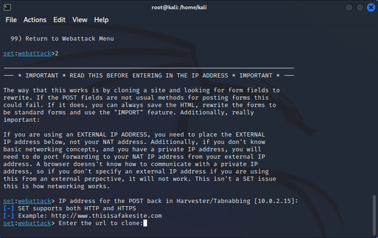

# SEToolkit
SEToolkit stands for Social Engineering Toolkit. It is a collection of over 30 social engineering attacks, written in Python, that can be used to perform a penetration test. The goal of this project is to provide a framework that allows penetration testers to perform social engineering attacks in a controlled and repeatable manner. The framework is designed to be modular and extensible, allowing new attacks to be added easily.

Some of the attacks included in SEToolkit are cloning websites to perform phishing attacks.

## Cloning a website
### Step 1: Start SEToolkit 
Open your terminal and type Setoolkit in Kali Linux OS
```bash	
$ sudo su # For root access
$ setoolkit # Start SEToolkit
```

When entered a prompt will appear asking you to agree to the terms and conditions. Type `y` and press enter to continue.



### Step 2: Select the attack
Type `1` for "Social-Engineering Attacks" and press the [Enter] key to continue.



### Step 3: Select the type
Now type `2` for "Website Attack Vectors" and press the [Enter] key to continue.



### Step 4: Select the method
Type `5` for "Web Jacking Attack Method" and press the [Enter] key to continue.



### Step 5: Enter the Cloning method
Type `2` for "Site Cloner" and press the [Enter] key to continue.



### Step 6: Enter the Post Back URL
Enter your IP address for SEToolkit to report back to. you'll be able to use your external IP if you're doing this over the Internet. However please ensure that port forward port 80 to your local IP.



### Step 7: Enter the URL to clone
Enter the URL of the website you want to clone. For example, if you want to clone Facebook, enter `https://www.facebook.com/`



Now shorten that copied IP Address using any URL shortener service and then send the link to your victim.
