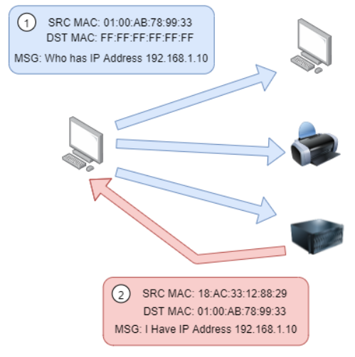

# The ARP Protocol

Recalling from our previous tasks that devices can have two identifiers: A MAC address and an IP address, the **ARP** protocol or **A**ddress **R**esolution **P**rotocol for short, is the technology that is responsible for allowing devices to identify themselves on a network.

Simply, the ARP protocol allows a device to associate its MAC address with an IP address on the network. Each device on a network will keep a log of the MAC addresses associated with other devices.

When devices wish to communicate with another, they will send a broadcast to the entire network searching for the specific device. Devices can use the ARP protocol to find the MAC address (and therefore the physical identifier) of a device for communication.

**How does ARP Work?**

Each device within a network has a ledger to store information on, which is called a cache. In the context of the ARP protocol, this cache stores the identifiers of other devices on the network.

In order to map these two identifiers together (IP address and MAC address), the ARP protocol sends two types of messages:

1. **ARP Request**
2. **ARP Reply**

When an **ARP request** is sent, a message is broadcasted to every other device found on a network by the device, asking whether or not the device's MAC address matches the requested IP address. If the device does have the requested IP address, an **ARP reply** is returned to the initial device to acknowledge this. The initial device will now remember this and store it within its cache (an ARP entry).

This process is illustrated in the diagram below:
