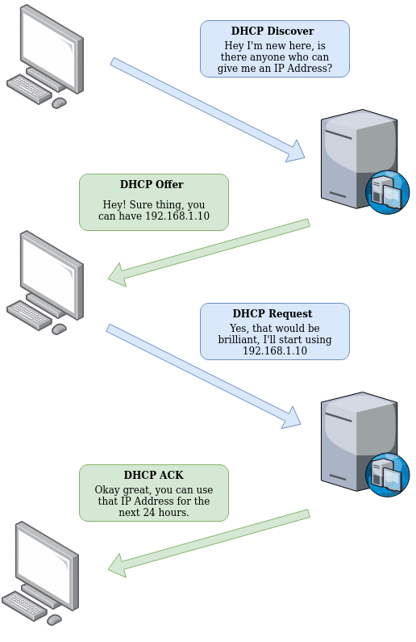

# The DHCP Protocol

IP addresses can be assigned either manually, by entering them physically into a device, or automatically and most commonly by using a DHCP (Dynamic Host Configuration Protocol) server. When a device connects to a network, if it has not already been manually assigned an IP address, it sends out a request (DHCP Discover) to see if any DHCP servers are on the network. The DHCP server then replies back with an IP address the device could use (DHCP Offer). The device then sends a reply confirming it wants the offered IP Address (DHCP Request), and then lastly, the DHCP server sends a reply acknowledging this has been completed, and the device can start using the IP Address (DHCP ACK).

