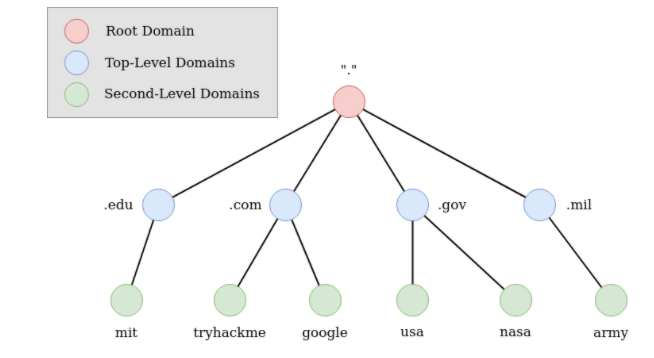

# DNS in Detail

# Domain Hierarchy

**TLD (Top-Level Domain)**

A TLD is the most righthand part of a domain name. So, for example, the tryhackme.com TLD is **.com**. There are two types of TLD, gTLD (Generic Top Level) and ccTLD (Country Code Top Level Domain). Historically a gTLD was meant to tell the user the domain name's purpose; for example, a .com would be for commercial purposes, .org for an organisation, .edu for education and .gov for government. And a ccTLD was used for geographical purposes, for example, .ca for sites based in Canada, .co.uk for sites based in the United Kingdom and so on. Due to such demand, there is an influx of new gTLDs ranging from .online , .club , .website , .biz and so many more. For a full list of over 2000 TLDs [click here](https://data.iana.org/TLD/tlds-alpha-by-domain.txt).

**Second-Level Domain**

Taking tryhackme.com as an example, the .com part is the TLD, and tryhackme is the Second Level Domain. When registering a domain name, the second-level domain is limited to 63 characters + the TLD and can only use a-z 0-9 and hyphens (cannot start or end with hyphens or have consecutive hyphens).

**Subdomain**

A subdomain sits on the left-hand side of the Second-Level Domain using a period to separate it; for example, in the name admin.tryhackme.com the admin part is the subdomain. A subdomain name has the same creation restrictions as a Second-Level Domain, being limited to 63 characters and can only use a-z 0-9 and hyphens (cannot start or end with hyphens or have consecutive hyphens). You can use multiple subdomains split with periods to create longer names, such as jupiter.servers.tryhackme.com. But the maximum length must be kept below 253 characters. There is no limit to the number of subdomains you can create for your domain name.

# DNS Record Types

DNS isn't just for websites though, and multiple types of DNS record exist. We'll go over some of the most common ones that you're likely to come across.

DNS isn't just for websites though, and multiple types of DNS record exist. We'll go over some of the most common ones that you're likely to come across.

**A Record**

These records resolve to IPv4 addresses, for example 104.26.10.229

**AAAA Record**

These records resolve to IPv6 addresses, for example 2606:4700:20::681a:be5

**CNAME Record**

These records resolve to another domain name, for example, TryHackMe's online shop has the subdomain name store.tryhackme.com which returns a CNAME record shops.shopify.com. Another DNS request would then be made to shops.shopify.com to work out the IP address.

**MX Record**

These records resolve to the address of the servers that handle the email for the domain you are querying, for example an MX record response for tryhackme.com would look something like alt1.aspmx.l.google.com. These records also come with a priority flag. This tells the client in which order to try the servers, this is perfect for if the main server goes down and email needs to be sent to a backup server.

**TXT Record**

TXT records are free text fields where any text-based data can be stored. TXT records have multiple uses, but some common ones can be to list servers that have the authority to send an email on behalf of the domain (this can help in the battle against spam and spoofed email). They can also be used to verify ownership of the domain name when signing up for third party services.

# Making A Request

## What happens when you make a DNS request

1. When you request a domain name, your computer first checks its local cache to see if you've previously looked up the address recently; if not, a request to your Recursive DNS Server will be made.
2. A Recursive DNS Server is usually provided by your ISP, but you can also choose your own. This server also has a local cache of recently looked up domain names. If a result is found locally, this is sent back to your computer, and your request ends here (this is common for popular and heavily requested services such as Google, Facebook, Twitter). If the request cannot be found locally, a journey begins to find the correct answer, starting with the internet's root DNS servers.
3. The root servers act as the DNS backbone of the internet; their job is to redirect you to the correct Top Level Domain Server, depending on your request. If, for example, you request [www.tryhackme.com](http://www.tryhackme.com/), the root server will recognise the Top Level Domain of .com and refer you to the correct TLD server that deals with .com addresses.
4. The TLD server holds records for where to find the authoritative server to answer the DNS request. The authoritative server is often also known as the nameserver for the domain. For example, the name server for [tryhackme.com](http://tryhackme.com/) is [kip.ns.cloudflare.com](http://kip.ns.cloudflare.com/) and [uma.ns.cloudflare.com](http://uma.ns.cloudflare.com/). You'll often find multiple nameservers for a domain name to act as a backup in case one goes down.
5. An authoritative DNS server is the server that is responsible for storing the DNS records for a particular domain name and where any updates to your domain name DNS records would be made. Depending on the record type, the DNS record is then sent back to the Recursive DNS Server, where a local copy will be cached for future requests and then relayed back to the original client that made the request. DNS records all come with a TTL (Time To Live) value. This value is a number represented in seconds that the response should be saved for locally until you have to look it up again. Caching saves on having to make a DNS request every time you communicate with a server.