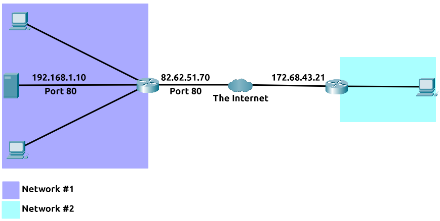

# Extending Your Network

# Introduction to Port Forwarding

Port forwarding is an essential component in connecting applications and services to the Internet. Without port forwarding, applications and services such as web servers are only available to devices within the same direct network.

Take the network below as an example. Within this network, the server with an IP address of "192.168.1.10" runs a webserver on port 80. Only the two other computers on this network will be able to access it (this is known as an intranet).

If the administrator wanted the website to be accessible to the public (using the Internet), they would have to implement port forwarding, like in the diagram below:

With this design, Network #2 will now be able to access the webserver running on Network #1 using the public IP address of Network #1 (82.62.51.70).

It is easy to confuse port forwarding with the behaviours of a firewall (a technology we'll come on to discuss in a later task). However, at this stage, just understand that port forwarding opens specific ports (recall how packets work). In comparison, firewalls determine if traffic can travel across these ports (even if these ports are open by port forwarding).

Port forwarding is configured at the router of a network.

# Firewalls 101

A firewall is a device within a network responsible for determining what traffic is allowed to enter and exit. Think of a firewall as border security for a network. An administrator can configure a firewall to **permit** or **deny** traffic from entering or exiting a network based on numerous factors such as:

- Where the traffic is coming from? (has the firewall been told to accept/deny traffic from a specific network?)
- Where is the traffic going to? (has the firewall been told to accept/deny traffic destined for a specific network?)
- What port is the traffic for? (has the firewall been told to accept/deny traffic destined for port 80 only?)
- What protocol is the traffic using? (has the firewall been told to accept/deny traffic that is UDP, TCP or both?)

Firewalls perform packet inspection to determine the answers to these questions.

Firewalls come in all shapes and sizes. From dedicated pieces of hardware (often found in large networks like businesses) that can handle a magnitude of data to residential routers (like at your home!) or software such as [Snort](https://www.snort.org/), firewalls can be categorised into 2 to 5 categories.

We'll cover the two primary categories of firewalls below:
* **Stateful Firewalls** - This type of firewall uses the entire information from a connection; rather than inspecting an individual packet, this firewall determines the behaviour of a device based upon the entire connection.
This firewall type consumes many resources in comparison to stateless firewalls as the decision making is dynamic. For example, a firewall could allow the first parts of a TCP handshake that would later fail.
If a connection from a host is bad, it will block the entire device.
* **Stateless Firewalls** - This firewall type uses a static set of rules to determine whether or not individual packets are acceptable or not. For example, a device sending a bad packet will not necessarily mean that the entire device is then blocked.
Whilst these firewalls use much fewer resources than alternatives, they are much dumber. For example, these firewalls are only effective as the rules that are defined within them. If a rule is not exactly matched, it is effectively useless.
However, these firewalls are great when receiving large amounts of traffic from a set of hosts (such as a Distributed Denial-of-Service attack)

# VPN Basics

A **V**irtual **P**rivate **N**etwork (or **VPN** for short) is a technology that allows devices on separate networks to communicate securely by creating a dedicated path between each other over the Internet (known as a tunnel). Devices connected within this tunnel form their own private network.

For example, only devices within the same network (such as within a business) can directly communicate. However, a VPN allows two offices to be connected. Let's take the diagram below, where there are three networks:

1. Network #1 (Office #1)
2. Network #2 (Office #2)
3. Network #3 (Two devices connected via a VPN)

The devices connected on Network #3 are still a part of Network #1 and Network #2 but also form together to create a private network (Network #3) that only devices that are connected via this VPN can communicate over.

Let's cover some of the other benefits offered by a VPN in the table below:

| Benefit | Description |
|---------|-------------|
| **Security** | VPNs provide security by encrypting data that is sent over the Internet. This means that if an attacker were to intercept this data, they would not be able to read it. |
| **Privacy** | VPNs provide privacy by hiding the IP address of a device. This means that if an attacker were to intercept this data, they would not be able to determine the IP address of the device that sent it. |
| **Anonymity** | VPNs provide anonymity by hiding the identity of a device. This means that if an attacker were to intercept this data, they would not be able to determine the identity of the device that sent it. |

VPN technology has improved over the years. Let's explore some existing VPN technologies below:
| Technology | Description |
|------------|-------------|
| **PPP** | PPP (Point-to-Point Protocol) is a VPN protocol that was developed by the Internet Engineering Task Force (IETF). It is one of the oldest VPN protocols and is still used today. However, it is not recommended to use this protocol as it is not secure. |
| **PPTP** | PPTP (Point-to-Point Tunneling Protocol) is a VPN protocol that was developed by Microsoft. It is one of the oldest VPN protocols and is still used today. However, it is not recommended to use this protocol as it is not secure. |
| **L2TP** | L2TP (Layer 2 Tunneling Protocol) is a VPN protocol that was developed by Cisco and Microsoft. It is a more secure alternative to PPTP. |
| **IPSec** | IPSec (Internet Protocol Security) is a VPN protocol that was developed by the Internet Engineering Task Force (IETF). It is a more secure alternative to L2TP. |
| **SSL/TLS** | SSL/TLS (Secure Sockets Layer/Transport Layer Security) is a VPN protocol that was developed by Netscape. It is a more secure alternative to IPSec. |
| **OpenVPN** | OpenVPN is a VPN protocol that was developed by James Yonan. It is a more secure alternative to SSL/TLS. |
