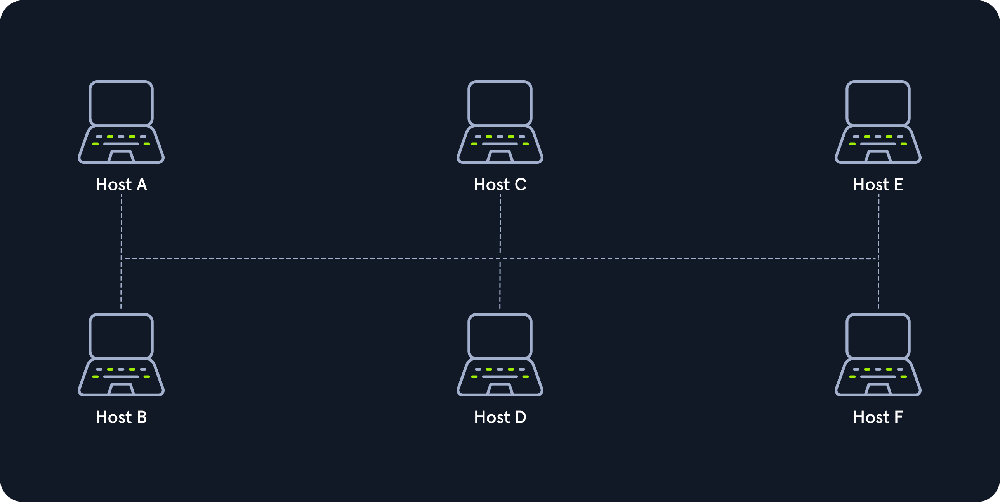
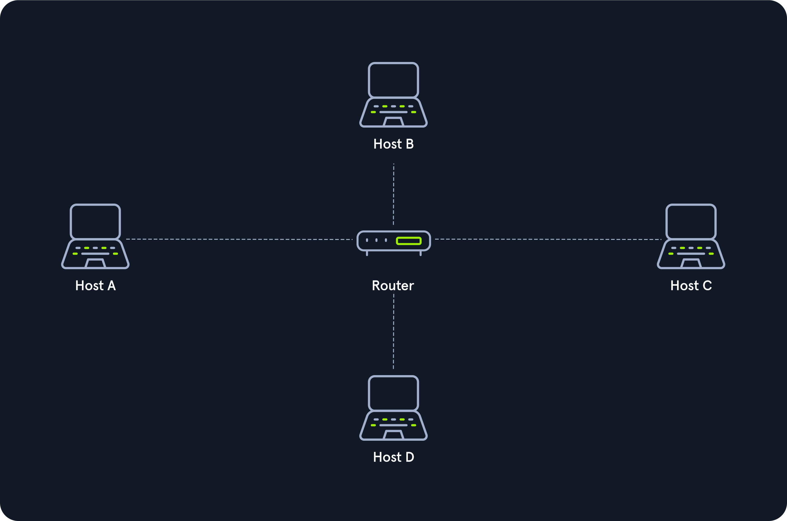
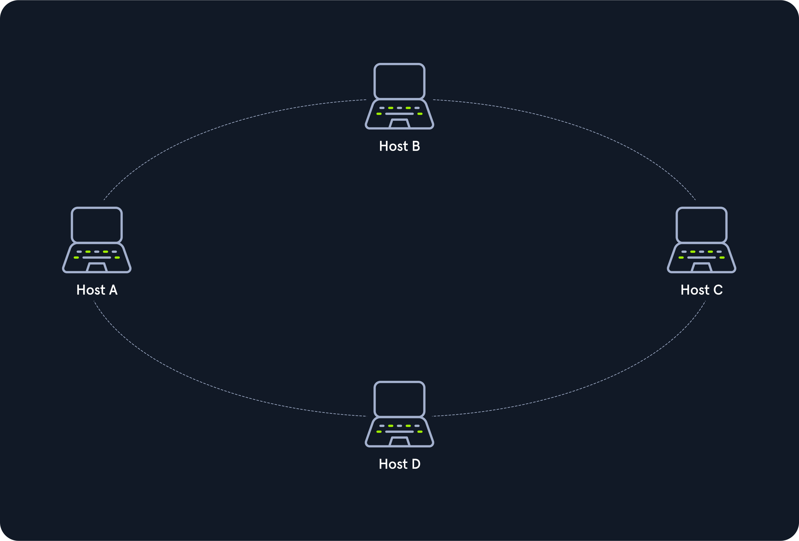
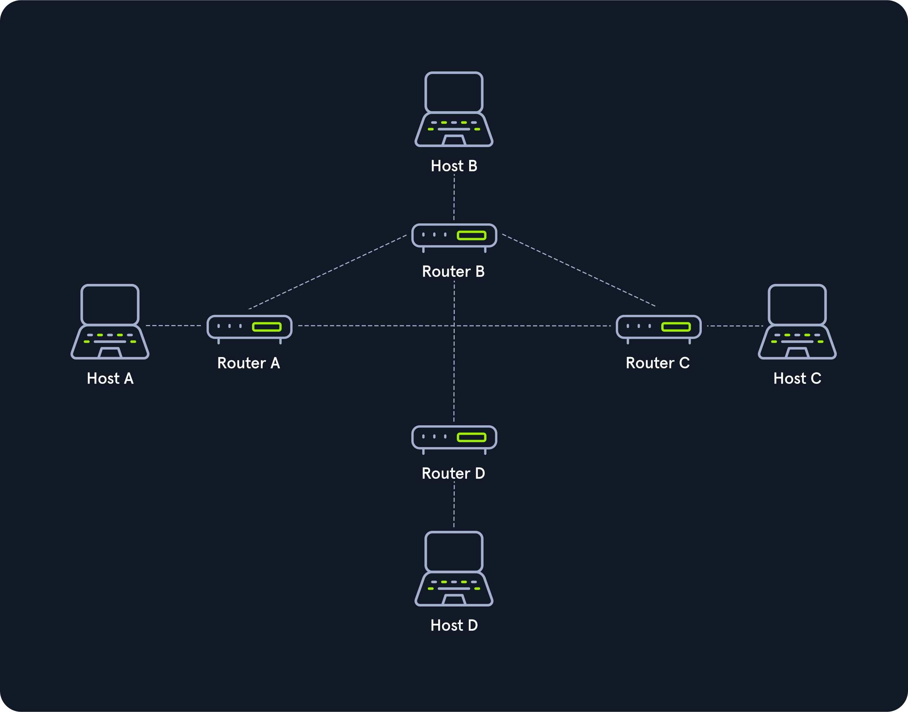
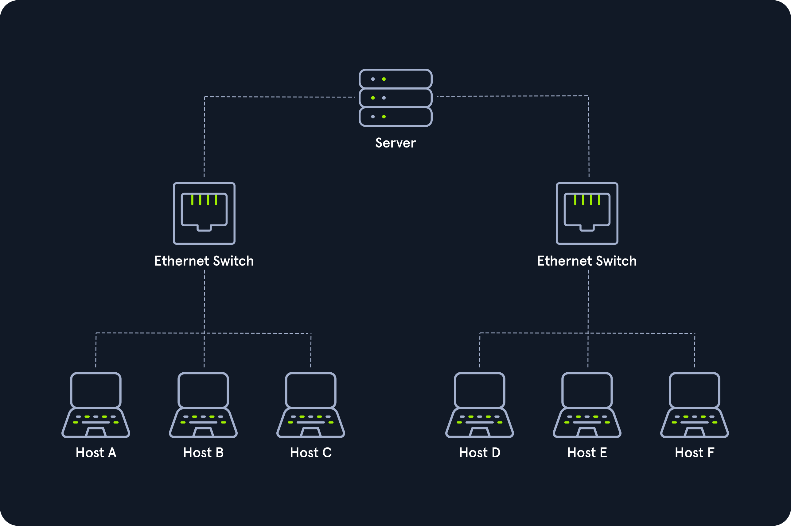
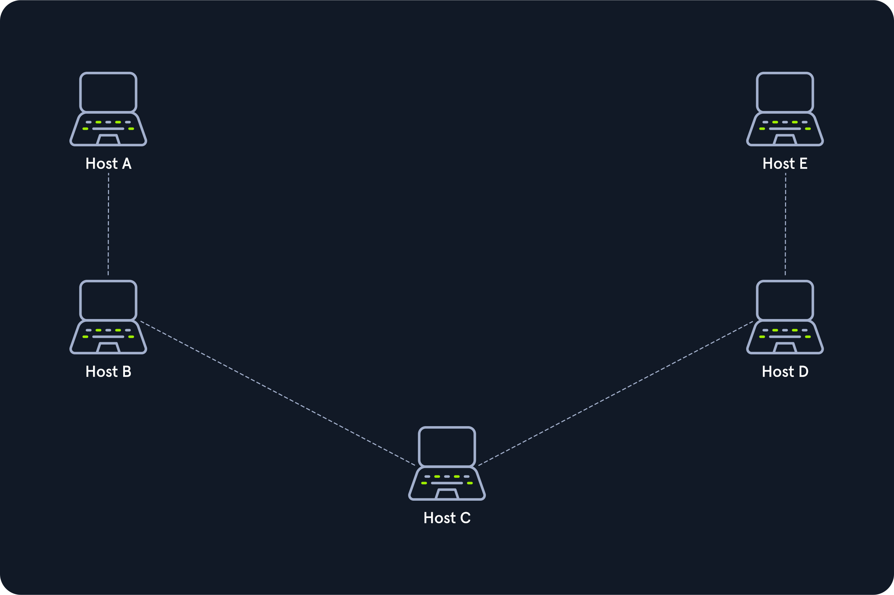

# Network Topologies
A network topology is a typical arrangement and physical or logical connection of devices in a network. Computers are hosts, such as clients and servers, that actively use the network. They also include network components such as switches, bridges, and routers.

We can divide the entire network topology area into three areas:

## 1. Connections
| Wired connections | Wireless connections |
|---|---|
| Coaxial cabling | Wi-Fi |
| Glass fiber cabling | Cellular |
| Twisted-pair cabling | Satellite |

## 2. Nodes - Network Interface Controller (NICs)
|  |  |  |  |
|---|---|---|---|
| Repeaters | Hubs | Bridges | Switches |
| Router/Modem | Gateways | Firewalls |  |

## 3. Classifications
We can imagine a topology as a virtual form or structure of a network.

Network topologies are divided into the following basic types:

### Point-to-Point	
The simplest network topology with a dedicated connection between two hosts is the point-to-point topology. In this topology, a direct and straightforward physical link exists only between two hosts. These two devices can use these connections for mutual communication.

Point-to-point topologies are the basic model of traditional telephony and must not be confused with P2P (Peer-to-Peer architecture).

### Bus
All hosts are connected via a transmission medium in the bus topology. Every host has access to the transmission medium and the signals that are transmitted over it. There is no central network component that controls the processes on it. The transmission medium for this can be, for example, a coaxial cable.

Since the medium is shared with all the others, only one host can send, and all the others can only receive and evaluate the data and see whether it is intended for itself.

### Star
The star topology is a network component that maintains a connection to all hosts. Each host is connected to the central network component via a separate link. This is usually a router, a hub, or a switch. These handle the forwarding function for the data packets. To do this, the data packets are received and forwarded to the destination. The data traffic on the central network component can be very high since all data and connections go through it.

### Ring
The physical ring topology is such that each host or node is connected to the ring with two cables:

* One for the incoming signals and
* the another for the outgoing ones.
* 
This means that one cable arrives at each host and one cable leaves. The ring topology typically does not require an active network component. The control and access to the transmission medium are regulated by a protocol to which all stations adhere.

A logical ring topology is based on a physical star topology, where a distributor at the node simulates the ring by forwarding from one port to the next.

The information is transmitted in a predetermined transmission direction. Typically, the transmission medium is accessed sequentially from station to station using a retrieval system from the central station or a token. A token is a bit pattern that continually passes through a ring network in one direction, which works according to the claim token process.

### Mesh	
Many nodes decide about the connections on a physical level and the routing on a logical level in meshed networks. Therefore, meshed structures have no fixed topology. There are two basic structures from the basic concept: the fully meshed and the partially meshed structure.

Each host is connected to every other host in the network in a fully meshed structure. This means that the hosts are meshed with each other. This technique is primarily used in WAN or MAN to ensure high reliability and bandwidth.

In this setup, important network nodes such as routers could be networked together. If one router fails, the others can continue to work without problems, and the network can absorb the failure due to the many connections.

Each node of a fully meshed topology has the same routing functions and knows the neighboring nodes it can communicate with proximity to the network gateway and traffic loads.

In the partially meshed structure, the endpoints are connected by only one connection. In this type of network topology, specific nodes are connected to exactly one other node, and some other nodes are connected to two or more other nodes with a point-to-point connection.

### Tree
The tree topology is an extended star topology that more extensive local networks have in this structure. This is especially useful when several topologies are combined. This topology is often used, for example, in larger company buildings.

There are both logical tree structures according to the spanning tree and physical ones. Modular modern networks, based on structured cabling with a hub hierarchy, also have a tree structure. Tree topologies are also used for broadband networks and city networks (MAN).

### Hybrid	
Hybrid networks combine two or more topologies so that the resulting network does not present any standard topologies. For example, a tree network can represent a hybrid topology in which star networks are connected via interconnected bus networks. However, a tree network that is linked to another tree network is still topologically a tree network. A hybrid topology is always created when two different basic network topologies are interconnected.

### Daisy Chain
In the daisy chain topology, multiple hosts are connected by placing a cable from one node to another.

Since this creates a chain of connections, it is also known as a daisy-chain configuration in which multiple hardware components are connected in a series. This type of networking is often found in automation technology (CAN).

Daisy chaining is based on the physical arrangement of the nodes, in contrast to token procedures, which are structural but can be made independent of the physical layout. The signal is sent to and from a component via its previous nodes to the computer system.

