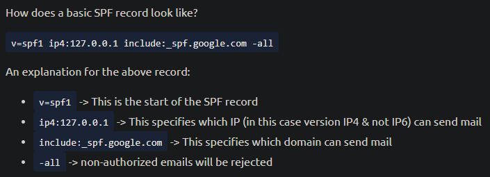
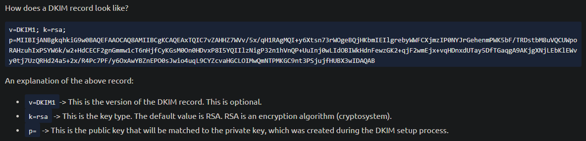
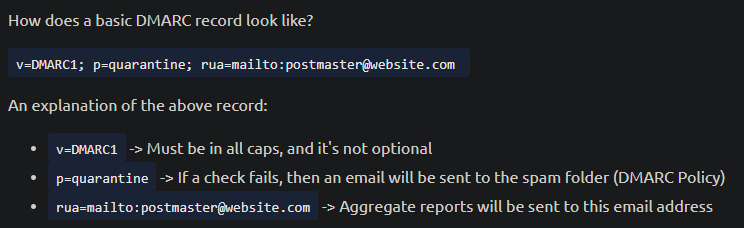

# Phishing - Analysis and Prevention
# Phishing

Below is a checklist of the pertinent information an analyst (you) is to collect from the email header:

- Sender email address
- Sender IP address
- Reverse lookup of the sender IP address
- Email subject line
- Recipient email address (this information might be in the CC/BCC field)
- Reply-to email address (if any)
- Date/time

Afterward, we draw our attention to the email body and attachment(s) (if any).

Below is a checklist of the artifacts an analyst (you) needs to collect from the email body:

- Any URL links (if an URL shortener service was used, then we'll need to obtain the real URL link)
- The name of the attachment
- The hash value of the attachment (hash type MD5 or SHA256, preferably the latter)

## Header analysis

https://urlscan.io/

https://ipinfo.io/

https://talosintelligence.com/reputation_center

[https://mailheader.org/](https://mailheader.org/show.cgi)

https://mha.azurewebsites.net/

## Body analysis

https://www.convertcsv.com/url-extractor.htm - extract urls

https://gchq.github.io/CyberChef/ - extract urls

https://www.reversinglabs.com/

https://www.virustotal.com/gui/home/upload

## Malware analysis

https://app.any.run/

https://www.hybrid-analysis.com/

https://www.joesecurity.org/

## Automated phishing analysis

https://www.phishtool.com/

- https://mxtoolbox.com/
- https://phishtank.com/?
- https://www.spamhaus.org/

# P****hishing Prevention****

Some examples of these actions are listed below:

- Email Security (SPF, DKIM, DMARC)
- SPAM Filters (flags or blocks incoming emails based on reputation)
- Email Labels (alert users that an incoming email is from an outside source)
- Email Address/Domain/URL Blocking (based on reputation or explicit denylist)
- Attachment Blocking (based on the extension of the attachment)
- Attachment Sandboxing (detonating email attachments in a sandbox environment to detect malicious activity)
- Security Awareness Training (internal phishing campaigns)

## SPF (Sender Policy Framework)

Per dmarcian, "Sender Policy Framework (SPF) is used to authenticate the sender of an email. With an SPF record in place, Internet Service Providers can verify that a mail server is authorized to send email for a specific domain. An SPF record is a DNS TXT record containing a list of the IP addresses that are allowed to send email on behalf of your domain.”

## DKIM (DomainKeys Identified Mail)

Per dmarcian, "DKIM stands for DomainKeys Identified Mail and is used for the authentication of an email that’s being sent. Like SPF, DKIM is an open standard for email authentication that is used for DMARC alignment. A DKIM record exists in the DNS, but it is a bit more complicated than SPF. DKIM’s advantage is that it can survive forwarding, which makes it superior to SPF and a foundation for securing your email.”

## DMARC (Domain-Based Message Authentication, Reporting, and Conformance)

Per dmarcian, "DMARC, (Domain-based Message Authentication Reporting, & Conformance) an open source standard, uses a concept called alignment to tie the result of two other open source standards, SPF (a published list of servers that are authorized to send email on behalf of a domain) and DKIM (a tamper-evident domain seal associated with a piece of email), to the content of an email. If not already deployed, putting a DMARC record into place for your domain will give you feedback that will allow you to troubleshoot your SPF and DKIM configurations if needed.”

## S/MIME (Secure/Multipurpose Internet Mail Extensions)

Per Microsoft, "S/MIME (Secure/Multipurpose internet Mail Extensions) is a widely accepted protocol for sending digitally signed and encrypted messages.”

As you can tell from the definition above, the 2 main ingredients for S/MIME are:

1. Digital Signatures
2. Encryption

Using Public Key Cryptography, S/MIME guarantees data integrity and nonrepudiation.

## Links

https://www.incidentresponse.org/playbooks/phishing