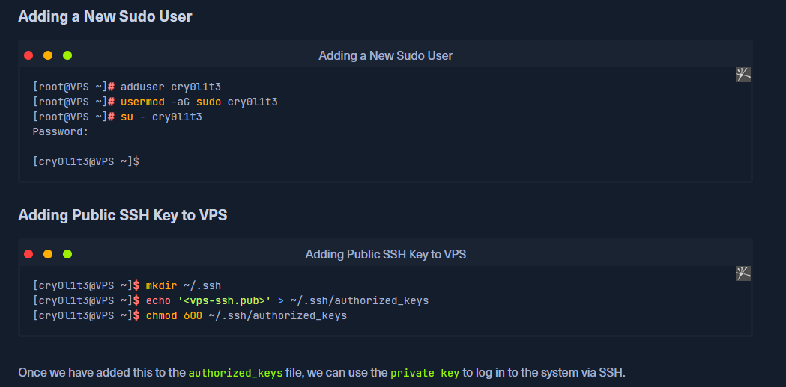

# OpenSSH
OpenSSH is the premier connectivity tool for remote login with the SSH protocol.

# Installation
**For Windows:**  
`choco install openssh` 

**For Linux and MacOS:**  
`sudo apt-get install openssh` 

## Configuration
Editing OpenSSH Config
```
[berkankutuk@kali ~]$ sudo cp /etc/ssh/sshd_config /etc/ssh/sshd_config.bak
[berkankutuk@kali ~]$ sudo vim /etc/ssh/sshd_config
```
| Settings | Description |
| --- | --- |
| LogLevel VERBOSE | Gives the verbosity level that is used when logging messages from SSH daemon. |
| PermitRootLogin no | Specifies whether root can log in using SSH. |
| MaxAuthTries 3 | Specifies the maximum number of authentication attempts permitted per connection. |
| MaxSessions 5 | Specifies the maximum number of open shell, login, or subsystem (e.g., SFTP) sessions allowed per network connection. |
| HostbasedAuthentication no | Specifies whether rhosts or /etc/hosts.equiv authentication together with successful public key client host authentication is allowed (host-based authentication). |
| PermitEmptyPasswords no | When password authentication is allowed, it specifies whether the server allows login to accounts with empty password strings. |
| ChallengeResponseAuthentication yes | Specifies whether challenge-response authentication is allowed. |
| UsePAM yes | Specifies if PAM modules should be used for authentification. |
| X11Forwarding no | Specifies whether X11 forwarding is permitted. |
| PrintMotd no | Specifies whether SSH daemon should print /etc/motd when a user logs in interactively. |
| ClientAliveInterval 600 | Sets a timeout interval in seconds, after which if no data has been received from the client, the SSH daemon will send a message through the encrypted channel to request a response from the client. |
| ClientAliveCountMax 0 | Sets the number of client alive messages which may be sent without SSH daemon receiving any messages back from the client. |
| AllowUsers <username> | This keyword can be followed by a list of user name patterns, separated by spaces. If specified, login is allowed only for user names that match one of the patterns. |
| Protocol 2 | Specifies the usage of the newer protocol with is more secure. |
| AuthenticationMethods publickey,keyboard-interactive | Specifies the authentication methods that must be successfully completed for a user to be granted access. |
| PasswordAuthentication no | Specifies whether password authentication is allowed. |

# Example  with adding a public key to a server
