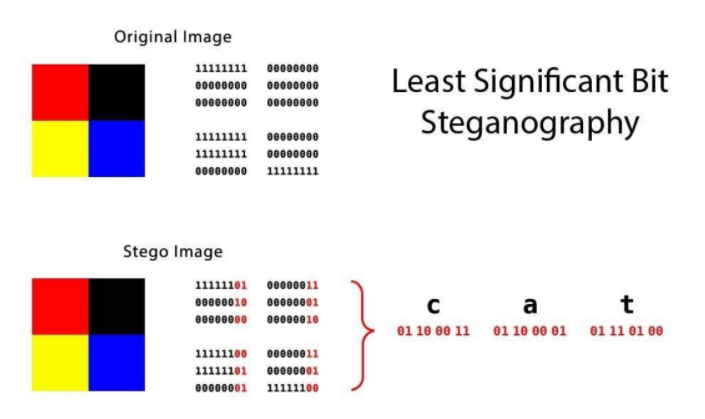
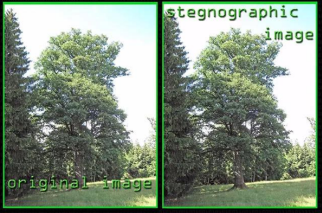
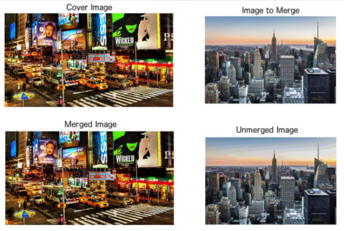

# Steganography

## Techniques
Simple technique: add extra data at the end of a file
* Often does not change the handling of the file
* Detected only by inspecting the contents of the file

Simplest version: add text string
* cat (print as ASCII), strings (print ASCII strings from the file)
* Search / filter the result with grip / bgrep

Can add entire additional files
* Eg ZIP file stored at the bottom of a PNG
* PNG ends with the trailer IEND, so the image viewer is unaffected 

## Image Steganography
Media files are specially suitable for steganography

Pixels
Color channels: RGB
Plans: typically 8 

## Examples

## Tools
* Step Solve: inspect the individual color channels and bit planes of images
* Especially useful for images stored in other images
* step: find saved text data in PNG and BMP
* steghide: embed / extract data in image and audio files
  * More sophisticated method than LSB
  * Optional password for embedding, requires the same password for extraction
  * Tip: password may be blank
  * Tip: use stegseek to bruteforce passwords
* Stego Toolkit: https://github.com/DominicBreuker/stego-toolkit 