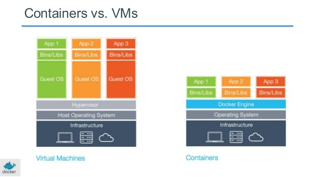

# Docker & Containers
A container cannot be defined as a virtual machine but as an isolated group of processes running on a single host that corresponds to a complete application, including its configuration and dependencies. This application is packaged in a precisely defined and reusable format. Unlike a usual VM on VMware Workstation, however, a container does not contain its operating system or kernel. It is, therefore, not a virtualized operating system. For this reason, containers are significantly slimmer than conventional virtual machines. 



## Difference
| Virtual Machine | Container |
|---|---|
| Contain applications and the complete operating system | Contain applications and only the necessary operating system components such as libraries and binaries |
| A hypervisor such as VMware ESXi provides virtualization | The operating system with the container engine provides its own virtualization |
| Multiple VMs run in isolation from each other on a physical server | Several containers run isolated from each other on one operating system |

The cooperation of various applications is also possible, and if the containers run on the same system, a container daemon is used, for example, the Linux Container Daemon (LXD). LXD is a similar technology to Linux Containers (LXC). LXC is a container-based virtualization technology at the operating system level. Technically, LXC combines isolated namespaces and the Linux kernel "cgroups" to implement isolated environments for code execution.

An image of the file system forms the basis of each container. We can choose whether to use an image that has already been created or to create one ourselves. Containers are also characterized by outstanding scalability. Improved scalability is ideally suited to the requirements of the now highly dynamic IT infrastructure in companies. Indeed, the high scalability of containers makes it possible to ideally adapt the capacities for the users' provision of applications. Meanwhile, even large container setups can be managed without any problems because of orchestration systems such as Apache Mesos or Google Kubernetes. These systems distribute the containers over the existing hardware based on predefined rules and monitor them.

## Benefits
- **Decrease expenses:** Physical servers can be expensive, and virtualization can decrease the number of servers or other hardware, or even completely remove physical hardware from a company's infrastructure.
- **Scale:** Without properly implemented DevOps, it may be hard for a company to scale resources as server usage increases. Virtualization makes this process easier and can delegate a server's resources to virtual machines as needed based on usage.
- **Efficiency:** Like scaling, virtualization can also make it easier to decrease the resources allocated to a virtual machine if there is reduced usage.

# Introduction to Docker
[Docker](https://www.docker.com/get-started/) is open-source software that can isolate applications in containers, similar to operating system virtualization. This approach significantly simplifies the deployment of applications. The application data stored in the containers can be transported and installed easily. The use of containers ensures that computer resources are strictly separated from each other. Docker stores programs together with their dependencies in images. These form the basis for virtualized containers that can run on almost any operating system. 

[Docker Engine](https://docs.docker.com/engine/) is the main component of container virtualization. The software provides the interface between host resources and running containers. Any system that has Docker Engine installed can use Docker containers.

Docker Installation
Using apt (Linux)
```
$ sudo apt update -y 
$ sudo apt install docker.io -y
```

Using Chocolatey (Windows)
```
C:\> IEX((new-object net.webclient).DownloadString('https://chocolatey.org/install.ps1'))
C:\> choco upgrade chocolatey
C:\> choco install docker-desktop
```