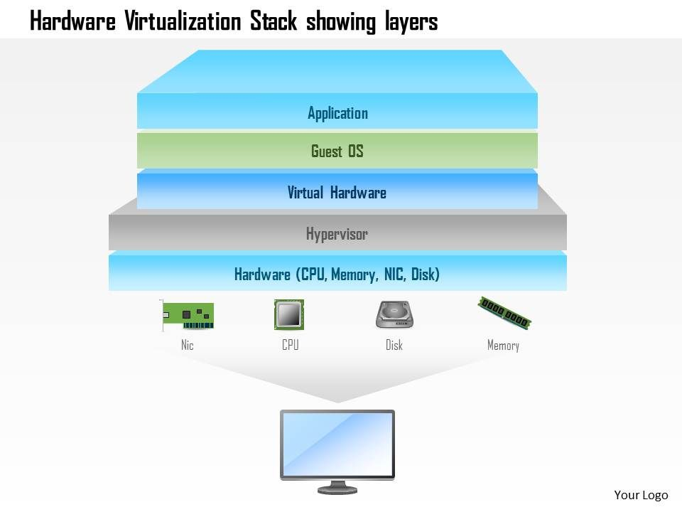

# What is virtualization?
Virtualization is an abstraction of physical computing resources. Both hardware and software components can be abstracted. A computer component created as part of virtualization is referred to as a virtual or logical component and can be used precisely as its physical counterpart. The main advantage of virtualization is the abstraction layer between the physical resource and the virtual image.

# Hardware virtualization
Hardware virtualization is about technologies that enable hardware components to be made available independently of their physical basis using hypervisor software. The best-known example of this is the virtual machine (VM). A VM is a virtual computer that behaves like a physical computer, including hardware and operating system. Virtual machines run as virtual guest systems on one or more physical systems referred to as hosts.


# Virtual machines
A virtual machine (VM) is a virtual operating system that runs on a host system (an actual physical computer system). Several VMs isolated from each other can be operated in parallel. The physical hardware resources of the host system are allocated via hypervisors. This is a sealed-off, virtualized environment with which several guest systems can be operated, independent of the operating system, in parallel, on one physical computer. 

The VMs act independently of each other and do not influence each other. A hypervisor manages the hardware resources, and from the virtual machine's point of view, allocated computing power, RAM, hard disk capacity, and network connections are exclusively available.

## Benefits
1. Applications and services of a VM do not interfere with each other
2. Complete independence of the guest system from the host system's operating system and the underlying physical hardware
3. VMs can be moved or cloned to other systems by simple copying
4. Hardware resources can be dynamically allocated via the hypervisor
5. Better and more efficient utilization of existing hardware resources
6. Shorter provisioning times for systems and applications
7. Simplified management of virtual systems
8. Higher availability of VMs due to independence from physical resources

## VM Options
### VMware
VMware produces software products for the virtualization of computer systems. VMware Workstation Pro and VMware Workstation Player are the most interesting. The difference between the two is that, unlike Workstation Pro, Workstation Player can only run one VM at a time.

Installation for windows: [Link](https://www.vmware.com/products/workstation-pro/workstation-pro-evaluation.html)  
Installation for Linux:
```sh
$ sudo apt install build-essential -y
$ sudo bash ~/Downloads/VMware*.bundle
```
### VirtualBox (Which I use)
With VirtualBox, hard disks are emulated in container files, called Virtual Disk Images (VDI. Aside from VDI format, VirtualBox can also handle hard disk files from VMware virtualization products (.vmdk), the Virtual Hard Disk format (.vhd), and others. We can also convert these external formats using the VBoxManager command-line tool that is part of VirtualBox.


Installation for windows: [Link](https://www.virtualbox.org/wiki/Downloads)  
Installation for Linux:
```sh
$ sudo apt install virtualbox virtualbox-ext-pack -y
```

> Remember to download the Extension pack 

# In Short: VM setup using VirtualBox

1. Enable Virtualization technology in bios
2. Download VirtualBox  https://www.virtualbox.org/wiki/Downloads
3. Download VirtualBox Extension Pack https://www.virtualbox.org/wiki/Downloads
4. Download kali linux https://www.kali.org/downloads/