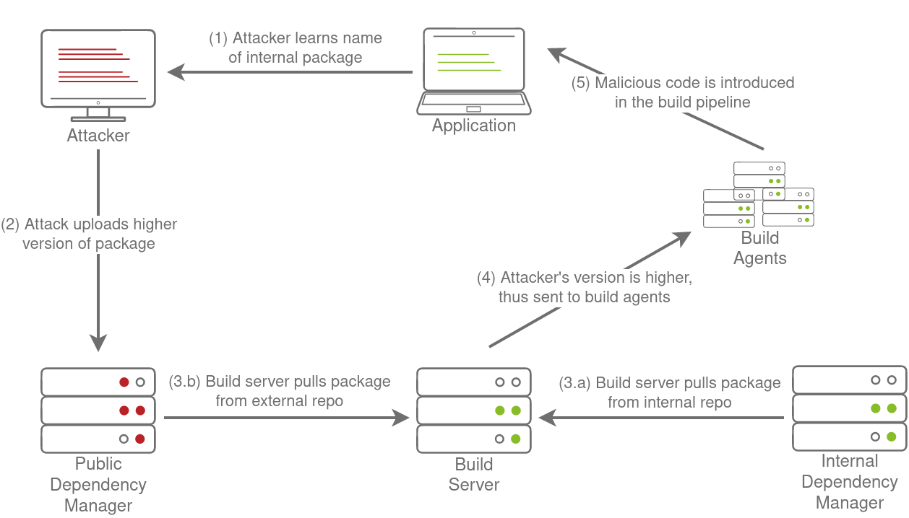

# Depencency management security issues
## Dependency confusion
Dependency Confusion was discovered by Alex Birsan in 2021. The issue stems from how internal dependencies are managed. Let's take a look at a simple example in Python:

`pip install numpy`

What actually happens in the background when we run this command? When we run this command, pip will connect to the external PyPi repository to look for a package called numpy, find the latest version, and install it. In the past, there have been some interesting ways this package could be compromised through a supply chain attack:

* Typosquatting - An attacker hosts a package called nunpy, hoping that a developer will mistype the name and install their malicious package.
* Source Injection - An attacker contributes to the package for a new feature through a pull request but also embeds a vulnerability in the code that could be used to compromise applications that make use of the package.
* Domain Expiry - Sometimes, the developers of packages may forget to renew the domain where their email is being hosted. If this happens, an attacker can buy the expired domain, allowing them full control over email, which could be used to reset the password of a package maintainer to gain full control over the package. This is a common risk for legacy packages on these external repositories.

There are several other supply chain attack methods, but all of them target the dependency or its maintainers directly. If we wanted to use pip to install an internal package and we followed the example on StackOverflow (like all good developers do), our build step would look something like this:

`pip install numpy --extra-index-url https://our-internal-pypi-server.com/`

The --extra-index-url argument tells pip that an additional Pypi server should be inspected for the package. But what if numpy exists in both the internal repo and the external, public-facing PyPi repo? How does pip know which package to install? Well, it's simple, it will collect the package from all available repos, compare the version numbers, and then install the package with the highest version number. You should start to see the problem here.

## Staging a Dependency Confusion Attack (Internal deps)

All an attacker really needs to stage an internal dependency attack is the name of one of your internal dependencies. While this might seem like a challenge, it happens more frequently than you would expect:

* Developers often ask questions on public forums such as StackOverflow but do not obfuscate sensitive information such as the names of libraries being used, some of which could be internal dependencies.
* Some compiled applications like NodeJS will often disclose internal package names in their package.json file, which is usually exposed in the application itself.

Once an attacker learns the name of an internal dependency, they can attempt to host a package with a similar name on one of the external package repos but with a higher version number. This will force any system that attempts to build the application and install the dependency to get confused between the internal and external package, and if the external one is chosen, the attacker's dependency confusion attack will succeed. The full attack is shown in the diagram below:
