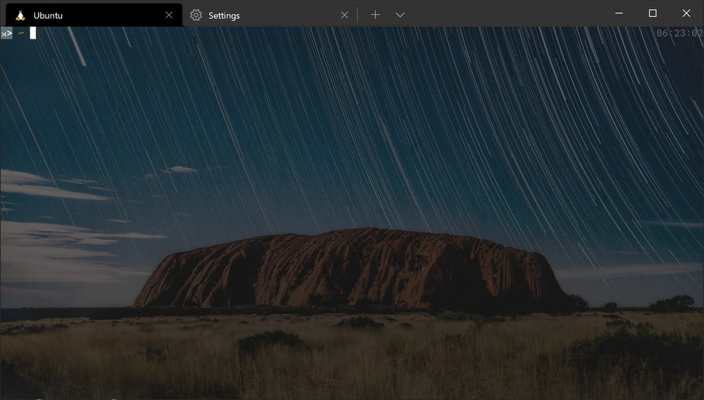
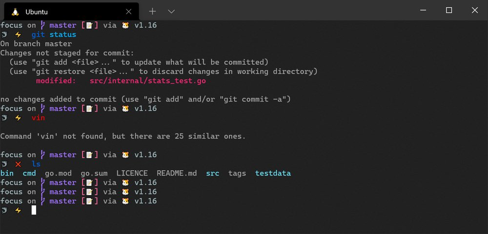
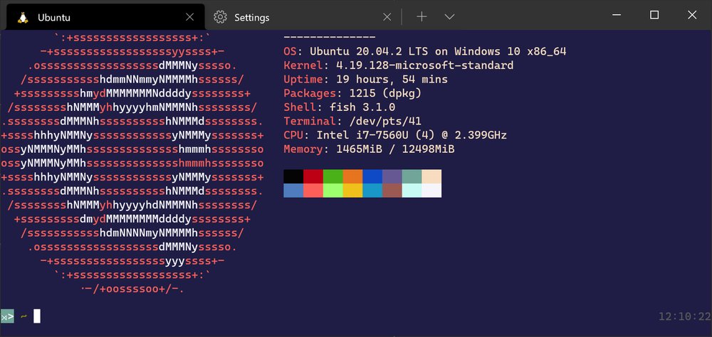
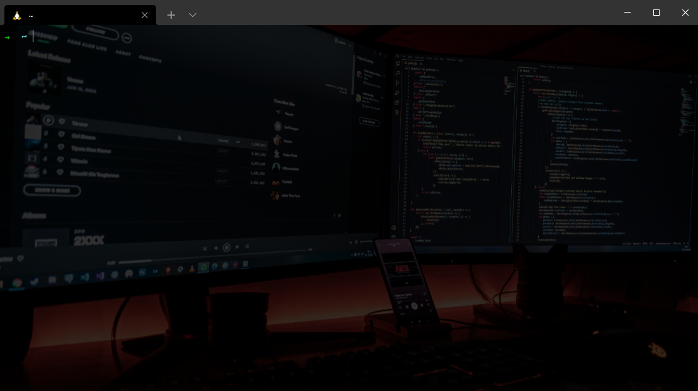

# Terminal Customizations
Windows Terminal is Microsoft's updated release for a GUI terminal emulator. It supports using many different command-line tools to include Command Prompt, PowerShell, and Windows Subsystem for Linux.'

## An amazing guide to customize the Windows Terminal:  
Find the link [here](https://freshman.tech/windows-terminal-guide/#customising-the-background)

Includes
* Launching the terminal with a keyboard shortcut
* Launching the terminal from Windows Explorer
* Customising the default profile
* Customising the tab switcher
* Customising the profile settings
* Customising the background
* Customising the colour scheme
* Prettifying your terminal prompt with Starship
* Splitting panes for multiple shells at once
* Customising the hotkeys
* Setting up custom SSH profiles
* Customising the startup layout

### Examples

**My terminal**
