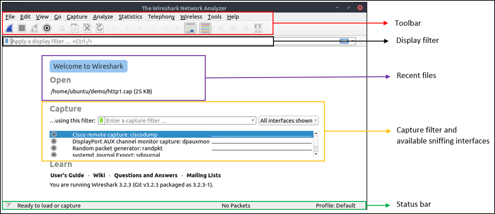
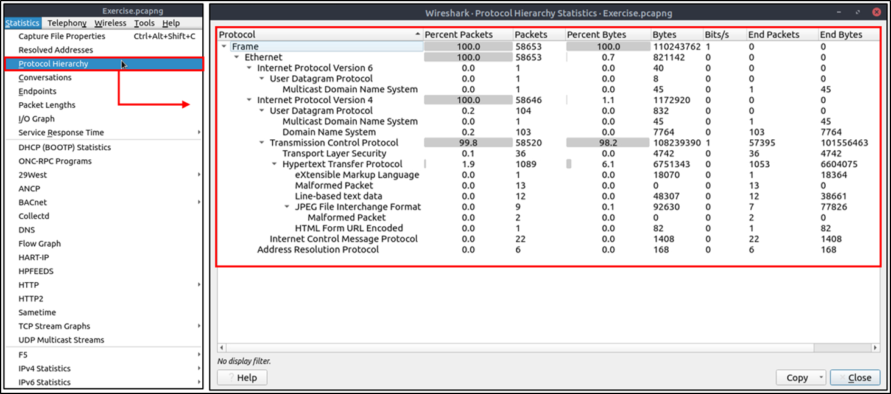
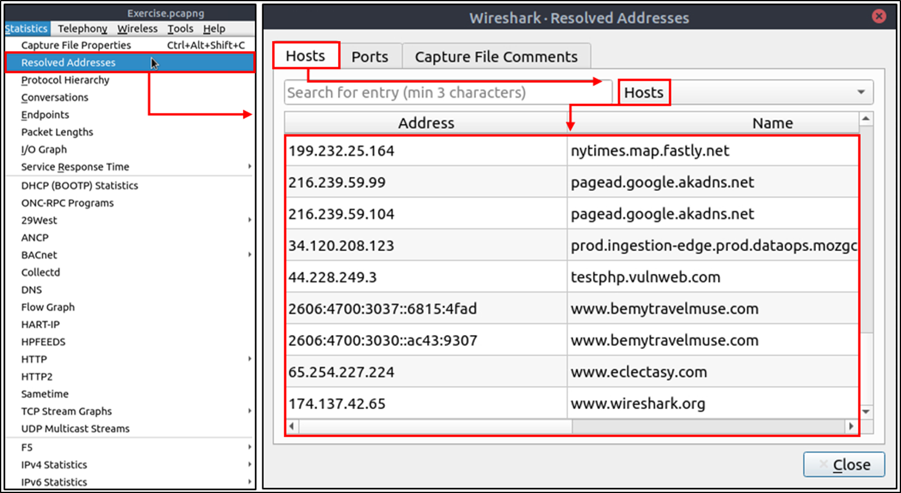
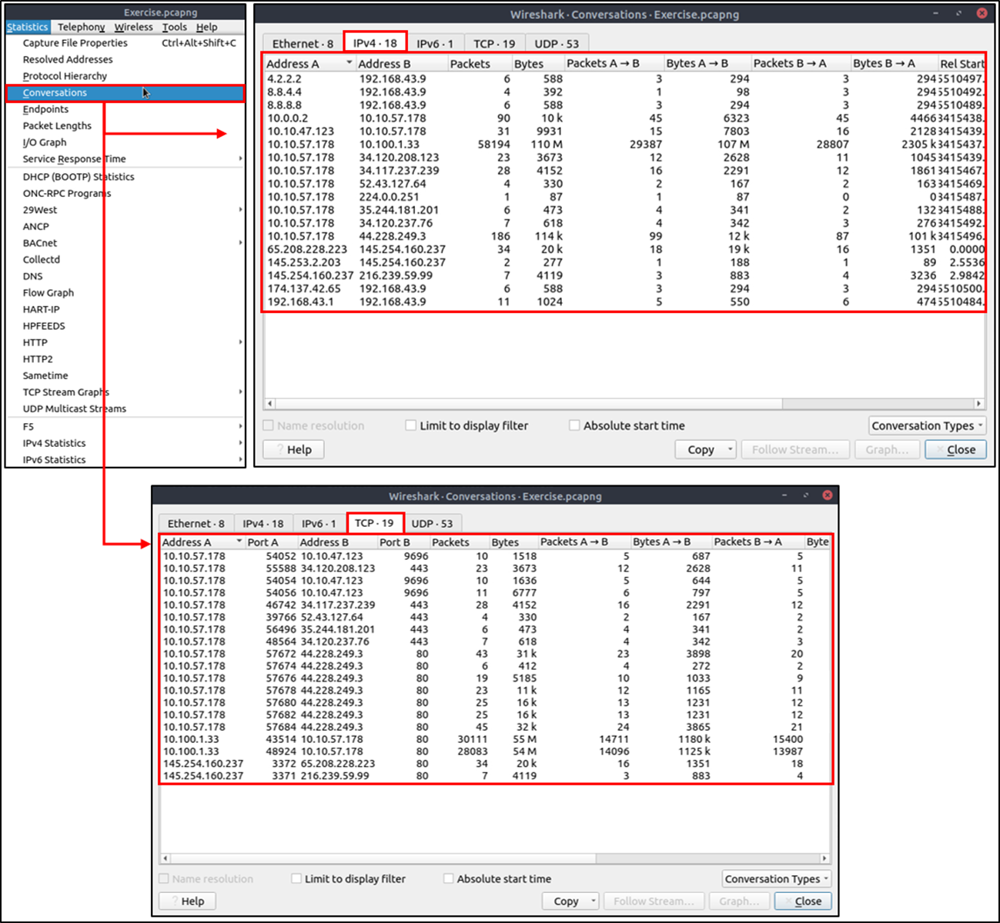
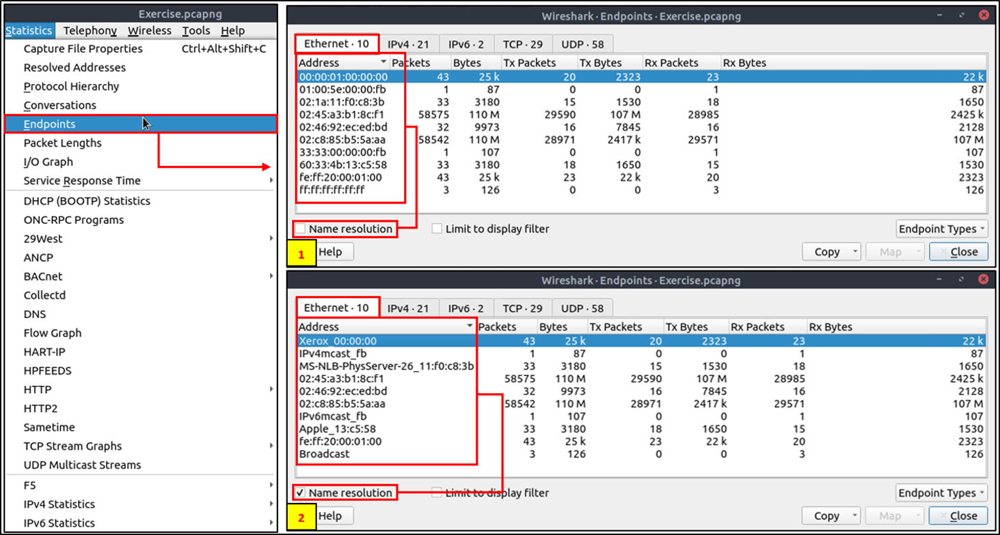

# Wireshark

## Introduction
Wireshark, a tool used for creating and analyzing PCAPs (network packet capture files), is commonly used as one of the best packet analysis tools. In this room, we will look at the basics of installing Wireshark and using it to perform basic packet analysis and take a deep look at each common networking protocol.

### MAC Floods
MAC Floods are a tactic commonly used by red teams as a way of actively sniffing packets. MAC Flooding is intended to stress the switch and fill the CAM table. Once the CAM table is filled the switch will no longer accept new MAC addresses and so in order to keep the network alive, the switch will send out packets to all ports of the switch.

Note: This technique should be used with extreme caution and with explicit prior consent.

## ARP Poisoning
ARP Poisoning is another technique used by red teams to actively sniff packets. By ARP Poisoning you can redirect the traffic from the host(s) to the machine you're monitoring from. This technique will not stress network equipment like MAC Flooding however should still be used with caution and only if other techniques like network taps are unavailable.

## Filtering Captures
and - operator: and / &&  
or - operator: or / ||  
equals - operator: eq / ==  
not equal - operator: ne / !=  
greater than - operator: gt /  >  
less than - operator: lt / <  

## Colors

## Basic Filtering
**Filtering by IP**: The first filter we will look at is ip.addr, this filter will allow you to comb through the traffic and only see packets with a specific IP address contained in those packets, whether it be from the source or destination. 

Syntax: `ip.addr == <IP Address>`

**Filtering by SRC and DST**: The second filter will look at is two in one as well as a filter operator: ip.src and ip.dst. These filters allow us to filter the traffic by the source and destination from which the traffic is coming from.

Syntax: `ip.src == <SRC IP Address> and ip.dst == <DST IP Address>`

**Filtering by TCP Protocols**: The last filter allows you to set a port or protocol to filter by and can be handy when trying to keep track of an unusual protocol or port being used.

Wireshark can filter by both port numbers as well as protocol names.

Syntax: `tcp.port eq <Port #> or <Protocol Name>`
Also works for udp

## Packet Dissection
Packet dissection is also known as protocol dissection, which investigates packet details by decoding available protocols and fields.

You can double click on a packet in capture to open its details. Packets consist of 5 to 7 layers based on the OSI model.
- Frame (Layer 1) - This will show you what frame / packet you are looking at as well as details specific to the Physical layer of the OSI model.
- Source [MAC] (Layer 2) - This will show you the source and destination MAC Addresses; from the Data Link layer of the OSI model.
- Source [IP] (Layer 3) - This will show you the source and destination IPv4 Addresses; from the Network layer of the OSI model.
- Protocol (Layer 4) - This will show you details of the protocol used (UDP/TCP) along with source and destination ports; from the Transport layer of the OSI model.
- Application Protocol (Layer 5) - This will show details specific to the protocol being used such HTTP, FTP, SMB, etc. From the Application layer of the OSI model.
- Application Data - This is an extension of layer 5 that can show the application-specific data.

# Usage and filtering
## Comparison Operators
| English | C-Like | Description | Example |
|:---:|:---:|:---:|:---:|
| eq | == | Equal | ip.src == 10.10.10.100 |
| ne | != | Not equal | ip.src != 10.10.10.100 |
| gt | > | Greater than | ip.ttl > 250 |
| lt | < | Less Than | ip.ttl < 10 |
| ge | >= | Greater than or equal to | ip.ttl >= 0xFA |
| le | <= | Less than or equal to | ip.ttl <= 0xA |

## Logical Operators
| English   | C-Like | Description   | Example |
|:---:|:---:|:---:|:---:|
| and | && | Logical AND | (ip.src == 10.10.10.100) AND (ip.src == 10.10.10.111) |
| or | \|\| | Logical OR | (ip.src == 10.10.10.100) OR (ip.src == 10.10.10.111) |
| not | ! | Logical NOT | !(ip.src == 10.10.10.222) Note: Usage of !=value is deprecated; using it could provide inconsistent results. Using the !(value) style is suggested for more consistent results. |

## Packet Filter Toolbar
| Color | Description |
|:---:|---|
| Green | Valid filter |
| Red | Invalid filter |
| Yellow | Warning filter. This filter works, but it is unreliable, and it is suggested to change it with a valid filter. |

## IP Filters
IP filters help analysts filter the traffic according to the IP level information from the packets (Network layer of the OSI model).

| Filter | Description |
|:---:|:---:|
| ip | Show all IP packets. |
| ip.addr == 10.10.10.111 | Show all packets containing IP address 10.10.10.111. |
| ip.addr == 10.10.10.0/24 | Show all packets containing IP addresses from 10.10.10.0/24 subnet. |
| ip.src == 10.10.10.111 | Show all packets originated from 10.10.10.111 |
| ip.dst == 10.10.10.111 | Show all packets sent to 10.10.10.111 |
| ip.addr vs ip.src/ip.dst | Note: The ip.addr filters the traffic without considering the packet direction. The ip.src/ip.dst filters the packet depending on the packet direction. |

## ARP Traffic
Sort after opcode  
`arp.opcode == 1` - request  
`arp.opcode == 2` - reply  

## ICMP Traffic

### ICMP Traffic Overview
ICMP or Internet Control Message Protocol is used to analyze various nodes on a network. This is most commonly used with utilities like ping and traceroute.

There are a few important things within the packet details that we can take note of first being the type and code of the packet. A type that equals 8 means that it is a request packet, if it is equal to 0 it is a reply packet. When these codes are altered or do not seem correct that is typically a sign of suspicious activity.

There are two other details within the packet that are useful to analyze: timestamp and data. The timestamp can be useful for identifying the time the ping was requested it can also be useful to identify suspicious activity in some cases. We can also look at the data string which will typically just be a random data string.

## TCP/UDP Traffic
TCP or Transmission Control Protocol handles the delivery of packets including sequencing and errors. UDP or User Datagram Protocol is a connectionless protocol that does not guarantee delivery.

Red packet = port is closed

| Filter | Description | Filter | Expression |
|:---:|:---:|:---:|:---:|
| tcp.port == 80 | Show all TCP packets with port 80  | udp.port == 53 | Show all UDP packets with port 53 |
| tcp.srcport == 1234 | Show all TCP packets originating from port 1234 | udp.srcport == 1234 | Show all UDP packets originating from port 1234 |
| tcp.dstport == 80 | Show all TCP packets sent to port 80 | udp.dstport == 5353 | Show all UDP packets sent to port 5353 |

### TCP Packet Analysis
The main thing that we want to look for when looking at a TCP packet is the sequence number and acknowledgment number.

## HTTP Traffic
HTTP is one of the most straight forward protocols for packet analysis, the protocol is straight to the point and does not include any handshakes or prerequisites before communication.

Looking at an HTTP packet we can easily gather information since the data stream is not encrypted like the HTTP counterpart HTTPS. Some of the important information we can gather from the packet is the Request URI, File Data, Server.

| Filter | Description |
|:---:|:---:|
| http | Show all HTTP packets |
| http.response.code == 200 | Show all packets with HTTP response code "200" |
| http.request.method == "GET" | Show all HTTP GET requests |
| http.request.method == "POST" | Show all HTTP POST requests |

### Practical HTTP Packet Analysis
Export HTTP Object. This feature will allow us to organize all requested URIs in the capture. To use Export HTTP Object navigate to file > Export Objects > HTTP.

Organize the protocols present in a capture the Protocol Hierarchy. Navigate to Statistics > Protocol Hierarchy.

Organize all endpoints and IPs found within a specific capture. Just like the other features, this can be useful to identify where a discrepancy is originating from. To use the Endpoints feature navigate to Statistics > Endpoints.

## DNS Traffic
DNS or Domain Name Service protocol is used to resolves names with IP addresses

There are a couple of things outlined below that you should keep in the back of your mind when analyzing DNS packets.

Query-Response
DNS-Servers Only
UDP

If anyone of these is out of place then the packets should be looked at further and should be considered suspicious.

| Filter | Description |
|:---:|:---:|
| dns | Show all DNS packets |
| dns.flags.response == 0 | Show all DNS requests |
| dns.flags.response == 1 | Show all DNS responses |
| dns.qry.type == 1 | Show all DNS "A" records |

### DNS Traffic Overview
The first bit of information we can look at is where the query is originating from

We can also look at what it is querying as well, this can be useful with other information to build a story of what happened

## HTTPS Traffic
HTTPS or Hypertext Transfer Protocol Secure can be one of the most annoying protocols to understand from a packet analysis perspective and can be confusing to understand the steps needed to take in order to analyze HTTPS packets.

### HTTPS Traffic Overview
Before sending encrypted information the client and server need to agree upon various steps in order to make a secure tunnel.

Client and server agree on a protocol version
Client and server select a cryptographic algorithm
The client and server can authenticate to each other; this step is optional
Creates a secure tunnel with a public key

### Practical HTTPS Packet Analysis
We can confirm from the packet details that the Application Data is encrypted. 
You can use an RSA key in Wireshark in order to view the data unencrypted. In order to load an RSA key navigate to Edit > Preferences > Protocols > TLS >  [+] . If you are using an older version of Wireshark then this will be SSL instead of TLS. You will need to fill in the various sections on the menu with the following preferences:  

**IP Address**: 127.0.0.1  
**Port**: start_tls  
**Protocol**: http  
**Keyfile**: RSA key location  

## Other Useful Filters
| Filter | Description |
|---|---|
| frame.number == 100 | Show the 100th packet |
| ip.ttl < 10 | Show all packets with a TTL less than 10 |
| tcp.port == 4444 | Show all packets with port 4444 |
| tcp.port == 80 && http.request.method == “GET” | Show all packets with port 80 and HTTP GET requests |
| dns.qry.type == 1 && dns.flags.response == 1 | Show all packets with DNS A records and responses |

## Advanced Filters
### The `contains` Operator
The contains operator is used to filter packets that contain a specific string. This can be useful when looking for packets that contain a specific piece of information.

| Filter | contains |
|:---:|:---|
| Type | Comparison Operator |
| Description | Search a value inside packets. It is case-sensitive and provides similar functionality to the "Find" option by focusing on a specific field. |
| Example | Find all "Apache" servers. |
| Workflow | List all HTTP packets where packets' "server" field contains the "Apache" keyword. |
| Usage | http.server contains "Apache" |

### The `matches` Operator
The matches operator is used to filter packets that match a specific regular expression. This can be useful when looking for packets that match a specific pattern.

| Filter | matches |
|:---:|:---|
| Type | Comparison Operator |
| Description | Search a pattern of a regular expression. It is case insensitive, and complex queries have a margin of error. |
| Example | Find all .php and .html pages. |
| Workflow | List all HTTP packets where packets' "host" fields match keywords ".php" or ".html". |
| Usage | http.host matches "\.(php\|html)" |

### The `in` Operator
The in operator is used to filter packets that contain a specific value in a list. This can be useful when looking for packets that contain a specific value in a list.

| Filter | in |
|:---:|:---|
| Type |  Set Membership |
| Description | Search a value or field inside of a specific scope/range. |
| Example | Find all packets that use ports 80, 443 or 8080. |
| Workflow | List all TCP packets where packets' "port" fields have values 80, 443 or 8080. |
| Usage | tcp.port in {80 443 8080} |

### The `upper` and `lower` Operators
The upper and lower operators are used to filter packets that contain a specific value in uppercase or lowercase. This can be useful when looking for packets that contain a specific value in uppercase or lowercase.

| Filter | lower |
|:---:|:---|
| Type | Function |
| Description | Convert a string value to lowercase. |
| Example | Find all "apache" servers. |
| Workflow | Convert all HTTP packets' "server" fields info to lowercase and list packets that contain the "apache" keyword. |
| Usage | lower(http.server) contains "apache" |

| Filter | upper |
|:---:|:---|
| Type | Function |
| Description | Convert a string value to uppercase. |
| Example | Find all "APACHE" servers. |
| Workflow | Convert all HTTP packets' "server" fields to uppercase and list packets that contain the "APACHE" keyword. |
| Usage | upper(http.server) contains "APACHE" |

### The `string` Operator
The string operator is used to filter packets that contain a specific string. This can be useful when looking for packets that contain a specific piece of information.

| Filter | string |
|:---:|:---|
| Type | Function |
| Description | Convert a non-string value to a string. |
| Example | Find all frames with odd numbers. |
| Workflow | Convert all "frame number" fields to string values, and list frames end with odd values. |
| Usage | string(frame.number) matches "[13579]$" |

# Packet Operations
## Statistics
### Protocol Hierarchy

This feature will allow you to see the protocol hierarchy in the capture. This can be useful to identify where a discrepancy is originating from. To use the Protocol Hierarchy feature navigate to Statistics > Protocol Hierarchy.

### Resolved Addresses

This feature will allow you to see all the resolved addresses in the capture. This can be useful to identify where a discrepancy is originating from. To use the Resolved Addresses feature navigate to Statistics > Resolved Addresses.

### Conversations

This feature will allow you to see all the conversations in the capture. This can be useful to identify where a discrepancy is originating from. To use the Conversations feature navigate to Statistics > Conversations.

### Endpoints

This feature will allow you to see all the endpoints in the capture. This can be useful to identify where a discrepancy is originating from. To use the Endpoints feature navigate to Statistics > Endpoints.

### IPv4 Statistics
Navigating to Statistics>IPv4 Statistics>Destinations and Ports brings up a list of every destination address along with a count