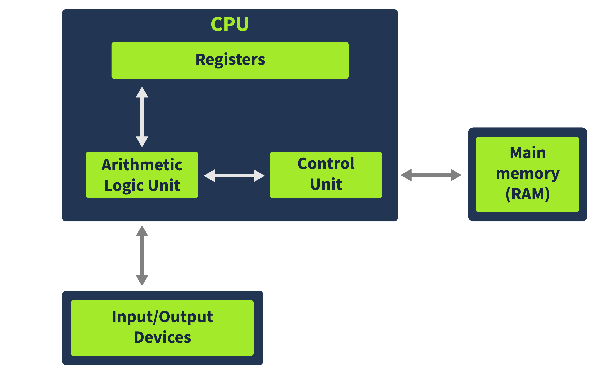
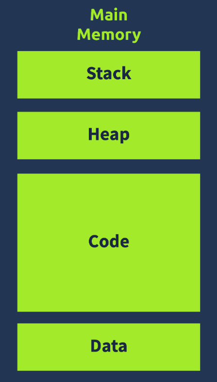
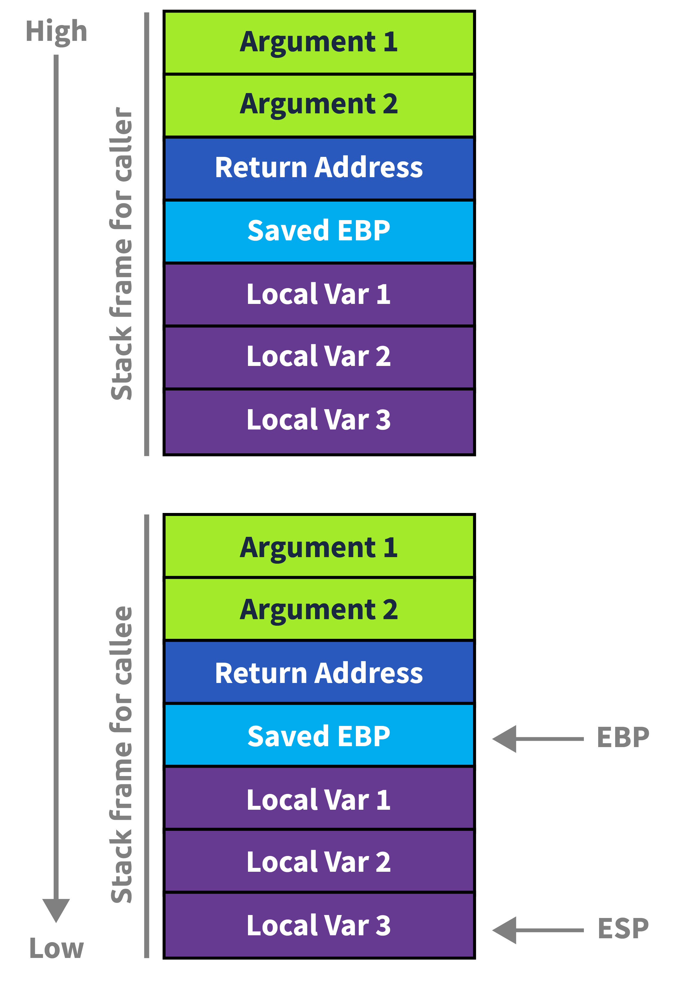

# x86 Architecture Overview
A crash course on the x86 architecture.

# Table of contents
- [CPU architecture overview](#cpu-architecture-overview)
  - [Control Unit](#control-unit)
  - [Arithmetic Logic Unit](#arithmetic-logic-unit)
  - [Registers](#registers)
  - [Memory](#memory)
  - [I/O devices](#io-devices)
- [Register overview](#register-overview)
  - [Instruction Pointer](#instruction-pointer)
  - [General Purpose Registers](#general-purpose-registers)
    - [EAX or RAX](#eax-or-rax)
    - [EBX or RBX](#ebx-or-rbx)
    - [ECX or RCX](#ecx-or-rcx)
    - [EDX or RDX](#edx-or-rdx)
    - [ESP or RSP](#esp-or-rsp)
    - [EBP or RBP](#ebp-or-rbp)
    - [ESI or RSI](#esi-or-rsi)
    - [EDI or RDI](#edi-or-rdi)
    - [R8-R15](#r8-r15)
- [Memory overview](#memory-overview)
  - [Code Section](#code-section)
  - [Data Section](#data-section)
  - [Heap Section](#heap-section)
  - [Stack Section](#stack-section)
- [Stack layout](#stack-layout)
  - [Stack Pointer (ESP or RSP)](#stack-pointer-esp-or-rsp)
  - [Base Pointer (EBP or RBP)](#base-pointer-ebp-or-rbp)
  - [Old Base Pointer and Return Address](#old-base-pointer-and-return-address)
  - [Arguments](#arguments)
  - [Function Prologue and Epilogue](#function-prologue-and-epilogue)

# CPU architecture overview
The CPU architecture that is most widely used is derived from the Von Neumann architecture

This diagram shows that the CPU has three components: the Arithmetic Logic Unit (ALU), the Control Unit, and the Registers. The CPU interacts with memory and I/O devices outside the CPU.

## Control Unit
The Control Unit gets instructions from the main memory, depicted here outside the CPU. The address to the next instruction to execute is stored in a register called the Instruction Pointer or IP. In 32-bit systems, this register is called EIP, and in 64-bit systems, it is called RIP.

## Arithmetic Logic Unit
The arithmetic logic unit executes the instruction fetched from the Memory. The results of the executed instruction are then stored in either the Registers or the Memory.

## Registers
The Registers are the CPU's storage. Registers are generally much smaller than the Main Memory, which is outside the CPU, and help save time in executing instructions by placing important data in direct access to the CPU.

## Memory
The Memory, also called Main Memory or Random Access Memory (RAM), contains all the code and data for a program to run. When a user executes a program, its code and data are loaded into the Memory, from where the CPU accesses it one instruction at a time.

## I/O devices
I/O devices or Input/Output devices are all other devices that interact with a computer. These devices include Keyboards, Mice, Displays, Printers, Mass storage devices like Hard Disks and USBs, etc.

# Register overview
The CPU can access data from the registers quicker than any other storage medium; however, its limited size means it has to be used effectively. For this purpose, the registers are divided into the following different types:

* Instruction Pointer
* General Purpose Registers
* Status Flag Registers
* Segment Registers

## Instruction Pointer
The Instruction Pointer (IP) register stores the address of the next instruction to be executed. In 32-bit systems, this register is called EIP, and in 64-bit systems, it is called RIP.

## General Purpose Registers
The General-Purpose registers in an x86 system are all 32-bit registers. As the name suggests, these are used during the general execution of instructions by the CPU. In 64-bit systems, these registers are extended as 64-bit registers. They contain the following registers.

### EAX or RAX
This is the Accumulator Register. Results of arithmetic operations are often stored in this register. In 32-bit systems, a 32-bit EAX register is present, while a 64-bit RAX register is present in 64-bit systems. The last 16 bits of this register can be accessed by addressing AX. Similarly, it can also be addressed in 8 bits by using AL for the lower 8 bits and AH for the higher 8 bits.

### EBX or RBX
This register is also called the Base Register, which is often used to store the Base address for referencing an offset. Similar to the EAX/RAX, it can be addressed as 64-bit RBX, 32-bit EBX, 16-bit BX, and 8-bit BH and BL registers.

### ECX or RCX
This register is also called the Counter Register and is often used in counting operations such as loops, etc. Similar to the above two registers, it can be addressed as 64-bit RCX, 32-bit ECX, 16-bit CX, and 8-bit CH and CL registers.

### EDX or RDX
This register is also called the Data Register. It is often used in multiplication/division operations. Similar to the above registers, it can be addressed as 64-bit RDX, 32-bit EDX, 16-bit DX, and 8-bit DH and DL registers. 

### ESP or RSP
This register is called the Stack Pointer. It points to the top of the stack and is used in conjunction with the Stack Segment register. It is a 32-bit register called ESP in 32-bit systems and a 64-bit register called RSP in 64-bit systems. It can not be addressed as smaller registers.

### EBP or RBP
This register is called the Base Pointer. It is used to access parameters passed by the stack. It is also used in conjunction with the Stack Segment register. It is a 32-bit register called EBP in 32-bit systems and a 64-bit register called RBP in 64-bit systems.

### ESI or RSI
This register is called the Source Index register. It is used for string operations. It is used with the Data Segment (DS) register as an offset. It is a 32-bit register called ESI in 32-bit systems and a 64-bit register called RSI in 64-bit systems.

### EDI or RDI
This register is called the Destination Index register. It is also used for string operations. It is used with the Extra Segment (ES) register as an offset. It is a 32-bit register called EDI in 32-bit systems and a 64-bit register called RDI in 64-bit systems.

### R8-R15
These 64-bit general-purpose registers are not present in 32-bit systems. They were introduced in the 64-bit systems. They are also addressable in 32-bit, 16-bit, and 8-bit modes. For example, for the R8 register, we can use R8D for lower 32-bit addressing, R8W for lower 16-bit addressing, and R8B for lower 8-bit addressing. Here, the suffix D stands for Double-word, W stands for Word, and B stands for Byte.

## Status Flag Registers
The Status Flag Registers are used to store the status of the CPU after executing an instruction. These registers are used to determine the outcome of an operation. The following are the status flag registers:

### EFLAGS or RFLAGS
This register is called the Flags Register. It is a 32-bit register in 32-bit systems called EFLAGS and a 64-bit register in 64-bit systems called RFLAGS. It contains some of the following flags:

* **Carry Flag (CF)** - Set if an operation results in a carry out of the most significant bit
* **Zero Flag (ZF)** - Set if the result of an operation is zero
* **Sign Flag (SF)** - Set if the result of an operation is negative
* **Trap Flag (TF)** - Used for debugging

## Segment Registers
Segment Registers are 16-bit registers that convert the flat memory space into different segments for easier addressing. There are six segment registers, as explained below:

1. **CS (Code Segment)** - This register points to the segment where the code is stored.
2. **DS (Data Segment)** - This register points to the segment where the data is stored.
3. **SS (Stack Segment)** - This register points to the segment where the stack is stored.
4. **ES (Extra Segment)** - This register is used for extra data storage.
   1. **FS (F Segment)** - This register is used for extra data storage.
   2. **GS (G Segment)** - This register is used for extra data storage.

# Memory overview
When a program is loaded into the Memory in the Windows Operating System, it sees an abstracted view of the Memory. This means that the program doesn't have access to the full Memory; instead, it only has access to its Memory. 

  

The diagram here is an overview of the typical memory layout for a program. As can be seen, Memory is divided into different sections, namely Stack, Heap, Code, and Data. While the four sections in a particular order is shown, this can be different from how they will be all the time, e.g., the Code section can be below the Data section.

## Code Section
The Code Section, as the name implies, contains the program's code. Specifically, this section refers to the text section in a Portable Executable file, which includes instructions executed by the CPU. This section of the Memory has execute permissions, meaning that the CPU can execute the data in this section of the program memory.

## Data Section
The Data section contains initialized data that is not variable and remains constant. It refers to the data section in a Portable Executable file. It often contains Global variables and other data that are not supposed to change during the program's execution.

## Heap Section
The heap, also known as dynamic Memory, contains variables and data created and destroyed during program execution. When a variable is created, memory is allocated for that variable at runtime. And when that variable is deleted, the memory is freed. Hence the name dynamic memory.

## Stack Section
The Stack is one of the important parts of the Memory from a malware analysis point of view. This section of the Memory contains local variables, arguments passed on to the program, and the return address of the parent process that called the program. Since the return address is related to the control flow of the CPU's instructions, the stack is often targeted by malware to hijack the control flow.

# Stack layout
The Stack is a part of a program's memory that contains the arguments passed to the program, the local variables, and the program's control flow. This makes the stack very important regarding malware analysis and reverse engineering. Malware often exploits the stack to hijack the control flow of the program. Therefore it is important to understand the stack, its layout, and its working.

The stack is a Last In First Out (LIFO) memory. This means that the last element pushed onto the stack is the first one to be popped out. For example, if we push A, B, and C onto the stack, when we pop out these elements, the first to pop out will be C, B, and then A. The CPU uses two registers to keep track of the stack. One is the Stack Pointer (the ESP or RSP), and the other is the Base Pointer (the EBP or RBP).

## Stack Pointer (ESP or RSP)
The Stack Pointer is a register that points to the top of the stack. When an element is pushed onto the stack, the stack pointer is decremented, and when an element is popped out, the stack pointer is incremented.

## Base Pointer (EBP or RBP)
The Base Pointer for any program remains constant. This is the reference address where the current program stack tracks its local variables and arguments.

## Old Base Pointer and Return Address
Below the Base Pointer lies the old Base Pointer of the calling program (the program that calls the current program). And below the old Base Pointer lies the Return Address, where the Instruction Pointer will return once the current program's execution ends. A common technique to hijack control flow is to overflow a local variable on the stack such that it overwrites the Return Address with an address of the malware author's choice. This technique is called a Stack Buffer Overflow.

## Arguments
The Arguments being passed to a function are pushed to the stack before the function starts execution. These arguments are present right below the Return Address on the stack.

## Function Prologue and Epilogue
When a function is called, the stack is prepared for the function to execute. This means that the arguments are pushed to the stack before the start of the function execution. After that, the Return Address and the Old Base Pointer are pushed onto the stack. Once these elements are pushed, the Base Pointer address is changed to the top of the stack (which will be the Stack Pointer of the caller function at that time). As the function executes, the Stack Pointer moves as per the requirements of the function. This portion of code that pushes the arguments, the Return Address, and the Base Pointer onto the Stack and rearranges the Stack and Base Pointers is called the Function Prologue.

  

Similarly, the Old Base Pointer is popped off the stack and onto the Base Pointer when the function exits. The Return address is popped off to the Instruction Pointer, and the Stack Pointer is rearranged to point to the top of the stack. The part of the code that performs this action is called the Function Epilogue. 